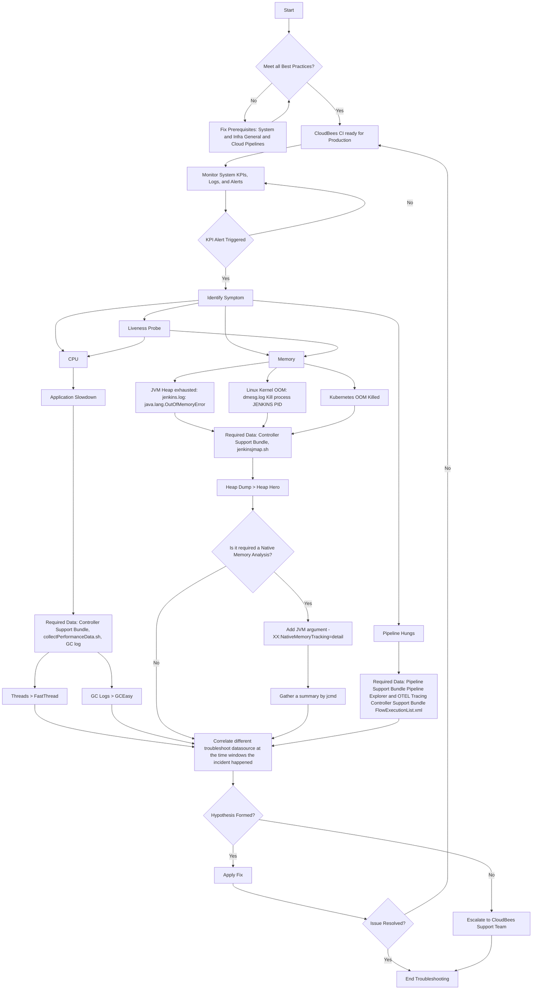

# CloudBees CI Troubleshooting Guide

## Overview

This document provides a comprehensive troubleshooting workflow for CloudBees CI performance issues. The troubleshooting process requires a series of concatenated processes:

- **Capture** of the data depending on the issue
- **Analysis** to establish a hypothesis based on pieces of evidence  
- **Applying** mitigation measures

After applying the proposed fix, the instance behavior is monitored to assess (feedback) the stability of the application. If it is still unstable, the above steps are repeated.

## Troubleshooting Flow Diagram

The following diagram illustrates the complete troubleshooting workflow:

## Key Components Explained

### Prerequisites Check

Before beginning troubleshooting, ensure all best practices are met:

- **System & Infrastructure**: General and Cloud configurations
- **Pipelines**: Following CloudBees CI pipeline best practices

### Symptom Identification

The troubleshooting process begins with monitoring system KPIs, logs, and alerts. When a KPI alert is triggered, identify the specific symptom:

#### CPU Issues

- **Application Slowdown**: High CPU utilization causing performance degradation
- **Required Data**: Controller Support Bundle, collectPerformanceData.sh, GC log file

#### Memory Issues

- **JVM Heap Exhausted**: `java.lang.OutOfMemoryError` in jenkins.log
- **Linux Kernel OOM**: Kill process messages in `/var/log/dmesg.log`
- **Kubernetes OOM Killed**: Container terminated by Kubernetes
- **Required Data**: Controller Support Bundle, jenkinsjmap.sh

#### Liveness Probe Issues

- Pod restarts due to liveness probe failures
- Connects to CPU and Memory analysis paths

#### Pipeline Hangs

- Jenkins CI pipelines become unresponsive or hang
- **Required Data**: OTEL Tracing, Pipeline Support Bundle

### Data Analysis Tools

#### For CPU Analysis

- **Threads > FastThread**: Thread dump analysis
- **GC Logs > GCEasy**: Garbage collection analysis

#### For Memory Analysis

- **Heap Dump > Heap Hero**: Memory usage analysis
- **Native Memory Analysis** (optional):
  1. Add JVM argument: `-XX:NativeMemoryTracking=detail`
  2. Gather summary by running `jcmd` after 24 hours

### Data Correlation

All analysis paths converge to correlate different troubleshoot data sources within the time window when the incident happened.

### Resolution Process

1. **Hypothesis Formation**: Based on data analysis
2. **Apply Fix**: Implement the identified solution
3. **Validation**: Check if the issue is resolved
4. **Escalation**: Contact CloudBees Support Team if hypothesis cannot be formed

## Best Practices

- Always ensure CloudBees CI is ready for production before troubleshooting
- Collect data when the issue is happening or immediately after
- Use the recommended analysis tools for each data type
- Document findings and applied fixes for future reference

## Support

If troubleshooting does not resolve the issue, escalate to the **CloudBees Support Team** with all collected data and analysis results.