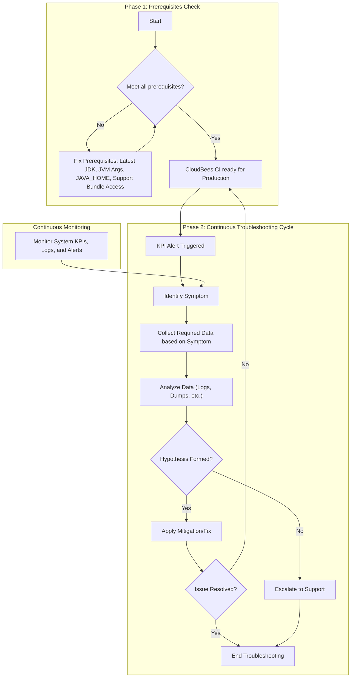

Troubleshooting
Troubleshooting a performance issue requires a series of concatenated processes:  
Capture of the data depending on the issue
Analysis to establish a hypothesis based on pieces of evidence
Applying mitigation measures.
After applying the proposed fix, the instance behaviour is monitored to assess (feedback) the stability of the application. If it is still unstable, the above steps are repeated.
Symptoms
Liveness and Readiness probe failure

Symptoms: The Pod restarts (in case of liveness probe failure). These errors can be spotted in the Kubernetes pod description > Events

Pods can sometimes get stuck, enter an unresponsive state, or encounter deadlocks. The liveness probe helps Kubernetes detect such situations and take corrective action by restarting the pod, ensuring the application remains available and reliable.
A Readiness Probe in Kubernetes is used to determine if a pod is ready to accept traffic. Unlike the liveness probe, which, if it fails, causes the pod to restart, the readiness probe controls if the pod is considered available for serving requests. When the readiness probe fails, the pod is marked as "not ready," and traffic is temporarily diverted away from it until it becomes healthy again.
Cloudbees CI Operation Centre and Controllers implement the Liveness and Readiness probe defined by design.
Liveness:   http-get http://:8080/health delay=0s timeout=5s period=10s #success=1 #failure=12

httpGet: Checks an HTTP endpoint.
initialDelaySeconds: Time to wait before starting health checks after the container starts.
periodSeconds: How often to perform the health check.
failureThreshold: Number of consecutive failures before considering the pod unhealthy and restarting it.

Readiness:  http-get http://:8080/health delay=0s timeout=5s period=10s #success=1 #failure=3

httpGet: Checks the /health endpoint via HTTP on port 8080.
initialDelaySeconds: 0: The probe starts immediately after the container starts.
timeoutSeconds: 5: Each health check request has a timeout of 5 seconds.
periodSeconds: 10: Checks are performed every 10 seconds.
successThreshold: 1: The pod is considered ready after a single successful check.
failureThreshold: 3: If three consecutive checks fail, the pod is marked as "not ready."
initialDelaySeconds can be increased. To increase the Liveness probe initial delay, configure the Managed controller item and update the value of "Health Check Initial Delay". By default, it is set to 600 (10 minutes). You may increase it to, for example, 1800 (30 minutes).
Note: While increasing the liveness probe can resolve the issue temporarily, it may only be a workaround. It’s essential to investigate the root cause. The pod might be marked as unhealthy or not ready because of resource issues like CPU or memory exhaustion, which could cause the application to slow down, become unresponsive, or crash, even if the health checks are still passing or simply not detecting these resource problems.

Memory

Unlike CPU resources, memory cannot be compressed. Because there is no way to throttle memory usage, if a container goes past its memory limi, it will be terminated: CI Service Outage
Types
JVM Heap exhausted

Symptoms: The application started to function abnormally (with or without being killed), and the following message can be found on  jenkins.log:

java.lang.OutOfMemoryError
java.lang.OutOfMemoryError: GC overhead limit exceeded
java.lang.OutOfMemoryError: Java heap space

Normally, when the JVM runs out of memory (heap, metaspace, etc.), it throws an OutOfMemoryError and may try to continue.

If OutOfMemory happens, Jenkins is in the undefined behaviour mode. It means that anything may fail, including mission-critical threads in the controller. As a result, it does not make sense to investigate any other observed issue (i.e. connectivity between nodes, any plugin misbehaviour, etc.) before fixing OOM first.

In case of application ends in restarting throws the generic Exit Code: 1(Generic error)

Additional interesting flags

#  Hard crash (SIGABRT).Generate a hs_err Log. Inmediate Exist with code 134
-XX:+CrashOnOutOfMemoryError
#  Clean exit (System.exit-style). .Generate a hs_err Log. Gracefully Exist with code 1 (code) 
-XX:+ExitOnOutOfMemoryError

Types of JVM heap exhaustion

java.lang.OutOfMemoryError: Unable to create new native thread — This error occurs when the Java application hits the limit of how many native threads it can create. 
The most common cause is that the operating system's resource limits (such as ulimit) are too low, preventing the JVM from creating additional native threads. It can also be caused by excessive thread creation within the application or a high number of processes running concurrently, which exhausts available system resources.
java.lang.OutOfMemoryError: Java heap space — This error indicates that the JVM has run out of available heap memory to allocate new objects. When the JVM attempts to create a new object but there isn’t enough space in the heap, it throws this error.
Cause: The heap size is insufficient for the application's current workload, either because the heap was set too small initially or because the application has a memory leak or is allocating too many objects.

Note: While increasing the heap can resolve the issue temporarily, it may only be a workaround. It’s essential to investigate the root cause, such as memory leaks, excessive object creation, or inefficient code, which could be causing the heap to fill up quickly.

java.lang.OutOfMemoryError: GC overhead limit exceeded — This error occurs when the JVM spends excessive time performing garbage collection but is unable to reclaim sufficient heap space. By default, the JVM is configured to throw this error if more than 98% of the total time is spent on GC with less than 2% of the heap being recovered during that time.
Cause:
The application is either exhausting heap space rapidly or experiencing frequent, ineffective garbage collection cycles. This situation often indicates memory leaks, large cache sizes, or inefficient memory usage.
Pre-requisite: Make sure JVM tunning follows CloudBees CI best practices
Linux Kernel OOM 

Symptoms: The JVM crashes. The error can be spotted in Kubernetes Node /var/log/dmesg.log:

[XXXXX] Out of memory: Kill process <JENKINS_PID> (java) score <SCORE> or sacrifice child
[XXXXX] Killed process <JENKINS_PID> (java) total-vm:XXXkB, anon-rss:XXXkB, file-rss:XXXkB, shmem-rss:XXXkB

It is important to understand that the Operating System itself and any other pod running on the node have their requirements regarding RAM and CPU. 

Kubernetes eviction should prevent most host OOM scenarios. But in edge cases (fast memory leaks, system process consumption, kernel memory fragmentation), host OOM kills can still occur

If the node experiences an out-of-memory (OOM) event before the kubelet being able to reclaim memory, the node depends on the oom_killer to respond.
The kubelet sets an oom_score_adj value for each container based on the QoS for the pod.
Quality of Service
oom_score_adj
Guaranteed
-997
BestEffort
1000
Burstable
min(max(2, 1000 - (1000 × memoryRequestBytes) / machineMemoryCapacityBytes), 999)

If the kubelet can't reclaim memory before a node experiences OOM, the oom_killer calculates an oom_score based on the percentage of memory it's using on the node, and then adds the oom_score_adj to get an effective oom_score for each container. It then kills the container with the highest score.

This means that containers in low QoS pods that consume a large amount of memory relative to their scheduling requests are killed first.
Kubernetes OOM Killed
Symptoms: The Pod restarts. The error can be spotted in the Kubernetes pod description > Last state and events

OOMKilled (137) = OS-enforced SIGKILL (uncatchable, immediate)

JVM OOO does not requires necessarily ends into Kubernetes OOM Killed under the following premises:

Memory usage at crash. There is some free space yet in the heap memory 
Heap: 800MB (max) + Non-heap: ~150MB = 950MB < 1024MB limit
cgroup never breached → Kernel doesn't intervene
JVM self-terminates gracefully via abort(
Required Data
It’s important to check the time when the memory issue was happening. In other words, when did the Java process start to consume high amounts of memory in comparison with the max heap setting for the environment? Was it killed?

Time around the issue is exposed: Check on Jenkins Systems logs or Performance KPI in your Observability platform.
Generate a Support Bundle, including System properties, controller Log Recorders, Garbage Collection Logs, Slow Request Records, Out Of Memory Errors, controller Heap Histogram, Deadlock Records, Thread dumps of running Pipeline builds, Thread dumps and Items Content.
Run the jenkinsjmap.sh script as the root user in one of the following modes:
./jenkinsjmap.sh PID - for default mode, which generates jmap -heap output and jmap -histo output
./jenkinsjmap.sh PID 1 - for heapdump mode, which generates jmap -heap output, jmap -histo output, and a heapdump file in binary format
The data will be generated in the same directory where the script is run.
+ Alternatively, you can request a heap dump using available Java tools if you have issues with the jenkinsjmap.sh script.
+ You can also optionally add the -XX:+HeapDumpOnOutOfMemoryError and -XX:HeapDumpPath=SPECIFY_PATH options to your existing Java arguments that are used when Jenkins starts. With these settings, the JVM will generate a heap dump automatically when an OutOfMemory exception is encountered. However, typically you would notice significant performance problems before all available memory was used up, so capturing a heap dump manually is usually preferable.
The particularities of Native Memory Analysis
Pre-conditions:
You have already confirmed expected heap utilisation is normal through garbage collection log analysis.
You have already confirmed the expected metaspace memory consumption.

Configure NMT Tracking

Step 1. First, you will need to add the JVM argument: -XX:NativeMemoryTracking=detail by following the instructions outlined here: How to add Java Arguments to Jenkins to get a more detailed view of native memory usage by tracking exactly what methods allocate the most memory. Enabling NMT will result in 5-10 percent JVM performance.
For the new argument to take effect, the Jenkins java process must be restarted. It is recommended to do this during a scheduled maintenance window.
Step 2: Gather a summary by running the following jcmd command continuously for 24h (using a cron or Jenkins job)

#!/bin/bash
TSTAMP="$(date +'%Y%m%d_%H%M%S')"
jenkinsPid="$(pgrep -o java)"
nmtLog="$JENKINS_HOME/support/nmt.log"
echo $TSTAMP $JENKINS_CLUSTER_ID >> $nmtLog
jcmd $jenkinsPid VM.native_memory summary >> $nmtLog

CPU

Symptoms:  If your application experiences a notable slowdown, high CPU utilisation is often a key indicator of underlying JVM issues. When a JVM is under stress—due to infinite loops, inefficient code, or insufficient tuning—it can cause the JVM's CPU consumption to skyrocket, sometimes approaching 100%. This intense CPU load forces the JVM to continually allocate and free memory, leading to increased garbage collection activity and further performance degradation. 

Note: Low Java heap space will also cause high CPU usage, as the CPU will be doing Garbage Collections constantly to free up memory. Before considering the issue as high CPU, please review Out of Memory error above and make sure the issue is not caused by low memory.

CPU is considered a “compressible” resource. If your app starts hitting your CPU limits, Kubernetes starts throttling your container. This means the CPU will be artificially restricted, potentially giving your app worse performance! However, it won’t be terminated or evicted.
Most of the time, servers only use a small fraction of their CPU power. When CloudBees CI is performing tasks, CPU usage will rise and/or spike temporarily. Once the CPU-intensive process completes, the CPU usage should once again drop down to a lower level.

Required Data
Time around the issue is exposed: Check on Jenkins Systems logs or Performance KPI in your Observability platform.
Support bundle enable at minimum the following checks: System properties, Controller Log Recorders, Garbage Collection Logs, Slow Request Records, Out Of Memory Errors, Controller Heap Histogram, Deadlock Records, Thread dumps of running Pipeline builds and Thread dumps.
Output of the script collectPerformanceData.sh . Follow this steps:
Execute into the pod and run collectPerformanceData.sh while the issue is occurring (example for pod controller-0 in namespace ci)

kubectl exec -it controller-0 -n ci -- sh
cd /tmp/
curl https://s3.amazonaws.com/cloudbees-jenkins-scripts/e206a5-linux/collectPerformanceData.sh -o collectPerformanceData.sh
# optional, but strongly recommended: download busybox so 'top' and 'top -H' can be collected
curl https://busybox.net/downloads/binaries/1.35.0-x86_64-linux-musl/busybox -o busybox
export BUSYBOX_HOME=/tmp
chmod +x collectPerformanceData.sh
chmod +x busybox
jps
# Replace PID with the output pid from 'jps'
./collectPerformanceData.sh PID

The output file name will be performanceData.PID.output.tar.gz. Attach this file to the support ticket.

kubectl cp -n ci controller-0:/tmp/performanceData.PID.output.tar.gz ./performanceData.PID.output.tar.gz
GC log file for review: If you followed Prepare CloudBees CI for Support then the gc logs file should be under -Xloggc:$path/gc.log

Pipelines Hung

Symptoms: Jenkins CI pipelines may become unresponsive or hang, with jobs stuck on specific stages for an extended period. You might notice build queues growing longer, with no progress or completion, and the pipeline logs may show no recent activity.

Oftentimes, the root cause of performance issues can be traced back to poorly constructed pipelines that do not follow Pipeline Best Practices. 

Considerations

Groovy script to list the FlowExecutionList
Groovy script to kill pipelines waiting for > 1 month (stuck pipelines)

Pre-requisites:

Install and Enable CloudBees Pipeline Explorer 
Required Data
The time around the issue is exposed to correlate the build console logs with the Jenkins controller logs when the issue is exposed. 
From the impacted Pipeline Job
The name of the pipeline job, including its full path location
Identify the bottlenecks stage and steps. Ideally, by using Tracing (stage view can also help) 
The full build directory in the $JENKINS_HOME of the failed build: Check the build number that is failing and generate a build support bundle or access the $JENKINS_HOME to collect the full build directory of the failed build. See How to get a Build directory?
Access the agent file system and grab the durable task folder for the hang build, e.g., /home/my-user/my-agent/workspace/pipeline-job@tmp.
From the impacted Controller
A support bundle from the problematic instance, ideally when the issue is happening or, in the worst case, right after the issue is exposed. Please follow the article below in case you don’t know how to generate a support bundle.
$JENKINS_HOME/org.jenkinsci.plugins.workflow.flow.FlowExecutionList.xml. . It contains all of the pipeline jobs that were executing before a restart. The controller will try to continue with the build of any pipelines that are in that folder after a restart. This can help you narrow down which job(s) may be associated with high resource usage or poor performance

Data Capture: HA vs none HA
Generally speaking, the golden rules for data capture are:
What? Get the right data. CloudBees Support has documented a series of articles to collect the minimum data to start working on troubleshooting different topics in our required data section. We also explained to them in this document the Required Data section.
When? Ideally, when the issue is happening or, in the worst case, right after the issue is exposed. 
In the scenario that HA is not enabled, CloudBees’ customers usually open a performance support case in the event of an outage (CI service is down). Although application and kernel logs might contain some valuable information, the problem is that pieces of evidence on the JVM are gone after restart.

In the scenario that HA is enabled, like in Kubernetes clusters where OOM kills or Liveness probes trigger a service restart, CloudBees’ customers usually open a performance support case based on alerts from their Observability solution. There is an increase in the availability and uptime of the CI/CD web service, but it might mask the origin of the performance. 

The question now is … How can you sync data capture with the performance incident to meet the golden rules of the Data Capture? 

Extend the alert capability from your Observability stack, not only to notify the platform admins when the KPI threshold is violated, but also to trigger the data capture at that moment.

Data Analysis

Controller Support bundle

about.md from the support bundle (shows Java Virtual Machine (JVM) configuration)
verbose GC data (useful for Java heap, metaspace, GC overhead limit exceeded, Out of Memory Errors)
heap dump (useful for Java heap out-of-memory errors)
heap histogram (useful for Java heap out-of-memory errors)
limits.txt file from the support bundle (useful for Java native Out of Memory Errors)
nodes.md for agent JVM configuration (if the issue occurs there)
hs_err_pidXXXX.log file (useful for native Out of Memory Errors)

Automated mode
CPU: Enabling Thread dumps on high CPU usage collect automatically thread dumps when the controller CPU usage is higher than 85% for 3 minutes. 
Memory: Enabling -XX:+HeapDumpOnOutOfMemoryError. This option tells the Java HotSpot VM to generate a heap dump when an allocation from the Java heap or the permanent generation cannot be satisfied. There is no overhead in running with this option, so it can be useful for production systems where the OutOfMemoryError exception takes a long time to surface.
Pipeline Support bundle
It contains detailed information about a specific pipeline builds, including console logs
Heap Dump
Tool: https://heaphero.io/
Steps:
1. Retained Heap Sizes & Dominator Tree
Use HeapHero’s “Object Retention Graph” and “Top Dominators” section.

Look for large retained heaps in single root objects (e.g., HashMap, ArrayList).

Any object with more than 5–10% of the total heap in retained size should be investigated.

Example:
 java.util.HashMap (retained: 1.2 GB, 43% of heap)

2. High Retained Objects (e.g., Large Collections)

Check the “Top Memory Consumers” or filter by collection types (HashMap, ArrayList).

Collections with tens of thousands of entries or retained heaps in the hundreds of MBs are potential memory issues.

Thresholds:
Metric
Limit
Collection size
≤ 10,000 items
Retained heap
< 100 MB per collection

3. Static References

Use the “Static Reference” view to identify static fields holding on to large objects.

Watch for static singletons, caches, or long-lived threads preventing GC.

Thresholds:
Metric
Limit
Static field size
> 50 MB
High static count
> 5 objects with > 10 MB each

4. ClassLoader Leaks

Use the ClassLoader report to check for multiple instances of the same ClassLoader type.

Look for undeployed or reloaded classloaders retaining large heaps.

This can be a sign of application redeploy memory leaks.

Common Symptoms:

Increasing heap usage after each redeploy.

Class definitions not getting unloaded.

Retained objects in ClassLoader subgraphs.

5. Filter by Class Name, Package, or Type

Use HeapHero’s filter options to narrow the analysis by:

Class name: MyClass, HashMap, etc.

Package: com.mycompany.*

Type: arrays, Strings, collections.

This helps pinpoint specific sources of object growth or leak candidates.

KPI
Red Flags
Retained Heap
Single object > 10% heap
Static Reference
> 50MB or > 5 static objects > 10MB
Large Collections
> 10K elements or > 100MB retained
ClassLoader Count
> 1 per app / undeployed modules retained 
Dominator Objects
Dominates long-lived retained graphs

GC Log
Tool: GCeasy

KPI
Red Flags
Young GC frequency
> 1/sec
Young GC duration
> 100ms
Full GC frequency
> 1 every 5 mins
Full GC duration
> 1 sec
Promotion failures
> 0
Allocation rate
> 500MB/sec
GC Throughput
< 98%

Thread Dump
Tool: FastThread.io
Analysis Steps & Key Patterns to Observe
1. Deadlocks (java.lang.Thread.State: BLOCKED)
Look for threads reported in BLOCKED state with the same monitor/object reference.

Check for “Deadlock Detected” sections in FastThread's summary.

Confirm if two or more threads are cyclically waiting on each other's locks.

What to look for:
Threads stuck waiting indefinitely on the same lock.

Stack traces involving synchronized blocks or object monitors.

Resolution Indicators:
Use of fine-grained locking or java.util.concurrent constructs instead of manual synchronized blocks.

Rewriting code to avoid nested locks.

2. Excessive Waiting on Locks

Identify threads in BLOCKED or WAITING state for long durations.

Look for hotspots: common classes or methods (e.g., database pools, synchronized collections).

FastThread shows thread distribution charts by lock owner and duration.

Common Sources:
Lock contention on synchronized data structures (Hashtable, Vector, synchronizedMap, etc.).

Blocking access to shared resources (I/O, DB, files).

Recommended Thresholds:
Metric
Threshold
% of threads blocked
Should be < 10%
Wait time on lock
Should be < 100ms on average

3. Long GC Pauses Locking All Threads
Threads appear in RUNNABLE state but are not progressing (stack traces stuck at safepoints).

FastThread may highlight “All threads paused” or GC-related safepoints.

JVM pause times >1s can cause thread starvation.

What to analyze:
Look for concurrent GC activity in thread names: GC Thread, VM Thread, etc.

Stack traces with java.lang.ref.Finalizer, ReferenceHandler, or GC internal methods.

Thresholds:
Metric
Threshold
GC Pause Duration
< 200ms for Young, < 1s Full
Thread pause
< 2s for all threads paused

4. Thread Explosion (Too Many Threads)
FastThread visualizes total thread count and categorizes by type (e.g., HTTP threads, GC, pool threads).

A high number of threads can cause context-switching overhead, memory pressure, and GC stress.

Common Causes:
Unbounded thread creation due to:

Blocking I/O

Executor misconfigurations (new Thread() usage)

Lack of pooling for DB or network connections

Summary

KPI
Red Flags
Deadlocks
> 0 
Threads in BLOCKED
> 10% Total
Lock wait time
> 100ms average, > 1s maximum
GC pause (thread blocking)
> 1 second

Probes 
The following probes are implemented in CloudBees Support Advisor and actively managed by CloudBees Support Service. The thing is that some customers do not have these services for different reasons (e.g. Air Gapped Environment)

Matching Text (WHAT?)
Location (WHERE?)
Resolution
URL: .*/api/(python|json|xml).*
Support Bundle / Slow Request
Best Practice for API REST
java.lang.Runtime.gc
Thread Dumps
Explicit GC calls made
java.lang.OutOfMemoryError
Support Bundle / System Logs
Out of Memory Exceptions
^ - FINE"
Support Bundle / Logs descriptor
I created an empty logger, and Jenkins crashed
sun.security.provider.NativePRNG$RandomIO.implNextBytes
Support Bundle / Agent logs
JENKINS-20108, A potential fix is to add `-Djava.security.egd=file:/dev/./urandom` to your startup command.
nfs: server .* not responding.*
Support Bundle / System dmseg
NFS Guide
Device or resource busy"
Support Bundle / System Logs
Device or Resource busy
URL: .*/timeline/data/.*
Support Bundle / Slow Request
Accessing graphs on a Build History page can cause Jenkins to become unresponsive
.*Handling POST .*/script .*
Thread Dumps
Script console might be producing performance issues

Custom Logger. The case of Bitbucket Webhooks
Reference: https://docs.cloudbees.com/docs/cloudbees-ci-kb/latest/troubleshooting-guides/bitbucket-webhooks-troubleshooting
Explanation of Custom loggers

Plugin
Classes
Git Plugin
hudson.plugins.git.GitStatus
Bitbucket Plugin and Bitbucket Push and Pull Request Plugin

com.cloudbees.jenkins.plugins.BitbucketJobProbe com.cloudbees.jenkins.plugins.BitBucketTrigger com.cloudbees.jenkins.plugins.BitbucketPayloadProcessor com.cloudbees.jenkins.plugins.BitbucketHookReceiver io.jenkins.plugins.bitbucketpushandpullrequest
Multibranch

com.cloudbees.jenkins.plugins.bitbucket.hooks

Pipeline Explorer

Tracing data
At the pipeline level

Tools: Jagger (open source), Grafana Tempo

Note: Adding property to only display HTTP request from pipelines

At Controller level

Tools: ELK, Prometheus-Grafana

Per Jobs

Per steps

## Troubleshooting Flow Diagram

