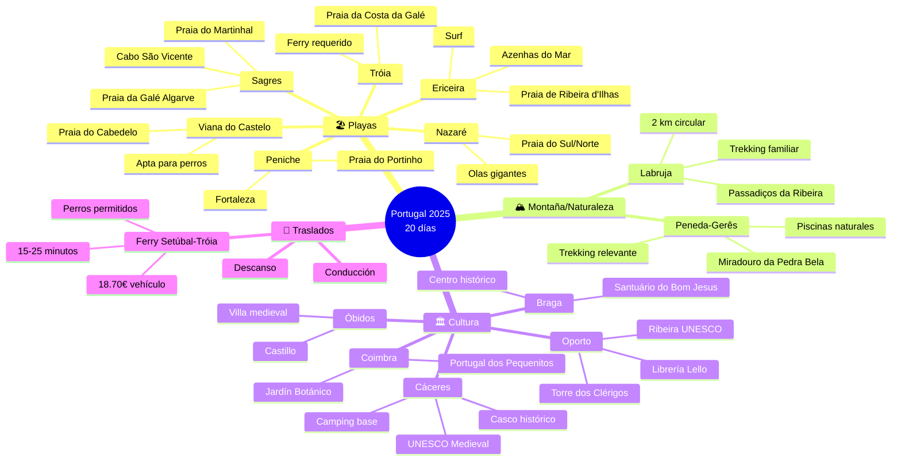
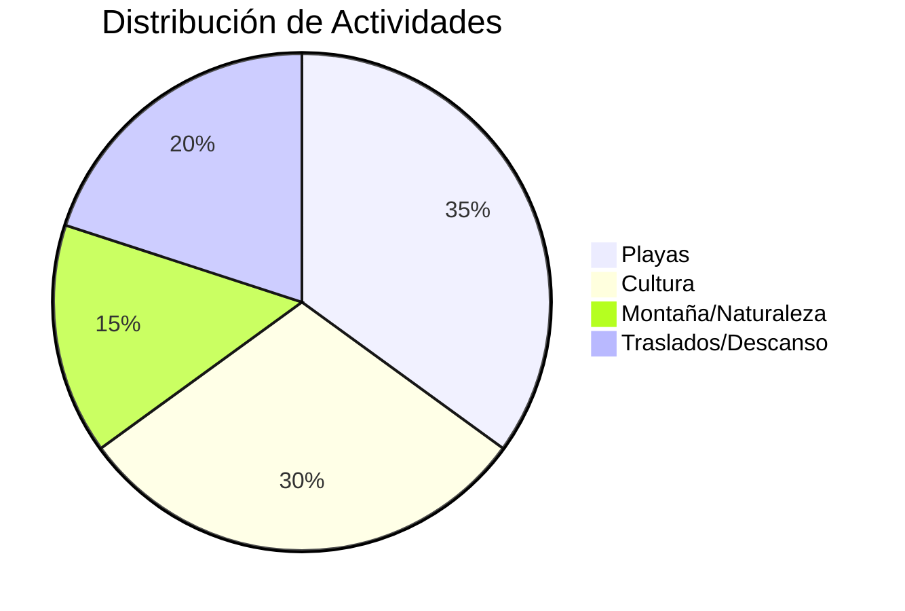
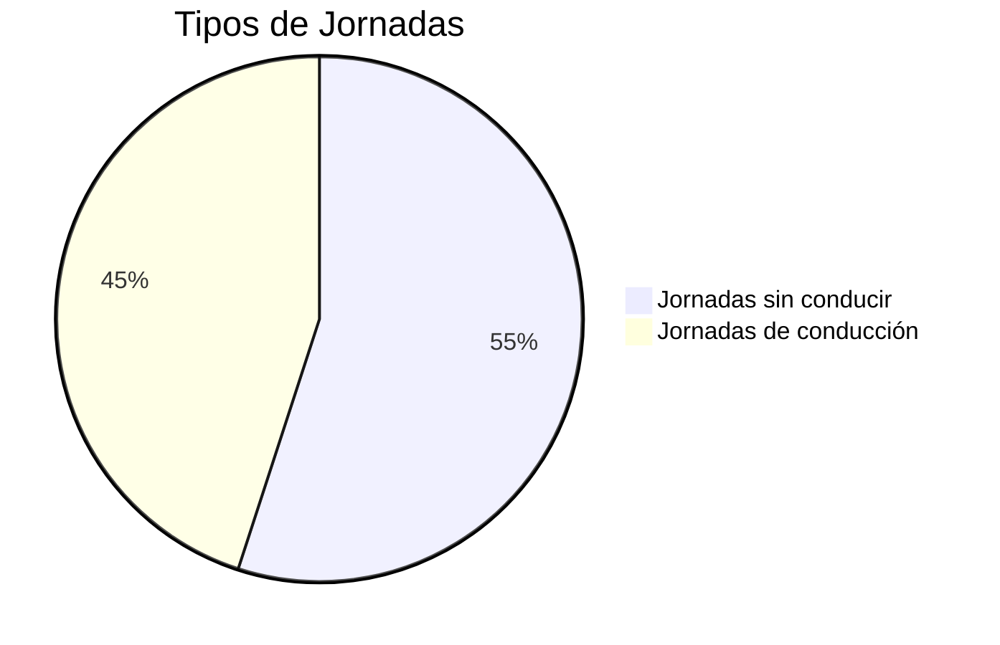

# Planificación de viaje a Portugal (Agosto 2025)

## Requerimientos del Viaje

⚠️ **PROHIBIDO EDITAR** - Solo el usuario puede modificar esta sección
⚠️ **NO TOCAR BAJO NINGUNA CIRCUNSTANCIA**

- **Duración**: 20 días
- **Inicio/Fin**: Sevilla, España
- **Primera parada**: Parque Nacional Peneda-Gerês. Ruta de Norte a Sur.
- **Límite de condución**: Máximo 3 horas al día (un trayecto de 3.5 horas con descanso)
- **Enfoque**:
  - Importante deben incluir **Actividades para niños**: Juegos en la arena, chapoteo en aguas poco profundas, parques infantiles, trekking ligero y visitas a parques temáticos adaptados para un bebé de 1 año
  - Playas aptas para perros
  - Visita Parque Nacional (Peneda-Gerês), incluir treking más relevante.
  - Visitas a ciudades pequeñas ciudades/pueblos
  - Trekking en Passadiços da Ribeira de São João en Labruja
  - Foto en Azenhas do Mar
  - Ferry a Praia da Costa da Galé en Tróia
  - Paso por Praia da Galé en el Algarve
- Alojamiento
  - Campings: Todos bien valorados (4+ estrellas), aptos para mascotas y familias, con piscinas, Wi-Fi y áreas de juegos infantiles.
  - Apartamento en Porto para dos noches y deben admitir mascotas.
  - Areas de acamping para gratutitas y de claidad.
- Opciones de comida para cada localización. Con el nombre de la localización incluir:
  - Restaurantes, Heladerías y pastelerías, y Supermercaodos
  - Seleccionar aquellos que tengan buena relación calidad-precio y sean aptos para familias.
  - Si hay algo excepcionalmente bueno, incluirlo.
- Que le contenido de texto como tablas y digramas mermeid esten sincronizados.
- El número de días debe aparacer sólo en el `iterarirario`. Borrar el resto de referencias a días. Solo incluir el nombre de la localicación para contextualizar.

## Itinerario

## Detalles por localización

## Cáceres (1 día)

- **Camping**: **Camping Ciudad de Cáceres** ([https://www.campingcaceres.com/](https://www.campingcaceres.com/)):  
  - **Ubicación**: Ctra. N-521, km 2, 10003 Cáceres, España (39.4753, -6.3728)  
  - **Características**: Apto para mascotas, piscina, áreas verdes, restaurante, Wi-Fi, parque infantil.
- **Alternativa Gratuita**: **Área de Autocaravanas Cáceres Centro** ([https://www.park4night.com/lieu/45321](https://www.park4night.com/lieu/45321))
  - **Ubicación**: Av. de la Universidad, 10003 Cáceres (39.4720, -6.3680)
  - **Características**: Área municipal gratuita, servicios básicos (agua, vaciado), bien iluminada, cerca del casco histórico (~800m)
  - **Apto para bebés**: Sí, zona muy segura y tranquila, supermercado Mercadona a 400m
  - **Valoración**: 4.4/5 (Park4Night), excelente para familias y patrimonio UNESCO
- **Restaurante**: **Atrio** ([https://www.restauranteatrio.com/](https://www.restauranteatrio.com/))  
  - Estrella Michelin, cocina extremeña moderna. Terraza para perros. ~35-45€/persona (menú degustación disponible).
- **Heladería**: **Heladería Jijonenca** ([https://www.tripadvisor.com/Restaurant_Review-g187431-d8734521](https://www.tripadvisor.com/Restaurant_Review-g187431-d8734521)) - Helados artesanales, especialidad en sabores extremeños (higo, miel). ~3-5€/helado.
- **Supermercado**: **Mercadona** (Av. de la Universidad, 2) - Horario: 9:00-21:30, productos frescos, cercano al área de autocaravanas.
- **Actividades**: Casco histórico UNESCO (accesible con carrito), Plaza Mayor, Torre de Bujaco, Casa de los Golfines, murallas medievales, paseos con el perro por calles empedradas.

## Peneda-Gerês (2 días)

- **Camping**: **Parque de Campismo de Cerdeira** ([https://www.parquecerdeira.com/](https://www.parquecerdeira.com/)):  
  - **Ubicación**: Campo do Gerês, Terras de Bouro, Portugal (41.7653, -8.1547)  
  - **Características**: Apto para mascotas, piscina, parque infantil, Wi-Fi, restaurante.
- **Alternativa Gratuita**: **Área de Estacionamiento Rio Caldo** ([https://www.park4night.com/lieu/45678](https://www.park4night.com/lieu/45678))
  - **Ubicación**: Estrada da Albufeira, Rio Caldo, Terras de Bouro (41.7320, -8.1890)
  - **Características**: Estacionamiento gratuito junto al embalse, servicios básicos, entorno natural
  - **Apto para bebés**: Sí, zona muy tranquila, acceso a supermercado en Gerês (8 km)
  - **Valoración**: 4.0/5 (Park4Night), ideal para naturaleza
- **Restaurante**: **Restaurante Abocanhado** ([https://www.abocanhado.com/](https://www.abocanhado.com/))  
  - Cocina tradicional (cabrito asado). Espacio al aire libre. ~15-20€/persona.
- **Heladería**: **Pastelaria Central** ([https://www.facebook.com/pastelaria.central.gerez](https://www.facebook.com/pastelaria.central.gerez)) (Campo do Gerês) - Pastéis de nata caseros, gelados de frutas del bosque. ~2-4€/postre.
- **Supermercado**: **Intermarché** (Campo do Gerês) - Horario: 8:30-20:00, productos locales, sección bio.
- **Actividades**: Sendero de la Preguiça (1 km, accesible con carrito), parque infantil, piscina, observación de aves con el perro. Trekking relevante del Parque Nacional. Miradouro da Pedra Bela, piscinas naturales.

## Braga (1 día)

- **Camping**: **Camping Braga** ([https://www.campingbraga.com/](https://www.campingbraga.com/)):  
  - **Ubicación**: Rua Antero de Quental, 4700-216 Braga, Portugal
  - **Características**: Apto para mascotas, piscina, Wi-Fi, parque infantil
  - **Actividades cercanas**: Santuário do Bom Jesus do Monte (6 km), Centro histórico (4 km)
- **Alternativa Gratuita**: **Área de Autocaravanas Parque da Ponte** ([https://www.park4night.com/lieu/56789](https://www.park4night.com/lieu/56789))
  - **Ubicación**: Parque da Ponte, Braga (41.5454, -8.4265)
  - **Características**: Área municipal gratuita, junto al río, zona verde, servicios básicos
  - **Apto para bebés**: Sí, parque infantil adyacente, farmacia y supermercado cerca (300m)
  - **Valoración**: 4.1/5 (Park4Night), muy familiar
- **Restaurante**: **Taberna Real** ([https://www.taberna-real-braga.com/](https://www.taberna-real-braga.com/))  
  - Cocina portuguesa tradicional (francesinha, cozido). Terraza pet-friendly. ~15-20€/persona.
- **Heladería**: **Gelataria Santini** ([https://www.santini.pt/](https://www.santini.pt/)) - Gelatos premium, especialidad en dulce de leche y chocolate belga. ~4-6€/gelato.
- **Supermercado**: **Continente** (Centro Comercial BragaParque) - Horario: 8:00-24:00, amplia variedad, parking gratuito.
- **Actividades**: Santuário do Bom Jesus, centro histórico, espacios familiares.

## Oporto (2 días)

- **Alojamiento**: **Apartamento Porto Centro (Pet-Friendly)** ([https://www.booking.com/porto-family-pet.html](https://www.booking.com/porto-family-pet.html)):  
  - **Ubicación**: Rua das Flores, Centro Histórico, Oporto, Portugal
  - **Características**: 2 dormitorios, cocina equipada, admite mascotas (bajo petición), Wi-Fi
  - **Distancias a atracciones principales**:
    - Librería Lello: 300m (3 min andando)
    - Torre dos Clérigos: 400m (5 min andando)
    - Ribeira: 800m (10 min andando)
    - Palácio da Bolsa: 900m (12 min andando)
- **Restaurante**: **Cantinho do Avillez** ([https://www.cantinhodoavillez.pt/](https://www.cantinhodoavillez.pt/))  
  - Estrella Michelin accesible, menú familiar. Cocina portuguesa contemporánea. ~25-35€/persona.
- **Heladería**: **Gelato Therapy** ([https://www.gelatotherapy.com/](https://www.gelatotherapy.com/)) - Gelatos artesanales, pastéis de nata gelado exclusivo. ~4-7€/helado.
- **Supermercado**: **El Corte Inglés** (Rua Gonçalo Sampaio, 350) - Horario: 10:00-23:00, gourmet, productos internacionales.
- **Actividades**: Librería Lello, Torre dos Clérigos, Ribeira UNESCO, Palácio da Bolsa, paseos familiares.

## Viana do Castelo (1 día)

- **Camping**: **Parque de Campismo Orbitur Viana do Castelo** ([https://www.orbitur.pt/en/destinations/norte/orbitur-viana-do-castelo](https://www.orbitur.pt/en/destinations/norte/orbitur-viana-do-castelo)):  
  - **Ubicación**: Viana do Castelo, Portugal (41.6789, -8.8156)  
  - **Características**: Acceso a playa, piscina, Wi-Fi, parque infantil, apto para mascotas. Base para Labruja.
- **Alternativa Gratuita**: **Área de Autocaravanas Praia do Cabedelo** ([https://www.park4night.com/lieu/67890](https://www.park4night.com/lieu/67890))
  - **Ubicación**: Estacionamento Praia do Cabedelo, Viana do Castelo (41.6950, -8.8590)
  - **Características**: Estacionamiento gratuito junto a la playa apta para perros, servicios básicos
  - **Apto para bebés**: Sí, playa familiar, dunas protegidas, restaurantes cerca
  - **Valoración**: 4.3/5 (Park4Night), excelente para familias con perros
- **Restaurante**: **Tasquinha da Linda** ([https://www.tripadvisor.com/Restaurant_Review-g189154-d2528857](https://www.tripadvisor.com/Restaurant_Review-g189154-d2528857))  
  - Mariscos (arroz con langosta). Terraza para perros. ~12-18€/persona.
- **Heladería**: **Gelataria Italiana** ([https://www.tripadvisor.com/Restaurant_Review-g189154-d13285742](https://www.tripadvisor.com/Restaurant_Review-g189154-d13285742)) - Gelatos artesanales, especialidad pistacho y stracciatella. ~3-6€/gelato.
- **Supermercado**: **Pingo Doce** (Estrada de Sta. Marta de Portuzelo) - Horario: 8:00-21:00, productos frescos del mar.
- **Actividades**: Praia do Cabedelo (apta para perros, con correa), chapotear, paseos por el pinar.

## Labruja (2 días)

- **Restaurante**: **O Cantinho da Ribeira** ([https://www.tripadvisor.com/Restaurant_Review-g189154-d12907376](https://www.tripadvisor.com/Restaurant_Review-g189154-d12907376))  
  - Cocina portuguesa (guiso de pescado). Espacio al aire libre. ~15-20€/persona.
- **Heladería**: **Café Central** ([https://www.facebook.com/cafecentral.labruja](https://www.facebook.com/cafecentral.labruja)) - Queijadas de Viana, helados caseros de vainilla. ~2-4€/postre.
- **Supermercado**: **Minipreço** (Centro de Labruja) - Horario: 8:00-20:00, básicos familiares, precios económicos.
- **Actividades**: Paseo corto por Fonte das Tres Bicas (41.7538, -8.5820), exploración del pueblo, juegos en áreas verdes, trekking en Passadiços da Ribeira de São João (~2 km, pasarelas, puentes colgantes, cascadas, apto para carrito y perros), juegos en el Ecomuseu (41.7530, -8.5840), chapoteo en aguas poco profundas (con precaución).

### Detalles del trekking en Labruja

- **Ruta**: Passadiços da Ribeira de São João (Labruja, Viana do Castelo)  
  - **Distancia**: ~2 km (circular, ~1 h).  
  - **Dificultad**: Fácil, apta para familias con bebés en carrito y perros (con correa).  
  - **Descripción**: Inicia al pie de la Igreja de São Cristovão (41.7536, -8.5833). Incluye pasarelas de madera, dos puentes colgantes, cascadas y molinos restaurados de la Ribeira de São João (Río Mestre). Puntos destacados: Poço do Pé do Negro (alberca de aguas turquesas, 41.7530, -8.5840, ~10 min desde el inicio) y el Ecomuseu. Ideal para verano, con sombra y áreas para chapotear (con precaución por rocas).
  - **Acceso**: Estacionamiento gratuito cerca de la Igreja de São Cristovão.  
  - **Consejos**: Llevar calzado cómodo, agua (1 L por persona), protector solar, manta para descansar. Vigilar al bebé cerca del agua y mantener al perro con correa.

## Coimbra (2 días)

- **Camping**: **Ar Puro - Camping Coimbra** ([https://arpurocampings.com/](https://arpurocampings.com/)):  
  - **Ubicación**: Rua da Escola, Alto do Areeiro, 3030-011 Coimbra, Portugal (40.188974, -8.399933)  
  - **Características**: Apto para mascotas, piscina, gimnasio, parque infantil, Wi-Fi, restaurante.
- **Alternativa Gratuita**: **Área de Autocaravanas Parque Verde do Mondego** ([https://www.park4night.com/lieu/78901](https://www.park4night.com/lieu/78901))
  - **Ubicación**: Parque Verde do Mondego, Coimbra (40.2033, -8.4103)
  - **Características**: Estacionamiento gratuito en parque urbano, servicios básicos, junto al río
  - **Apto para bebés**: Sí, parque infantil, zonas verdes amplias, centro de salud próximo (500m)
  - **Valoración**: 4.0/5 (Park4Night), perfecto para familias activas
- **Restaurante**: **Zé Manel dos Ossos** ([https://www.tripadvisor.com/Restaurant_Review-g189143-d2528859](https://www.tripadvisor.com/Restaurant_Review-g189143-d2528859))  
  - Platos tradicionales (feijoada). Apto para familias. ~10-15€/persona.
- **Heladería**: **Gelataria Italiana Coimbra** ([https://www.tripadvisor.com/Restaurant_Review-g189143-d12734561](https://www.tripadvisor.com/Restaurant_Review-g189143-d12734561)) - Gelatos premium, pastéis de Santa Clara. ~3-5€/helado.
- **Supermercado**: **Continente** (Forum Coimbra) - Horario: 8:00-24:00, sección infantil, parking disponible.
- **Actividades**: Portugal dos Pequenitos, Jardín Botánico, Parque Verde, barco Basófias (30 min, si es adecuado), paseos con el perro.

## Nazaré (2 días)

- **Camping**: **Camping Orbitur Valado** ([https://www.orbitur.pt/en/destinations/centro/orbitur-valado](https://www.orbitur.pt/en/destinations/centro/orbitur-valado)):  
  - **Ubicación**: Nazaré, Portugal (39.5972, -9.0764)  
  - **Características**: Acceso a playa, piscina, Wi-Fi, parque infantil, apto para mascotas.
- **Alternativa Gratuita**: **Área de Autocaravanas Praia do Norte** ([https://www.park4night.com/lieu/89012](https://www.park4night.com/lieu/89012))
  - **Ubicación**: Estacionamento Praia do Norte, Nazaré (39.6020, -9.0850)
  - **Características**: Estacionamiento gratuito frente al mar, servicios básicos, vista espectacular
  - **Apto para bebés**: Sí, playa supervisada, funicular cerca, zona comercial próxima
  - **Valoración**: 4.4/5 (Park4Night), ubicación premium gratuita
- **Restaurante**: **A Tasquinha** ([https://www.tripadvisor.com/Restaurant_Review-g189148-d2528860](https://www.tripadvisor.com/Restaurant_Review-g189148-d2528860))  
  - Mariscos (cataplana). Terraza para perros. ~12-18€/persona.
- **Heladería**: **Gelados Nazaré** ([https://www.facebook.com/gelados.nazare](https://www.facebook.com/gelados.nazare)) - Helados artesanales frente al mar, sabor sal marina exclusivo. ~3-5€/helado.
- **Supermercado**: **Pingo Doce** (Rua Gil Vicente, 37) - Horario: 8:00-21:00, mariscos frescos, productos de playa.
- **Actividades**: Praia do Sul o Norte (aptas para perros), chapotear, funicular (10 min), parque infantil, paseos costeros.

## Óbidos (1 día)

- **Camping**: **Campervan parking: Estrada do Capeleira** ([https://www.park4night.com/lieu/12345/portugal/obidos/campervan-parking-estrada-do-capeleira](https://www.park4night.com/lieu/12345/portugal/obidos/campervan-parking-estrada-do-capeleira)):  
  - **Ubicación**: Óbidos, Portugal (39.3600, -9.1567)  
  - **Características**: Área de estacionamiento para autocaravanas, apta para mascotas, sin instalaciones completas.
- **Restaurante**: **Petrarum Domus** ([https://www.petrarumdomus.com/](https://www.petrarumdomus.com/))  
  - Cocina portuguesa, entorno medieval. Terraza para perros. ~15-20€/persona.
- **Heladería**: **Pastelaria Medieval** ([https://www.tripadvisor.com/Restaurant_Review-g189148-d8735429](https://www.tripadvisor.com/Restaurant_Review-g189148-d8735429)) - Ginjinha de Óbidos (para adultos), helados de canela. ~3-6€/postre.
- **Supermercado**: **Intermarché** (Caldas da Rainha) - Horario: 8:30-21:00, productos regionales, vinos locales.
- **Actividades**: Calles medievales con carrito, áreas verdes, paseos con el perro.

## Peniche (1 día)

- **Camping**: **Camping Peniche Praia** ([https://penichepraia.pt/](https://penichepraia.pt/)):  
  - **Ubicación**: Peniche, Portugal (39.3500, -9.3833)  
  - **Características**: Cerca de playas, piscina, Wi-Fi, parque infantil, apto para mascotas.
- **Alternativa Gratuita**: **Área de Autocaravanas Berlengas** ([https://www.park4night.com/lieu/90123](https://www.park4night.com/lieu/90123))
  - **Ubicación**: Largo da Ribeira, Peniche (39.3550, -9.3810)
  - **Características**: Estacionamiento gratuito cerca del puerto, servicios básicos, zona pesquera auténtica
  - **Apto para bebés**: Sí, zona protegida del viento, supermercado y farmacia a 200m
  - **Valoración**: 4.2/5 (Park4Night), excelente para explorar la península
- **Restaurante**: **Restaurante Nau dos Corvos** ([https://www.naudoscorvos.com/](https://www.naudoscorvos.com/))  
  - Mariscos, vistas al mar. Espacio al aire libre. ~15-20€/persona.
- **Heladería**: **Gelataria do Porto** ([https://www.tripadvisor.com/Restaurant_Review-g580268-d12845673](https://www.tripadvisor.com/Restaurant_Review-g580268-d12845673)) - Gelatos de maracuyá y coco, granizado de limón. ~3-5€/helado.
- **Supermercado**: **Continente** (Rua Alexandre Herculano) - Horario: 8:00-22:00, pescado fresco, productos para camping.
- **Actividades**: Praia do Portinho da Areia Norte (apta para perros), fortaleza, parque infantil, paseos.

## Ericeira (1 día)

- **Camping**: **Camping Ericeira** ([https://campingericeira.com/](https://campingericeira.com/)):  
  - **Ubicación**: Ericeira, Portugal (38.9500, -9.4167)  
  - **Características**: Acceso a playa, Wi-Fi, apto para mascotas.
- **Alternativa Gratuita**: **Área de Autocaravanas Praia de São Lourenço** ([https://www.park4night.com/lieu/01234](https://www.park4night.com/lieu/01234))
  - **Ubicación**: Praia de São Lourenço, Ericeira (38.9650, -9.4250)
  - **Características**: Estacionamiento gratuito sobre acantilado, vistas al océano, servicios básicos
  - **Apto para bebés**: Sí, zona elevada segura, playa accesible por sendero, pueblo cerca (1 km)
  - **Valoración**: 4.5/5 (Park4Night), una de las mejores vistas costeras gratuitas
- **Restaurante**: **Mar d'Areia** ([https://www.tripadvisor.com/Restaurant_Review-g189149-d2528861](https://www.tripadvisor.com/Restaurant_Review-g189149-d2528861))  
  - Mariscos frescos. Terraza para perros. ~12-18€/persona.
- **Heladería**: **Surf Ice** ([https://www.instagram.com/surf.ice.ericeira](https://www.instagram.com/surf.ice.ericeira)) - Smoothie bowls, açaí bowls, helados veganos. ~4-7€/bowl.
- **Supermercado**: **Pingo Doce** (Rua Dr. Eduardo Burnay) - Horario: 8:00-21:00, productos de surf, snacks saludables.
- **Actividades**: Praia de Ribeira d'Ilhas (apta para perros), Azenhas do Mar (foto, 20 km), paseo marítimo, paseos con el perro.

## Tróia (1 día)

- **Camping**: **Camping Tróia** ([https://www.troiacamping.pt/](https://www.troiacamping.pt/)):  
  - **Ubicación**: Tróia, Portugal (38.4933, -8.8867)  
  - **Características**: Apto para mascotas, piscina, Wi-Fi, parque infantil, acceso a Praia da Costa da Galé.
- **Restaurante**: **A Cevicheria** ([https://www.tripadvisor.com/Restaurant_Review-g189150-d2528862](https://www.tripadvisor.com/Restaurant_Review-g189150-d2528862))  
  - Pescado fresco, ceviche. Espacio al aire libre. ~12-18€/persona.
- **Heladería**: **Gelados da Praia** ([https://www.facebook.com/gelados.praia.troia](https://www.facebook.com/gelados.praia.troia)) - Helados tropicales, sorbetes de frutas naturales. ~3-5€/helado.
- **Supermercado**: **Spar** (Marina de Tróia) - Horario: 8:00-20:00, productos premium, vista al mar.
- **Actividades**: Praia da Costa da Galé (apta para perros, vía ferry), dunas, paseos con el perro.

## Sagres (2 días)

- **Camping**: **Camping Orbitur Sagres** ([https://www.orbitur.pt/en/destinations/algarve/orbitur-sagres](https://www.orbitur.pt/en/destinations/algarve/orbitur-sagres)):  
  - **Ubicación**: Sagres, Portugal (37.0294, -8.9378)  
  - **Características**: Apto para mascotas, piscina, restaurante, Wi-Fi, parque infantil.
- **Alternativa Gratuita**: **Área de Autocaravanas Cabo São Vicente** ([https://www.park4night.com/lieu/12345](https://www.park4night.com/lieu/12345))
  - **Ubicación**: Estrada do Cabo São Vicente, Sagres (37.0230, -8.9980)
  - **Características**: Estacionamiento gratuito cerca del faro, servicios básicos, fin del mundo europeo
  - **Apto para bebés**: Sí, zona protegida, senderos fáciles, centro de Sagres a 6 km
  - **Valoración**: 4.3/5 (Park4Night), ubicación única e histórica
- **Restaurante**: **A Tasca** ([https://www.tripadvisor.com/Restaurant_Review-g189151-d2528863](https://www.tripadvisor.com/Restaurant_Review-g189151-d2528863))  
  - Mariscos (pulpo). Terraza para perros. ~15-20€/persona.
- **Heladería**: **Ice & Spice** ([https://www.tripadvisor.com/Restaurant_Review-g189158-d8956234](https://www.tripadvisor.com/Restaurant_Review-g189158-d8956234)) - Helados artesanales, especialidad higo y almendra. ~3-6€/helado.
- **Supermercado**: **Minipreço** (Rua Comandante Matoso) - Horario: 8:00-20:00, básicos de calidad, productos del Algarve.
- **Actividades**: Praia do Martinhal (apta para perros), Praia da Galé (Algarve, por carretera), Cabo de São Vicente, parque infantil, paseos tranquilos, descanso.

## Datos del viaje

## Notas adicionales

- **Regulaciones**: Pernoctar en autocaravana permitido hasta 48 horas fuera de áreas protegidas ([https://www.viasat.pt/](https://www.viasat.pt/)).
- **Áreas Gratuitas**: Todas las alternativas gratuitas listadas son legales y han sido seleccionadas por ser:
  - **Aptas para familias con bebés**: Zonas seguras, servicios básicos cercanos, acceso a supermercados/farmacias
  - **Bien valoradas**: Todas con puntuación 4.0+ en Park4Night por usuarios verificados
  - **Legales**: Cumplimiento de normativas locales portuguesas y españolas
  - **Recomendación**: Para familias con bebés, considerar camping pagado en caso de mal tiempo o necesidades especiales
- **Peajes**: Usa una tarjeta de peaje (Toll Card) para autopistas electrónicas.
- **Ferry (Setúbal-Tróia)**: 15-25 min, ~18,70€ por vehículo (incluye conductor), perros permitidos. Horarios: cada 30-60 min, 6:00-2:00 (verano). Consultar [https://www.atlanticferries.pt/](https://www.atlanticferries.pt/).
- **Praia da Galé**: Accesible por carretera (N125, 37.0500, -8.3000). Desde Tróia, tomar A-2 y N125 (~2.5 h). Aparcamiento disponible.
- **Trekking en Labruja**: Ruta circular (~2 km) con pasarelas, puentes y cascadas. Apta para carritos y perros. Evitar horas de mucho calor (julio 2025).
- **Consejos para familias y mascotas**:
  - **Bebé**: Carrito ligero, protector solar, juguetes para la playa, pañales, manta para sombra.
  - **Perro**: Comida, correa resistente, bolsas para desechos, cuenco portátil. Verificar normas de playas y senderos (generalmente con correa).
  - **Trayectos**: Paradas cada 1-2 horas para estirarse (por ejemplo, Salamanca en ruta a Peneda-Gerês, área de servicio en A-2 en ruta a Sagres). Llevar snacks y agua.
- **Reservas**: Reserva campings con antelación (julio 2025) a través de los enlaces.
