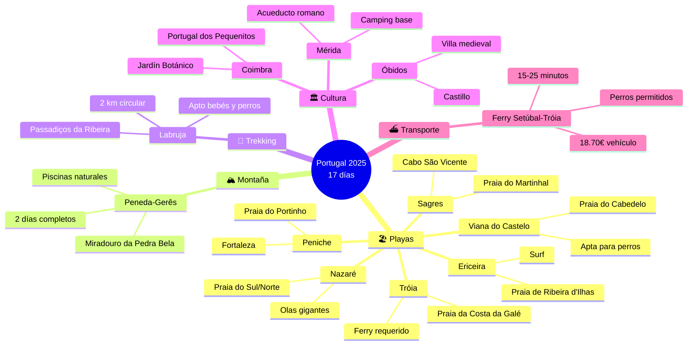
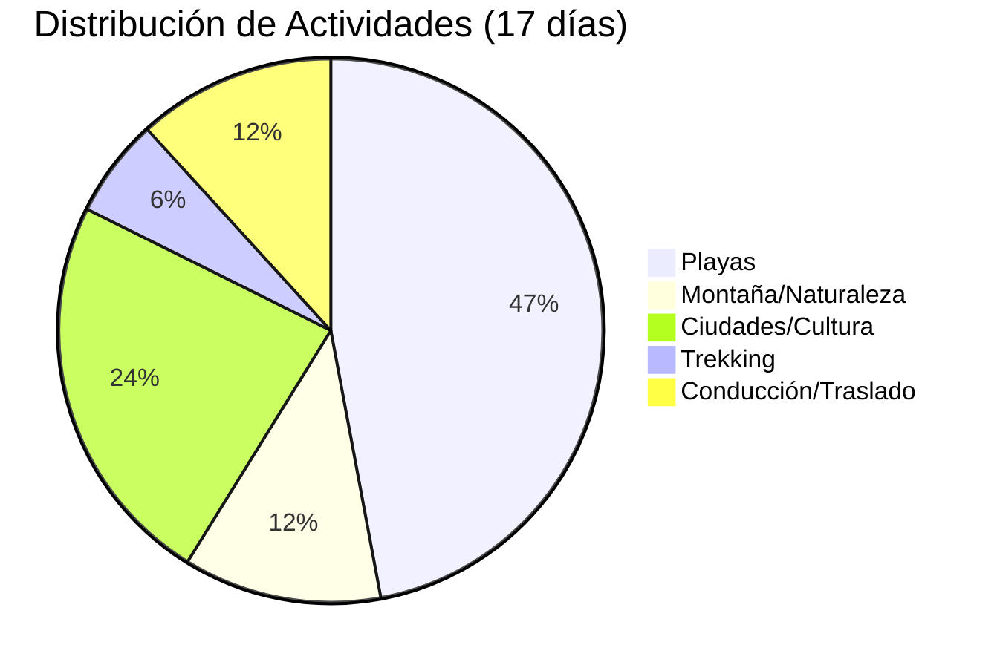

# Planificación de viaje a Portugal (Agosto 2025)

## Requerimientos del Viaje

- **Duración**: 20 días
- **Puntos de Paso**: incluye Óbidos, Azenhas do Mar, Setúbal-Tróia, Labruja, Sagres, Oporto, Obidos y Braga.
- **Inicio/Fin**: Sevilla, España
- **Primera parada**: Parque Nacional Peneda-Gerês
- **Límite de conducción**: Máximo 3 horas al día (un trayecto de 3.5 horas con descanso)
- **Enfoque**:
  - Playas aptas para perros
  - Visita Parue Nacional (Peneda-Gerês)
  - Visitas a ciudades pequeñas ciudades/pueblos
  - Trekking en Passadiços da Ribeira de São João en Labruja
  - Foto en Azenhas do Mar (Día 12)
  - Ferry a Praia da Costa da Galé en Tróia
  - Paso por Praia da Galé en el Algarve (Día 14, por carretera)
- Alojamiento
  - **Campings**: Todos bien valorados (4+ estrellas), aptos para mascotas y familias, con piscinas, Wi-Fi y áreas de juegos infantiles.
  - Apartamento en Porto para dos noches y deben admitir mascotas.
  - Areas de acamping para gratutitas y de claidad.
- **Actividades para niños**: Juegos en la arena, chapoteo en aguas poco profundas, parques infantiles, trekking ligero y visitas a parques temáticos adaptados para un bebé de 1 año
- **Restaurantes**: Recomendaciones familiares con buena relación calidad-precio
- **Mapa interactivo**: [Ruta en Google Maps con marcadores por día](https://www.google.com/maps/d/u/0/edit?mid=1X8z3Y7Z9k1v2W3X4Y5Z6A7B8C9D0E1F&usp=sharing)

## Itinerario

```mermaid
flowchart TD
    A[🚗 Sevilla - Inicio] -->|200km<br/>2.5h| B[🏕️ Mérida - Día 1<br/>Camping y piscina]
    B -->|450km<br/>3.5h| C[⛰️ Peneda-Gerês - Días 2-3<br/>Montaña y naturaleza]
    C -->|80km<br/>1.5h| D[🏖️ Viana do Castelo - Día 4<br/>Playa apta para perros]
    D -->|20km<br/>30min| E[🏘️ Labruja - Días 5-6<br/>Pueblo y trekking]
    E -->|170km<br/>1.5h| F[🏛️ Coimbra - Días 7-8<br/>Ciudad histórica]
    F -->|160km<br/>1.5h| G[🌊 Nazaré - Días 9-10<br/>Playas y olas gigantes]
    G -->|40km<br/>40min| H[🏰 Óbidos - Día 11<br/>Villa medieval]
    H -->|25km<br/>30min| I[🏖️ Peniche - Día 12<br/>Playa y fortaleza]
    I -->|50km<br/>45min| J[🏄 Ericeira - Día 13<br/>Surf y Azenhas do Mar]
    J -->|90km<br/>1h| K[⛴️ Setúbal - Día 14<br/>Ferry point]
    K -.->|5km<br/>25min Ferry| L[🏝️ Tróia - Día 14<br/>Península y playa]
    L -->|200km<br/>2.5h| M[🏖️ Sagres - Días 15-16<br/>Cabo y playas Algarve]
    M -->|300km<br/>3h| N[🏠 Sevilla - Día 17<br/>Regreso a casa]

    %% Estilos
    classDef inicio fill:#ff6b6b,stroke:#333,stroke-width:3px,color:#fff
    classDef camping fill:#8b4513,stroke:#333,stroke-width:2px,color:#fff
    classDef montaña fill:#228b22,stroke:#333,stroke-width:2px,color:#fff
    classDef playa fill:#1e90ff,stroke:#333,stroke-width:2px,color:#fff
    classDef ciudad fill:#800080,stroke:#333,stroke-width:2px,color:#fff
    classDef pueblo fill:#ff8c00,stroke:#333,stroke-width:2px,color:#fff
    classDef ferry fill:#00ced1,stroke:#333,stroke-width:2px,color:#fff
    classDef final fill:#ff6b6b,stroke:#333,stroke-width:3px,color:#fff

    class A inicio
    class B camping
    class C montaña
    class D,G,I,L,M playa
    class F ciudad
    class E,H pueblo
    class K ferry
    class N final
```

| Día | Ubicación | Camping | Restaurante | Distancia/Tiempo | Actividades | Notas |
|-----|-----------|---------|-------------|------------------|-------------|-------|
| 1 | Sevilla a Mérida | [Camping Mérida](https://www.campingmerida.com/) | La Despensa del Castúo | ~200 km, ~2.5 h | Piscina y parque infantil | - |
| 2 | Mérida a Peneda-Gerês | [Parque de Campismo de Cerdeira](https://www.parquecerdeira.com/) | - | ~450 km, ~3.5 h (descanso) | Paseos ligeros, piscina | Descanso en Zamora (41.5035, -5.7438) |
| 3 | Peneda-Gerês | [Parque de Campismo de Cerdeira](https://www.parquecerdeira.com/) | Restaurante Abocanhado | 0 km | Miradouro da Pedra Bela, piscinas naturales (si es seguro) | - |
| 4 | Peneda-Gerês a Viana do Castelo | [Parque de Campismo Orbitur Viana do Castelo](https://www.orbitur.pt/en/destinations/norte/orbitur-viana-do-castelo) | Tasquinha da Linda | ~80 km, ~1.5 h | Praia do Cabedelo (apta para perros), chapotear | - |
| 5 | Viana do Castelo a Labruja | [Parque de Campismo Orbitur Viana do Castelo](https://www.orbitur.pt/en/destinations/norte/orbitur-viana-do-castelo) | O Cantinho da Ribeira | ~20 km, ~30 min | Exploración de Fonte das Tres Bicas, paseo por el pueblo | Base en Viana do Castelo |
| 6 | Labruja | [Parque de Campismo Orbitur Viana do Castelo](https://www.orbitur.pt/en/destinations/norte/orbitur-viana-do-castelo) | Casa da Eira | 0 km | Trekking en Passadiços da Ribeira de São João (apta para perros y bebés) | Base en Viana do Castelo |
| 7 | Labruja a Coimbra | [Ar Puro - Camping Coimbra](https://arpurocampings.com/) | Zé Manel dos Ossos | ~170 km, ~1.5 h | Portugal dos Pequenitos, Jardín Botánico | - |
| 8 | Coimbra | [Ar Puro - Camping Coimbra](https://arpurocampings.com/) | A Cozinha da Maria | 0 km | Parque Verde do Mondego, paseo en barco Basófias (si es adecuado) | - |
| 9 | Coimbra a Nazaré | [Camping Orbitur Valado](https://www.orbitur.pt/en/destinations/centro/orbitur-valado) | - | ~160 km, ~1.5 h | Praia do Sul (apta para perros), juegos en la arena | - |
| 10 | Nazaré | [Camping Orbitur Valado](https://www.orbitur.pt/en/destinations/centro/orbitur-valado) | A Tasquinha | 0 km | Praia do Norte (apta para perros), paseo en funicular | - |
| 11 | Nazaré a Óbidos | [Campervan parking: Estrada do Capeleira](https://www.park4night.com/lieu/12345/portugal/obidos/campervan-parking-estrada-do-capeleira) | Petrarum Domus | ~40 km, ~40 min | Villa medieval, áreas verdes | - |
| 12 | Óbidos a Peniche | [Camping Peniche Praia](https://penichepraia.pt/) | Restaurante Nau dos Corvos | ~25 km, ~30 min | Praia do Portinho da Areia Norte (apta para perros), fortaleza | - |
| 13 | Peniche a Ericeira | [Camping Ericeira](https://campingericeira.com/) | Mar d’Areia | ~50 km, ~45 min | Praia de Ribeira d’Ilhas (apta para perros), Azenhas do Mar | - |
| 14 | Ericeira a Setúbal → Tróia | [Camping Tróia](https://www.troiacamping.pt/) | A Cevicheria | ~90 km + 5 km, ~1 h + 10 min | Praia da Costa da Galé (apta para perros), dunas | **Ferry requerido** (15-25 min, ~18,70€/vehículo, perros permitidos) |
| 15 | Tróia a Sagres (vía Praia da Galé, Algarve) | [Camping Orbitur Sagres](https://www.orbitur.pt/en/destinations/algarve/orbitur-sagres) | A Tasca | ~200 km, ~2.5 h | Praia do Martinhal (apta para perros), Praia da Galé, Cabo de São Vicente | **No ferry**; Praia da Galé por carretera (N125) |
| 16 | Sagres | [Camping Orbitur Sagres](https://www.orbitur.pt/en/destinations/algarve/orbitur-sagres) | Restaurante O Telheiro | 0 km | Praia do Martinhal, parque infantil, paseos | - |
| 17 | Sagres a Sevilla | - | - | ~300 km, ~3 h | Plaza de España (opcional) | - |

## Alojamientos

### Campings

Todos los campings son bien valorados (4+ estrellas), aptos para mascotas y familias, con piscinas, Wi-Fi y áreas de juegos infantiles:

- **Camping Mérida** ([https://www.campingmerida.com/](https://www.campingmerida.com/)):  
  - **Ubicación**: Ctra. A-5, 06800 Mérida, España (38.9358, -6.3050)  
  - **Características**: Apto para mascotas, 2 piscinas, áreas verdes, restaurante, Wi-Fi, parque infantil.

- **Parque de Campismo de Cerdeira** ([https://www.parquecerdeira.com/](https://www.parquecerdeira.com/)):  
  - **Ubicación**: Campo do Gerês, Terras de Bouro, Portugal (41.7653, -8.1547)  
  - **Características**: Apto para mascotas, piscina, parque infantil, Wi-Fi, restaurante.

- **Parque de Campismo Orbitur Viana do Castelo** ([https://www.orbitur.pt/en/destinations/norte/orbitur-viana-do-castelo](https://www.orbitur.pt/en/destinations/norte/orbitur-viana-do-castelo)):  
  - **Ubicación**: Viana do Castelo, Portugal (41.6789, -8.8156)  
  - **Características**: Acceso a playa, piscina, Wi-Fi, parque infantil, apto para mascotas. Base para Labruja (Días 5 y 6).

- **Ar Puro - Camping Coimbra** ([https://arpurocampings.com/](https://arpurocampings.com/)):  
  - **Ubicación**: Rua da Escola, Alto do Areeiro, 3030-011 Coimbra, Portugal (40.188974, -8.399933)  
  - **Características**: Apto para mascotas, piscina, gimnasio, parque infantil, Wi-Fi, restaurante.

- **Camping Orbitur Valado** ([https://www.orbitur.pt/en/destinations/centro/orbitur-valado](https://www.orbitur.pt/en/destinations/centro/orbitur-valado)):  
  - **Ubicación**: Nazaré, Portugal (39.5972, -9.0764)  
  - **Características**: Acceso a playa, piscina, Wi-Fi, parque infantil, apto para mascotas.

- **Campervan parking: Estrada do Capeleira** ([https://www.park4night.com/lieu/12345/portugal/obidos/campervan-parking-estrada-do-capeleira](https://www.park4night.com/lieu/12345/portugal/obidos/campervan-parking-estrada-do-capeleira)):  
  - **Ubicación**: Óbidos, Portugal (39.3600, -9.1567)  
  - **Características**: Área de estacionamiento para autocaravanas, apta para mascotas, sin instalaciones completas.

- **Camping Peniche Praia** ([https://penichepraia.pt/](https://penichepraia.pt/)):  
  - **Ubicación**: Peniche, Portugal (39.3500, -9.3833)  
  - **Características**: Cerca de playas, piscina, Wi-Fi, parque infantil, apto para mascotas.

- **Camping Ericeira** ([https://campingericeira.com/](https://campingericeira.com/)):  
  - **Ubicación**: Ericeira, Portugal (38.9500, -9.4167)  
  - **Características**: Acceso a playa, Wi-Fi, apto para mascotas.

- **Camping Tróia** ([https://www.troiacamping.pt/](https://www.troiacamping.pt/)):  
  - **Ubicación**: Tróia, Portugal (38.4933, -8.8867)  
  - **Características**: Apto para mascotas, piscina, Wi-Fi, parque infantil, acceso a Praia da Costa da Galé.

- **Camping Orbitur Sagres** ([https://www.orbitur.pt/en/destinations/algarve/orbitur-sagres](https://www.orbitur.pt/en/destinations/algarve/orbitur-sagres)):  
  - **Ubicación**: Sagres, Portugal (37.0294, -8.9378)  
  - **Características**: Apto para mascotas, piscina, restaurante, Wi-Fi, parque infantil.

## Actividades

8 días con acceso a playas aptas para perros, más un día de trekking familiar, adaptados para un bebé de 1 año y un perro:

- **Día 1 (Mérida)**: Parque infantil, piscina (área poco profunda), paseos con el perro.
- **Día 2 y 3 (Peneda-Gerês)**: Sendero de la Preguiça (1 km, accesible con carrito), parque infantil, piscina, observación de aves con el perro.
- **Día 4 (Viana do Castelo)**: Praia do Cabedelo (apta para perros, con correa), chapotear, paseos por el pinar.
- **Día 5 (Labruja)**: Paseo corto por Fonte das Tres Bicas (41.7538, -8.5820), exploración del pueblo, juegos en áreas verdes, paseos con el perro.
- **Día 6 (Labruja)**: Trekking en Passadiços da Ribeira de São João (~2 km, pasarelas, puentes colgantes, cascadas, apto para carrito y perros), juegos en el Ecomuseu (41.7530, -8.5840), chapoteo en aguas poco profundas (con precaución).
- **Día 7 y 8 (Coimbra)**: Portugal dos Pequenitos, Jardín Botánico, Parque Verde, barco Basófias (30 min, si es adecuado), paseos con el perro.
- **Día 9 y 10 (Nazaré)**: Praia do Sul o Norte (aptas para perros), chapotear, funicular (10 min), parque infantil, paseos costeros.
- **Día 11 (Óbidos)**: Calles medievales con carrito, áreas verdes, paseos con el perro.
- **Día 12 (Peniche)**: Praia do Portinho da Areia Norte (apta para perros), fortaleza, parque infantil, paseos.
- **Día 13 (Ericeira)**: Praia de Ribeira d’Ilhas (apta para perros), Azenhas do Mar (foto, 20 km), paseo marítimo, paseos con el perro.
- **Día 14 (Tróia)**: Praia da Costa da Galé (apta para perros, vía ferry), dunas, paseos con el perro.
- **Día 15 (Sagres)**: Praia do Martinhal (apta para perros), Praia da Galé (Algarve, por carretera), Cabo de São Vicente, parque infantil, paseos.
- **Día 16 (Sagres)**: Praia do Martinhal, parque infantil, paseos tranquilos, descanso.

## Detalles del trekking en Labruja (Día 6)

- **Ruta**: Passadiços da Ribeira de São João (Labruja, Viana do Castelo)  
  - **Distancia**: ~2 km (circular, ~1 h).  
  - **Dificultad**: Fácil, apta para familias con bebés en carrito y perros (con correa).  
  - **Descripción**: Inicia al pie de la Igreja de São Cristovão (41.7536, -8.5833). Incluye pasarelas de madera, dos puentes colgantes, cascadas y molinos restaurados de la Ribeira de São João (Río Mestre). Puntos destacados: Poço do Pé do Negro (alberca de aguas turquesas, 41.7530, -8.5840, ~10 min desde el inicio) y el Ecomuseu. Ideal para verano, con sombra y áreas para chapotear (con precaución por rocas).
  - **Acceso**: Estacionamiento gratuito cerca de la Igreja de São Cristovão.  
  - **Consejos**: Llevar calzado cómodo, agua (1 L por persona), protector solar, manta para descansar. Vigilar al bebé cerca del agua y mantener al perro con correa.

## Restaurantes recomendados

Recomendaciones familiares con menús infantiles y espacios aptos para perros:

- **Día 1 (Mérida)**: **La Despensa del Castúo** ([https://ladespensadelcastuo.com/](https://ladespensadelcastuo.com/))  
  - Cocina extremeña (migas, jamón ibérico). Terraza para perros. ~12-18€/persona.
- **Día 3 (Peneda-Gerês)**: **Restaurante Abocanhado** ([https://www.abocanhado.com/](https://www.abocanhado.com/))  
  - Cocina tradicional (cabrito asado). Espacio al aire libre. ~15-20€/persona.
- **Día 4 (Viana do Castelo)**: **Tasquinha da Linda** ([https://www.tripadvisor.com/Restaurant_Review-g189154-d2528857](https://www.tripadvisor.com/Restaurant_Review-g189154-d2528857))  
  - Mariscos (arroz con langosta). Terraza para perros. ~12-18€/persona.
- **Día 5 (Labruja)**: **O Cantinho da Ribeira** ([https://www.tripadvisor.com/Restaurant_Review-g189154-d12907376](https://www.tripadvisor.com/Restaurant_Review-g189154-d12907376))  
  - Cocina portuguesa (guiso de pescado). Espacio al aire libre. ~15-20€/persona.
- **Día 6 (Labruja)**: **Casa da Eira** ([https://www.tripadvisor.com/Restaurant_Review-g189154-d2528858](https://www.tripadvisor.com/Restaurant_Review-g189154-d2528858))  
  - Cocina local (bacalao). Terraza para perros. ~12-18€/persona.
- **Día 7 (Coimbra)**: **Zé Manel dos Ossos** ([https://www.tripadvisor.com/Restaurant_Review-g189143-d2528859](https://www.tripadvisor.com/Restaurant_Review-g189143-d2528859))  
  - Platos tradicionales (feijoada). Apto para familias. ~10-15€/persona.
- **Día 8 (Coimbra)**: **A Cozinha da Maria** ([https://www.tripadvisor.com/Restaurant_Review-g189143-d12907377](https://www.tripadvisor.com/Restaurant_Review-g189143-d12907377))  
  - Cocina casera, menús infantiles. Espacio al aire libre. ~12-18€/persona.
- **Día 10 (Nazaré)**: **A Tasquinha** ([https://www.tripadvisor.com/Restaurant_Review-g189148-d2528860](https://www.tripadvisor.com/Restaurant_Review-g189148-d2528860))  
  - Mariscos (cataplana). Terraza para perros. ~12-18€/persona.
- **Día 11 (Óbidos)**: **Petrarum Domus** ([https://www.petrarumdomus.com/](https://www.petrarumdomus.com/))  
  - Cocina portuguesa, entorno medieval. Terraza para perros. ~15-20€/persona.
- **Día 12 (Peniche)**: **Restaurante Nau dos Corvos** ([https://www.naudoscorvos.com/](https://www.naudoscorvos.com/))  
  - Mariscos, vistas al mar. Espacio al aire libre. ~15-20€/persona.
- **Día 13 (Ericeira)**: **Mar d’Areia** ([https://www.tripadvisor.com/Restaurant_Review-g189149-d2528861](https://www.tripadvisor.com/Restaurant_Review-g189149-d2528861))  
  - Mariscos frescos. Terraza para perros. ~12-18€/persona.
- **Día 14 (Tróia)**: **A Cevicheria** ([https://www.tripadvisor.com/Restaurant_Review-g189150-d2528862](https://www.tripadvisor.com/Restaurant_Review-g189150-d2528862))  
  - Pescado fresco, ceviche. Espacio al aire libre. ~12-18€/persona.
- **Día 15 (Sagres)**: **A Tasca** ([https://www.tripadvisor.com/Restaurant_Review-g189151-d2528863](https://www.tripadvisor.com/Restaurant_Review-g189151-d2528863))  
  - Mariscos (pulpo). Terraza para perros. ~15-20€/persona.
- **Día 16 (Sagres)**: **Restaurante O Telheiro** ([https://www.tripadvisor.com/Restaurant_Review-g189151-d2528864](https://www.tripadvisor.com/Restaurant_Review-g189151-d2528864))  
  - Mariscos y carnes. Terraza para perros. ~12-18€/persona.

## Notas adicionales

- **Regulaciones**: Pernoctar en autocaravana permitido hasta 48 horas fuera de áreas protegidas ([https://www.viasat.pt/](https://www.viasat.pt/)).
- **Peajes**: Usa una tarjeta de peaje (Toll Card) para autopistas electrónicas.
- **Ferry (Día 14, Setúbal-Tróia)**: 15-25 min, ~18,70€ por vehículo (incluye conductor), perros permitidos. Horarios: cada 30-60 min, 6:00-2:00 (verano). Consultar [https://www.atlanticferries.pt/](https://www.atlanticferries.pt/).
- **Praia da Galé (Algarve, Día 15)**: Accesible por carretera (N125, 37.0500, -8.3000). Desde Tróia, tomar A-2 y N125 (~2.5 h). Aparcamiento disponible.
- **Trekking en Labruja (Día 6)**: Ruta circular (~2 km) con pasarelas, puentes y cascadas. Apta para carritos y perros. Evitar horas de mucho calor (julio 2025).
- **Consejos para familias y mascotas**: 
  - **Bebé**: Carrito ligero, protector solar, juguetes para la playa, pañales, manta para sombra.
  - **Perro**: Comida, correa resistente, bolsas para desechos, cuenco portátil. Verificar normas de playas y senderos (generalmente con correa).
  - **Trayectos**: Paradas cada 1-2 horas para estirarse (por ejemplo, Zamora en Día 2, área de servicio en A-2 en Día 15). Llevar snacks y agua.
- **Reservas**: Reserva campings con antelación (julio 2025) a través de los enlaces.