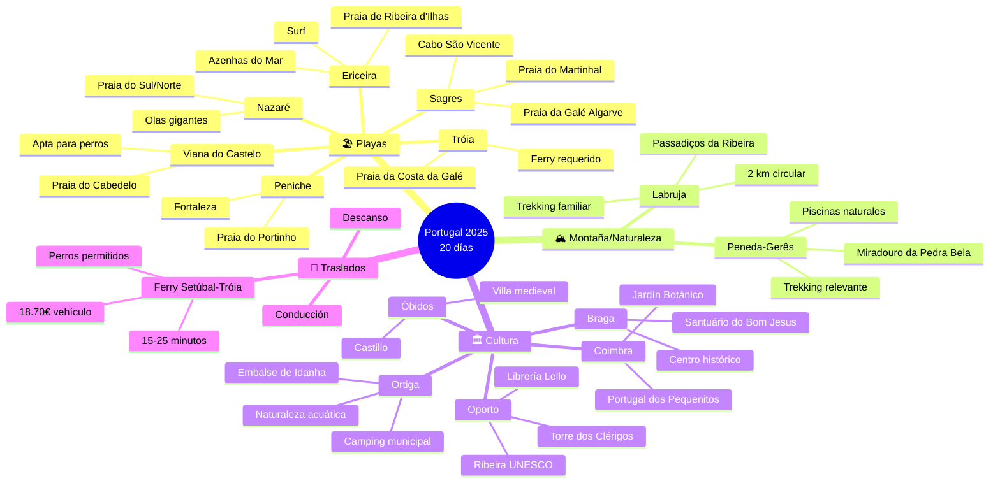
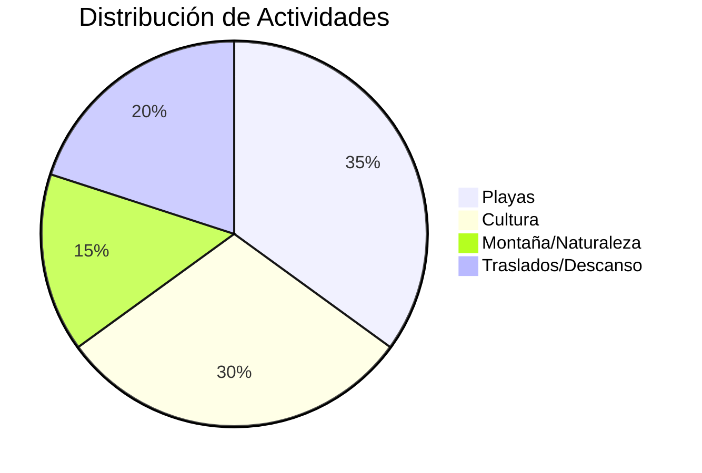
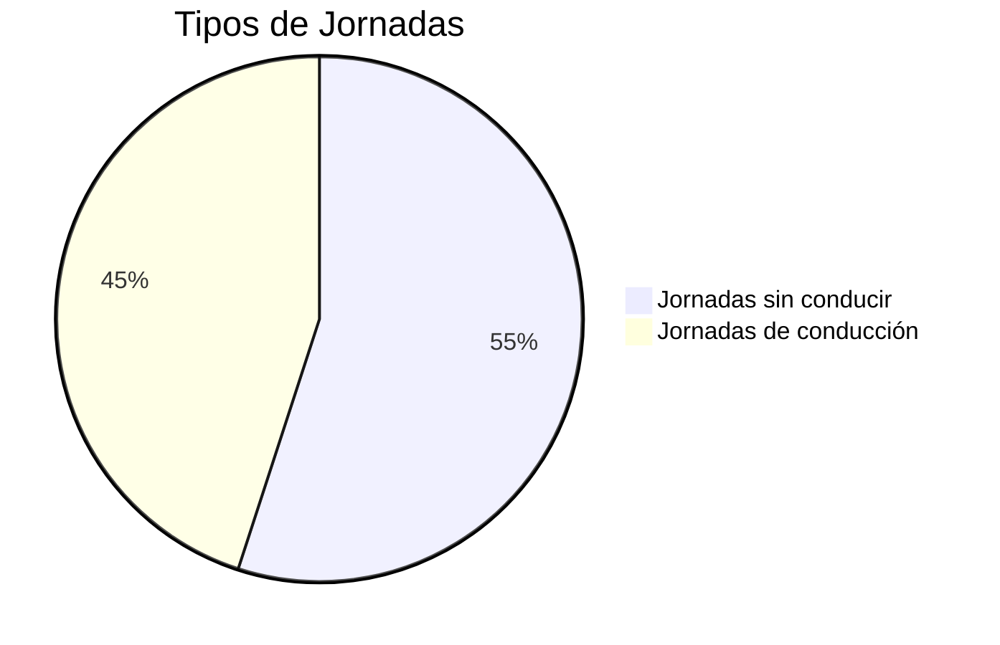

# Planificación de viaje a Portugal (Agosto 2025)

<!-- ====================================================================== -->
<!-- INSTRUCCIONES PARA GITHUB COPILOT: NO MODIFICAR LA SIGUIENTE SECCIÓN -->
<!-- ====================================================================== -->

## ⛔ REQUERIMIENTOS DEL VIAJE - SOLO LECTURA ⛔

> **🤖 INSTRUCCIONES PARA GITHUB COPILOT:**
> 
> - Esta sección es **INMUTABLE**
> - **NO** sugerir cambios, modificaciones o mejoras
> - **USAR SOLO** como referencia para generar contenido en otras secciones
> - Cualquier edición requiere autorización **EXPLÍCITA** del usuario
> - **RESPETAR** absolutamente todo el contenido entre estas marcas

### Especificaciones del viaje

- **Duración**: 20 días
- **Inicio/Fin**: Sevilla, España
- **Primera parada**: Parque Nacional Peneda-Gerês. Ruta de Norte a Sur.
- **Límite de condución**: Máximo 3 horas al día (un trayecto de 3.5 horas con descanso)

### Particularidades obligatorias

- Importante deben incluir **Actividades para niños**: Juegos en la arena, chapoteo en aguas poco profundas, parques infantiles, trekking ligero y visitas a parques temáticos adaptados para un bebé de 1 año
- Playas aptas para perros
- Visita Parque Nacional (Peneda-Gerês), incluir treking más relevante.
- Visitas a ciudades pequeñas ciudades/pueblos
- Trekking en Passadiços da Ribeira de São João en Labruja
- Foto en Azenhas do Mar
- Ferry a Praia da Costa da Galé en Tróia
- Paso por Praia da Galé en el Algarve

### Especificaciones de alojamiento

- Campings: Todos bien valorados (4+ estrellas), aptos para mascotas y familias, con piscinas, Wi-Fi y áreas de juegos infantiles.
- Apartamento en Porto para dos noches y deben admitir mascotas.
- Areas de acamping para gratutitas y de claidad.

### Opciones de comida requeridas

Para cada localización incluir:
- Restaurantes, Heladerías y pastelerías, y Supermercaodos
- Seleccionar aquellos que tengan buena relación calidad-precio y sean aptos para familias.
- Si hay algo excepcionalmente bueno, incluirlo.

### Reglas de formato y contenido

- Que le contenido de texto como tablas y digramas mermeid esten sincronizados.
- El número de días debe aparacer sólo en el `iterarirario`. Borrar el resto de referencias a días. Solo incluir el nombre de la localicación para contextualizar.
- Verificar que la información sea correcta, incluyendo coordenadas GPS, horarios de apertura y contacto de los lugares recomendados.

<!-- ====================================================================== -->
<!-- FIN SECCIÓN PROTEGIDA - COPILOT PUEDE EDITAR DESDE AQUÍ -->
<!-- ====================================================================== -->

## Itinerario

```mermaid
flowchart TD
    A[🚗 Sevilla - Inicio] -->|385km<br/>3h 30min<br/><a href='https://maps.google.com/maps?f=d&source=s_d&saddr=Sevilla,Spain&daddr=Ortiga,Portugal'>🗺️</a>| B[🏕️ Ortiga - Día 1<br/>Camping municipal, embalse]
    B -->|200km<br/>2h 15min<br/><a href='https://maps.google.com/maps?f=d&source=s_d&saddr=Ortiga,Portugal&daddr=Peneda-Gerês,Portugal'>🗺️</a>| C[⛰️ Peneda-Gerês - Días 2-3<br/>Montaña y naturaleza]
    C -->|70km<br/>1h<br/><a href='https://maps.google.com/maps?f=d&source=s_d&saddr=Peneda-Gerês,Portugal&daddr=Braga,Portugal'>🗺️</a>| D[🏕️ Braga - Día 4<br/>Camping, centro histórico]
    D -->|60km<br/>1h<br/><a href='https://maps.google.com/maps?f=d&source=s_d&saddr=Braga,Portugal&daddr=Porto,Portugal'>🗺️</a>| E[🏠 Oporto - Días 5-6<br/>Apartamento, UNESCO]
    E -->|90km<br/>1h 20min<br/><a href='https://maps.google.com/maps?f=d&source=s_d&saddr=Porto,Portugal&daddr=Viana+do+Castelo,Portugal'>🗺️</a>| F[🏖️ Viana do Castelo - Día 7<br/>Playa apta para perros]
    F -->|25km<br/>35min<br/><a href='https://maps.google.com/maps?f=d&source=s_d&saddr=Viana+do+Castelo,Portugal&daddr=Labruja,Portugal'>🗺️</a>| G[🏘️ Labruja - Días 8-9<br/>Pueblo y trekking]
    G -->|160km<br/>1h 50min<br/><a href='https://maps.google.com/maps?f=d&source=s_d&saddr=Labruja,Portugal&daddr=Coimbra,Portugal'>🗺️</a>| H[🏛️ Coimbra - Días 10-11<br/>Ciudad histórica]
    H -->|120km<br/>1h 25min<br/><a href='https://maps.google.com/maps?f=d&source=s_d&saddr=Coimbra,Portugal&daddr=Nazaré,Portugal'>🗺️</a>| I[🌊 Nazaré - Días 12-13<br/>Playas y olas gigantes]
    I -->|35km<br/>45min<br/><a href='https://maps.google.com/maps?f=d&source=s_d&saddr=Nazaré,Portugal&daddr=Óbidos,Portugal'>🗺️</a>| J[🏰 Óbidos - Día 14<br/>Villa medieval]
    J -->|20km<br/>25min<br/><a href='https://maps.google.com/maps?f=d&source=s_d&saddr=Óbidos,Portugal&daddr=Peniche,Portugal'>🗺️</a>| K[🏖️ Peniche - Día 15<br/>Playa y fortaleza]
    K -->|70km<br/>1h 10min<br/><a href='https://maps.google.com/maps?f=d&source=s_d&saddr=Peniche,Portugal&daddr=Ericeira,Portugal'>🗺️</a>| L[🏄 Ericeira - Día 16<br/>Surf y Azenhas do Mar]
    L -->|45km<br/>50min<br/><a href='https://maps.google.com/maps?f=d&source=s_d&saddr=Ericeira,Portugal&daddr=Setúbal,Portugal'>🗺️</a>| M[⛴️ Setúbal - Día 17<br/>Ferry point]
    M -.->|5km<br/>25min Ferry<br/><a href='https://maps.google.com/maps?f=d&source=s_d&saddr=Setúbal,Portugal&daddr=Tróia,Portugal'>🗺️</a>| N[🏝️ Tróia - Día 17<br/>Península y playa]
    N -->|220km<br/>2h 30min<br/><a href='https://maps.google.com/maps?f=d&source=s_d&saddr=Tróia,Portugal&daddr=Sagres,Portugal'>🗺️</a>| O[🏖️ Sagres - Días 18-19<br/>Cabo y playas Algarve]
    O -->|300km<br/>3h 15min<br/><a href='https://maps.google.com/maps?f=d&source=s_d&saddr=Sagres,Portugal&daddr=Sevilla,Spain'>🗺️</a>| P[🏠 Sevilla - Día 20<br/>Regreso a casa]

    %% Estilos
    classDef inicio fill:#ff6b6b,stroke:#333,stroke-width:3px,color:#fff
    classDef camping fill:#8b4513,stroke:#333,stroke-width:2px,color:#fff
    classDef montaña fill:#228b22,stroke:#333,stroke-width:2px,color:#fff
    classDef playa fill:#1e90ff,stroke:#333,stroke-width:2px,color:#fff
    classDef ciudad fill:#800080,stroke:#333,stroke-width:2px,color:#fff
    classDef pueblo fill:#ff8c00,stroke:#333,stroke-width:2px,color:#fff
    classDef ferry fill:#00ced1,stroke:#333,stroke-width:2px,color:#fff
    classDef apartamento fill:#ff9999,stroke:#333,stroke-width:3px,color:#fff
    classDef final fill:#ff6b6b,stroke:#333,stroke-width:3px,color:#fff

    class A inicio
    class B,D camping
    class C montaña
    class E apartamento
    class F,I,K,N,O playa
    class H ciudad
    class G,J pueblo
    class M ferry
    class P final
```

Ver Ruta Completa en [Google Maps](https://www.google.com/maps/dir/Seville/Ortiga,+Portugal/Campo+do+Ger%C3%AAs,+4840-030,+Portugal/Braga,+Portugal/Porto,+Portugal/Viana+do+Castelo,+Portugal/Coimbra,+Portugal/Nazar%C3%A9,+Portugal/%C3%93bidos,+Portugal/Peniche,+Portugal/Ericeira,+Portugal/Set%C3%BAbal,+Portugal/Praia+Tr%C3%B3ia+Mar,+Portugal/Sagres,+Portugal/Seville/@39.3578532,-10.3355031,785875m/data=!3m2!1e3!4b1!4m91!4m90!1m5!1m1!1s0xd126c1114be6291:0x34f018621cfe5648!2m2!1d-5.9844589!2d37.3890924!1m5!1m1!1s0xd18111383b7c2ed:0xde6ff22e89ae11f9!2m2!1d-8.0301544!2d39.4930613!1m5!1m1!1s0xd2519bb7e560803:0x44dee2910bc3e457!2m2!1d-8.193793!2d41.7585567!1m5!1m1!1s0xd24febc6cf5d867:0xbc5d054162d1e218!2m2!1d-8.426507!2d41.5454486!1m5!1m1!1s0xd2465abc4e153c1:0xa648d95640b114bc!2m2!1d-8.6291053!2d41.1579438!1m5!1m1!1s0xd25b7cef6e86a73:0xfe4d167e5dd21dfd!2m2!1d-8.8344101!2d41.6918275!1m5!1m1!1s0xd22f9144aacd16d:0x634564477b42a6b9!2m2!1d-8.4102573!2d40.2033145!1m5!1m1!1s0xd18a8232f6ad417:0x3d2d871af42106f!2m2!1d-9.0677509!2d39.6015562!1m5!1m1!1s0xd18b49eef1edec5:0x170a628ab34d3bb3!2m2!1d-9.1578614!2d39.3572399!1m5!1m1!1s0xd1f45c49805a145:0x26caf596a0956bf3!2m2!1d-9.387622!2d39.3603291!1m5!1m1!1s0xd1f270eadfd6f97:0x742c0c610c10aa4c!2m2!1d-9.4073004!2d38.9681277!1m5!1m1!1s0xd1942feab027435:0x9ff23f769bb5aa54!2m2!1d-8.8909328!2d38.5260437!1m5!1m1!1s0xd195d21a60c8309:0x469ad66dd8ce1939!2m2!1d-8.9076333!2d38.4863234!1m5!1m1!1s0xd1b4c17d26b1a2d:0x500ebbde490b750!2m2!1d-8.9405858!2d37.0168316!1m5!1m1!1s0xd126c1114be6291:0x34f018621cfe5648!2m2!1d-5.9844589!2d37.3890924?entry=ttu&g_ep=EgoyMDI1MDcwOS4wIKXMDSoASAFQAw%3D%3D).

## Detalles por localización

## Ortiga (1 día)

- **Camping**: **Parque de Campismo Municipal de Ortiga** ([Tel: +351 272 348 129](tel:+351272348129)):  
  - **Ubicación**: Estr. da Barragem, 6120-525 Ortiga, Portugal (39.8167, -7.4333)  
  - **Características**: Camping municipal junto al embalse de Idanha, apto para mascotas, piscina, restaurante, Wi-Fi, parque infantil, zona de pesca
- **Alternativa Gratuita**: **Área de Autocaravanas Embalse de Idanha**
  - **Ubicación**: Miradouro do Embalse, Ortiga (39.8200, -7.4300)
  - **Características**: Estacionamiento gratuito con vistas al embalse, servicios básicos, entorno natural tranquilo
  - **Apto para bebés**: Sí, zona muy segura y tranquila, supermercado en Vila Velha de Ródão (8 km)
  - **Info**: Consultar con Câmara Municipal Vila Velha de Ródão: +351 272 540 010
- **Restaurante**: **Adega do Embalse** ([Tel: +351 272 348 150](tel:+351272348150))  
  - Cocina regional portuguesa, especialidad en pescado del río. Terraza con vistas al embalse. ~12-18€/persona.
- **Heladería**: **Café Central de Vila Velha** (Vila Velha de Ródão) - Helados caseros, especialidad en gelado de figo. ~2-4€/helado.
- **Supermercado**: **Minipreço** (Vila Velha de Ródão) - Horario: 8:00-20:00, productos frescos, cercano al camping (8 km).
- **Actividades**: Paseo en barco por el embalse (si disponible), pesca deportiva, senderismo por el miradouro, parque infantil en el camping, chapoteo en aguas poco profundas del embalse (vigilado), paseos tranquilos con el perro por la zona del embalse.

## Peneda-Gerês (2 días)

- **Camping**: **Parque de Campismo de Cerdeira** ([https://www.parquecerdeira.com/](https://www.parquecerdeira.com/)):  
  - **Ubicación**: Campo do Gerês, Terras de Bouro, Portugal (41.7653, -8.1547)  
  - **Características**: Apto para mascotas, piscina, parque infantil, Wi-Fi, restaurante.
- **Alternativa Gratuita**: **Área de Estacionamiento Rio Caldo**
  - **Ubicación**: Estrada da Albufeira, Rio Caldo, Terras de Bouro (41.7320, -8.1890)
  - **Características**: Estacionamiento gratuito junto al embalse, servicios básicos, entorno natural
  - **Apto para bebés**: Sí, zona muy tranquila, acceso a supermercado en Gerês (8 km)
  - **Info**: Consultar con Posto de Turismo Gerês: +351 253 391 133
- **Restaurante**: **Restaurante Abocanhado** ([https://www.abocanhado.com/](https://www.abocanhado.com/))  
  - Cocina tradicional (cabrito asado). Espacio al aire libre. ~15-20€/persona.
- **Heladería**: **Pastelaria Central** ([https://www.facebook.com/pastelaria.central.gerez](https://www.facebook.com/pastelaria.central.gerez)) (Campo do Gerês) - Pastéis de nata caseros, gelados de frutas del bosque. ~2-4€/postre.
- **Supermercado**: **Intermarché** (Campo do Gerês) - Horario: 8:30-20:00, productos locales, sección bio.
- **Actividades**: Sendero de la Preguiça (1 km, accesible con carrito), parque infantil, piscina, observación de aves con el perro. Trekking relevante del Parque Nacional. Miradouro da Pedra Bela, piscinas naturales.

## Braga (1 día)

**[Braga](https://es.wikipedia.org/wiki/Braga)** es una ciudad portuguesa situada en el norte del país, capital del distrito homónimo. Es una de las ciudades económicamente más dinámicas y pobladas de Portugal, conocida como la "Ciudad de los Arzobispos" y destacada por su patrimonio religioso, especialmente el Santuario de Bom Jesus do Monte. Con más de 180.000 habitantes, conserva un importante centro histórico que incluye la catedral más antigua de Portugal y numerosos monumentos barrocos.

- **Camping**: **Parque de Campismo da Ponte** ([Tel: +351 253 273 355](tel:+351253273355)):  
  - **Ubicación**: Parque da Ponte, 4700-031 Braga, Portugal (41.5454, -8.4265)
  - **Características**: Camping municipal junto al río Ave, apto para mascotas, servicios básicos, zona verde amplia
  - **Actividades cercanas**: Santuário do Bom Jesus do Monte (6 km), Centro histórico (3 km), parque infantil adyacente
- **Alternativa Gratuita**: **Área de Autocaravanas Parque da Ponte**
  - **Ubicación**: Parque da Ponte, Braga (41.5454, -8.4265)
  - **Características**: Área municipal gratuita, junto al río, zona verde, servicios básicos
  - **Apto para bebés**: Sí, parque infantil adyacente, farmacia y supermercado cerca (300m)
  - **Info**: Consultar con Câmara Municipal de Braga: +351 253 203 550
- **Restaurante**: **Taberna Real** ([https://www.taberna-real-braga.com/](https://www.taberna-real-braga.com/))  
  - Cocina portuguesa tradicional (francesinha, cozido). Terraza pet-friendly. ~15-20€/persona.
- **Heladería**: **Gelataria Santini** ([https://www.santini.pt/](https://www.santini.pt/)) - Gelatos premium, especialidad en dulce de leche y chocolate belga. ~4-6€/gelato.
- **Supermercado**: **Continente** (Centro Comercial BragaParque) - Horario: 8:00-24:00, amplia variedad, parking gratuito.
- **Actividades**: Santuário do Bom Jesus, centro histórico, espacios familiares.

## Oporto (2 días)

**[Oporto](https://es.wikipedia.org/wiki/Oporto)** (en portugués Porto) es el tercer municipio más poblado de Portugal, después de Lisboa y Vila Nova de Gaia. Con 231.828 habitantes, es considerada la "Capital del Norte" de Portugal. Su centro histórico fue declarado Patrimonio de la Humanidad por la UNESCO en 1996. La ciudad es famosa por el vino de Oporto, que lleva su nombre, y por sus monumentos como la Torre de los Clérigos y el Palacio de la Bolsa. Cuenta con una rica arquitectura que va desde estructuras medievales hasta construcciones contemporáneas como la Casa de la Música.

- **Alojamiento**: **Apartamento Porto Centro (Pet-Friendly)** ([https://www.booking.com/porto-family-pet.html](https://www.booking.com/porto-family-pet.html)):  
  - **Ubicación**: Rua das Flores, Centro Histórico, Oporto, Portugal
  - **Características**: 2 dormitorios, cocina equipada, admite mascotas (bajo petición), Wi-Fi
  - **Distancias a atracciones principales**:
    - Librería Lello: 300m (3 min andando)
    - Torre dos Clérigos: 400m (5 min andando)
    - Ribeira: 800m (10 min andando)
    - Palácio da Bolsa: 900m (12 min andando)
- **Restaurante**: **Cantinho do Avillez** ([https://www.cantinhodoavillez.pt/](https://www.cantinhodoavillez.pt/))  
  - Estrella Michelin accesible, menú familiar. Cocina portuguesa contemporánea. ~25-35€/persona.
- **Heladería**: **Gelato Therapy** ([https://www.gelatotherapy.com/](https://www.gelatotherapy.com/)) - Gelatos artesanales, pastéis de nata gelado exclusivo. ~4-7€/helado.
- **Supermercado**: **El Corte Inglés** (Rua Gonçalo Sampaio, 350) - Horario: 10:00-23:00, gourmet, productos internacionales.
- **Actividades**: Librería Lello, Torre dos Clérigos, Ribeira UNESCO, Palácio da Bolsa, paseos familiares.

## Viana do Castelo (1 día)

[**Viana do Castelo**](https://es.wikipedia.org/wiki/Viana_do_Castelo) es una ciudad portuguesa situada en la margen derecha del estuario del río Limia, capital del municipio y del distrito homónimo. Es una ciudad de gran tradición marinera que fue un importante centro comercial durante la época de los descubrimientos portugueses. Su próspero comercio marítimo con el norte de Europa la convirtió en un destacado puerto pesquero de bacalao, y conserva importantes monumentos como la Catedral de Santa María de la Concepción, el Templo de Santa Luzia y el Puente Eiffel.

- **Camping**: **Parque de Campismo Cabedelo** ([Tel: +351 258 322 942](tel:+351258322942)):  
  - **Ubicación**: Praia do Cabedelo, 4935-126 Viana do Castelo, Portugal (41.6950, -8.8590)  
  - **Características**: Camping junto a playa apta para perros, servicios básicos, zona dunar protegida, cerca del centro (4 km)
- **Alternativa Gratuita**: **Área de Autocaravanas Praia do Cabedelo**
  - **Ubicación**: Estacionamento Praia do Cabedelo, Viana do Castelo (41.6950, -8.8590)
  - **Características**: Estacionamiento gratuito junto a la playa apta para perros, servicios básicos
  - **Apto para bebés**: Sí, playa familiar, dunas protegidas, restaurantes cerca
  - **Info**: Consultar con Posto de Turismo Viana do Castelo: +351 258 822 620
- **Restaurante**: **Tasquinha da Linda** ([https://www.tripadvisor.com/Restaurant_Review-g189154-d2528857](https://www.tripadvisor.com/Restaurant_Review-g189154-d2528857))  
  - Mariscos (arroz con langosta). Terraza para perros. ~12-18€/persona.
- **Heladería**: **Gelataria Italiana** ([https://www.tripadvisor.com/Restaurant_Review-g189154-d13285742](https://www.tripadvisor.com/Restaurant_Review-g189154-d13285742)) - Gelatos artesanales, especialidad pistacho y stracciatella. ~3-6€/gelato.
- **Supermercado**: **Pingo Doce** (Estrada de Sta. Marta de Portuzelo) - Horario: 8:00-21:00, productos frescos del mar.
- **Actividades**: Praia do Cabedelo (apta para perros, con correa), chapotear, paseos por el pinar.

## Labruja (2 días)

- **Restaurante**: **O Cantinho da Ribeira** ([https://www.tripadvisor.com/Restaurant_Review-g189154-d12907376](https://www.tripadvisor.com/Restaurant_Review-g189154-d12907376))  
  - Cocina portuguesa (guiso de pescado). Espacio al aire libre. ~15-20€/persona.
- **Heladería**: **Café Central** ([https://www.facebook.com/cafecentral.labruja](https://www.facebook.com/cafecentral.labruja)) - Queijadas de Viana, helados caseros de vainilla. ~2-4€/postre.
- **Supermercado**: **Minipreço** (Centro de Labruja) - Horario: 8:00-20:00, básicos familiares, precios económicos.
- **Actividades**: Paseo corto por Fonte das Tres Bicas (41.7538, -8.5820), exploración del pueblo, juegos en áreas verdes, trekking en Passadiços da Ribeira de São João (~2 km, pasarelas, puentes colgantes, cascadas, apto para carrito y perros), juegos en el Ecomuseu (41.7530, -8.5840), chapoteo en aguas poco profundas (con precaución).

### Detalles del trekking en Labruja

- **Ruta**: Passadiços da Ribeira de São João (Labruja, Viana do Castelo)  
  - **Distancia**: ~2 km (circular, ~1 h).  
  - **Dificultad**: Fácil, apta para familias con bebés en carrito y perros (con correa).  
  - **Descripción**: Inicia al pie de la Igreja de São Cristovão (41.7536, -8.5833). Incluye pasarelas de madera, dos puentes colgantes, cascadas y molinos restaurados de la Ribeira de São João (Río Mestre). Puntos destacados: Poço do Pé do Negro (alberca de aguas turquesas, 41.7530, -8.5840, ~10 min desde el inicio) y el Ecomuseu. Ideal para verano, con sombra y áreas para chapotear (con precaución por rocas).
  - **Acceso**: Estacionamiento gratuito cerca de la Igreja de São Cristovão.  
  - **Consejos**: Llevar calzado cómodo, agua (1 L por persona), protector solar, manta para descansar. Vigilar al bebé cerca del agua y mantener al perro con correa.

## Coimbra (2 días)

[**Coimbra**](https://es.wikipedia.org/wiki/Co%C3%ADmbra) es una ciudad portuguesa capital del distrito homónimo, famosa por albergar una de las universidades más antiguas de Europa. Atravesada por el río Mondego, la ciudad fue cuna de seis reyes portugueses y capital del reino hasta 1255. Conserva importantes vestigios de la época romana, como su acueducto y criptopórtico, y fue declarada Patrimonio de la Humanidad por la UNESCO en 2013. Sus calles estrechas, patios y escaleras medievales, junto con monumentos como la Universidad de Coimbra, la Biblioteca Joanina y las catedrales Vieja y Nueva, la convierten en la "Atenas Lusitana".

- **Camping**: **Parque de Campismo Municipal de Coimbra** ([Tel: +351 239 701 497](tel:+351239701497)):  
  - **Ubicación**: Rua António Augusto Gonçalves, 3041-401 Coimbra, Portugal (40.1920, -8.4080)  
  - **Características**: Camping municipal apto para mascotas, servicios básicos, cerca del río Mondego, acceso al centro (2 km)
- **Alternativa Gratuita**: **Área de Autocaravanas Parque Verde do Mondego**
  - **Ubicación**: Parque Verde do Mondego, Coimbra (40.2033, -8.4103)
  - **Características**: Estacionamiento gratuito en parque urbano, servicios básicos, junto al río
  - **Apto para bebés**: Sí, parque infantil, zonas verdes amplias, centro de salud próximo (500m)
  - **Info**: Consultar con Turismo Centro de Portugal: +351 239 488 120
- **Restaurante**: **Zé Manel dos Ossos** ([https://www.tripadvisor.com/Restaurant_Review-g189143-d2528859](https://www.tripadvisor.com/Restaurant_Review-g189143-d2528859))  
  - Platos tradicionales (feijoada). Apto para familias. ~10-15€/persona.
- **Heladería**: **Gelataria Italiana Coimbra** ([https://www.tripadvisor.com/Restaurant_Review-g189143-d12734561](https://www.tripadvisor.com/Restaurant_Review-g189143-d12734561)) - Gelatos premium, pastéis de Santa Clara. ~3-5€/helado.
- **Supermercado**: **Continente** (Forum Coimbra) - Horario: 8:00-24:00, sección infantil, parking disponible.
- **Actividades**: Portugal dos Pequenitos, Jardín Botánico, Parque Verde, barco Basófias (30 min, si es adecuado), paseos con el perro.

## Nazaré (2 días)

[**Nazaré**](https://es.wikipedia.org/wiki/Nazar%C3%A9_(Portugal)) es una villa y municipio portugués famoso por sus tradiciones pesqueras y por albergar las olas más grandes del mundo para la práctica del surf. Ubicada en la costa atlántica, conserva su estética tradicional con mujeres vestidas con trajes típicos de siete faldas de franela de colores. El pueblo se divide en tres barrios: Pederneira (el antiguo barrio pesquero), la Praia da Nazaré y el Sitio da Nazaré, donde se encuentra el Santuario de Nuestra Señora de Nazaré. Es mundialmente conocida por el cañón submarino de Nazaré, que crea olas de récord mundial en la Playa del Norte.

- **Camping**: **Parque de Campismo da Nazaré** ([Tel: +351 262 561 111](tel:+351262561111)):  
  - **Ubicación**: Rua dos Combatentes da Grande Guerra, 2450-065 Nazaré, Portugal (39.5960, -9.0750)  
  - **Características**: Camping municipal cerca del centro, apto para mascotas, servicios básicos, acceso a playas (800m)
- **Alternativa Gratuita**: **Área de Autocaravanas Praia do Norte**
  - **Ubicación**: Estacionamento Praia do Norte, Nazaré (39.6020, -9.0850)
  - **Características**: Estacionamiento gratuito frente al mar, servicios básicos, vista espectacular
  - **Apto para bebés**: Sí, playa supervisada, funicular cerca, zona comercial próxima
  - **Info**: Consultar con Posto de Turismo Nazaré: +351 262 561 194
- **Restaurante**: **A Tasquinha** ([https://www.tripadvisor.com/Restaurant_Review-g189148-d2528860](https://www.tripadvisor.com/Restaurant_Review-g189148-d2528860))  
  - Mariscos (cataplana). Terraza para perros. ~12-18€/persona.
- **Heladería**: **Gelados Nazaré** ([https://www.facebook.com/gelados.nazare](https://www.facebook.com/gelados.nazare)) - Helados artesanales frente al mar, sabor sal marina exclusivo. ~3-5€/helado.
- **Supermercado**: **Pingo Doce** (Rua Gil Vicente, 37) - Horario: 8:00-21:00, mariscos frescos, productos de playa.
- **Actividades**: Praia do Sul o Norte (aptas para perros), chapotear, funicular (10 min), parque infantil, paseos costeros.

## Óbidos (1 día)

[**Óbidos**](https://es.wikipedia.org/wiki/%C3%93bidos_(Portugal)) es una villa portuguesa fortificada que conserva su aspecto medieval prácticamente intacto. Su nombre deriva del latín "oppidum" que significa "ciudadela" o "ciudad fortificada". Rodeada por murallas del siglo XII, es famosa por sus calles empedradas, casas blancas con detalles azules y amarillos, y por ser el lugar donde se produce la famosa ginjinha (licor de cereza ácida). Entre sus monumentos destacan el Castillo de Óbidos, la Porta da Vila, la Plaza de Santa María y diversas iglesias históricas.

- **Camping**: **Parque de Campismo Municipal de Óbidos** ([Tel: +351 262 959 237](tel:+351262959237)):  
  - **Ubicación**: Rua do Capeleira, 2510-001 Óbidos, Portugal (39.3600, -9.1567)  
  - **Características**: Camping municipal cerca de la villa medieval, apto para mascotas, servicios básicos, acceso al centro histórico (500m)
- **Restaurante**: **Petrarum Domus** ([https://www.petrarumdomus.com/](https://www.petrarumdomus.com/))  
  - Cocina portuguesa, entorno medieval. Terraza para perros. ~15-20€/persona.
- **Heladería**: **Pastelaria Medieval** ([https://www.tripadvisor.com/Restaurant_Review-g189148-d8735429](https://www.tripadvisor.com/Restaurant_Review-g189148-d8735429)) - Ginjinha de Óbidos (para adultos), helados de canela. ~3-6€/postre.
- **Supermercado**: **Intermarché** (Caldas da Rainha) - Horario: 8:30-21:00, productos regionales, vinos locales.
- **Actividades**: Calles medievales con carrito, áreas verdes, paseos con el perro.

## Peniche (1 día)

[**Peniche**](https://es.wikipedia.org/wiki/Peniche) es un municipio portugués situado en una península rodeada por el océano Atlántico, siendo la población más occidental de Europa Continental. Es famoso mundialmente por ser uno de los mejores destinos para la práctica del surf, bodyboard y otros deportes acuáticos, especialmente en la playa de Supertubos. La ciudad conserva su histórica fortaleza del siglo XVII, que fue utilizada como prisión durante el régimen de Salazar y se hizo famosa por la fuga del líder comunista Álvaro Cunhal. Peniche tiene un microclima especial que escapa a los calurosos veranos portugueses.

- **Camping**: **Camping Peniche Praia** ([https://penichepraia.pt/](https://penichepraia.pt/)):  
  - **Ubicación**: Peniche, Portugal (39.3500, -9.3833)  
  - **Características**: Cerca de playas, piscina, Wi-Fi, parque infantil, apto para mascotas.
- **Alternativa Gratuita**: **Área de Autocaravanas Berlengas**
  - **Ubicación**: Largo da Ribeira, Peniche (39.3550, -9.3810)
  - **Características**: Estacionamiento gratuito cerca del puerto, servicios básicos, zona pesquera auténtica
  - **Apto para bebés**: Sí, zona protegida del viento, supermercado y farmacia a 200m
  - **Info**: Consultar con Posto de Turismo Peniche: +351 262 789 571
- **Restaurante**: **Restaurante Nau dos Corvos** ([https://www.naudoscorvos.com/](https://www.naudoscorvos.com/))  
  - Mariscos, vistas al mar. Espacio al aire libre. ~15-20€/persona.
- **Heladería**: **Gelataria do Porto** ([https://www.tripadvisor.com/Restaurant_Review-g580268-d12845673](https://www.tripadvisor.com/Restaurant_Review-g580268-d12845673)) - Gelatos de maracuyá y coco, granizado de limón. ~3-5€/helado.
- **Supermercado**: **Continente** (Rua Alexandre Herculano) - Horario: 8:00-22:00, pescado fresco, productos para camping.
- **Actividades**: Praia do Portinho da Areia Norte (apta para perros), fortaleza, parque infantil, paseos.

## Ericeira (1 día)

[**Ericeira**](https://es.wikipedia.org/wiki/Ericeira) es una freguesia situada en el municipio de Mafra, en Portugal. Es conocida mundialmente por las altísimas olas de esta parte de la costa que atraen a surfistas de todo el mundo. Con sus 11 kilómetros de costa, ha sido elegida la 1ª Reserva Mundial de Surf en Europa y la 2ª del mundo. Además de ser un destino privilegiado para la práctica de numerosos deportes acuáticos, desde el bodyboard hasta el skimming, conserva el encanto de una villa pesquera tradicional portuguesa.

- **Camping**: **Parque de Campismo de Ericeira** ([Tel: +351 261 862 706](tel:+351261862706)):  
  - **Ubicación**: Rua de São Sebastião, 2655-319 Ericeira, Portugal (38.9500, -9.4100)  
  - **Características**: Camping municipal cerca del centro de surf, apto para mascotas, servicios básicos, acceso a playas (300m)
- **Alternativa Gratuita**: **Área de Autocaravanas Praia de São Lourenço**
  - **Ubicación**: Praia de São Lourenço, Ericeira (38.9650, -9.4250)
  - **Características**: Estacionamiento gratuito sobre acantilado, vistas al océano, servicios básicos
  - **Apto para bebés**: Sí, zona elevada segura, playa accesible por sendero, pueblo cerca (1 km)
  - **Info**: Consultar con Posto de Turismo Ericeira: +351 261 863 122
- **Restaurante**: **Mar d'Areia** ([https://www.tripadvisor.com/Restaurant_Review-g189149-d2528861](https://www.tripadvisor.com/Restaurant_Review-g189149-d2528861))  
  - Mariscos frescos. Terraza para perros. ~12-18€/persona.
- **Heladería**: **Surf Ice** ([https://www.instagram.com/surf.ice.ericeira](https://www.instagram.com/surf.ice.ericeira)) - Smoothie bowls, açaí bowls, helados veganos. ~4-7€/bowl.
- **Supermercado**: **Pingo Doce** (Rua Dr. Eduardo Burnay) - Horario: 8:00-21:00, productos de surf, snacks saludables.
- **Actividades**: Praia de Ribeira d'Ilhas (apta para perros), Azenhas do Mar (foto, 20 km), paseo marítimo, paseos con el perro.

## Tróia (1 día)

- **Camping**: **Parque de Campismo da Península de Tróia** ([Tel: +351 265 499 511](tel:+351265499511)):  
  - **Ubicación**: Soltroia, 7570-779 Tróia, Portugal (38.4933, -8.8800)  
  - **Características**: Camping en península, apto para mascotas, cerca de Praia da Costa da Galé, servicios básicos, acceso a marina
- **Restaurante**: **A Cevicheria** ([https://www.tripadvisor.com/Restaurant_Review-g189150-d2528862](https://www.tripadvisor.com/Restaurant_Review-g189150-d2528862))  
  - Pescado fresco, ceviche. Espacio al aire libre. ~12-18€/persona.
- **Heladería**: **Gelados da Praia** ([https://www.facebook.com/gelados.praia.troia](https://www.facebook.com/gelados.praia.troia)) - Helados tropicales, sorbetes de frutas naturales. ~3-5€/helado.
- **Supermercado**: **Spar** (Marina de Tróia) - Horario: 8:00-20:00, productos premium, vista al mar.
- **Actividades**: Praia da Costa da Galé (apta para perros, vía ferry), dunas, paseos con el perro.

## Sagres (2 días)

- **Camping**: **Camping Orbitur Sagres** ([https://www.orbitur.pt/en/destinations/algarve/orbitur-sagres](https://www.orbitur.pt/en/destinations/algarve/orbitur-sagres)):  
  - **Ubicación**: Sagres, Portugal (37.0294, -8.9378)  
  - **Características**: Apto para mascotas, piscina, restaurante, Wi-Fi, parque infantil.
- **Alternativa Gratuita**: **Área de Autocaravanas Cabo São Vicente**
  - **Ubicación**: Estrada do Cabo São Vicente, Sagres (37.0230, -8.9980)
  - **Características**: Estacionamiento gratuito cerca del faro, servicios básicos, fin del mundo europeo
  - **Apto para bebés**: Sí, zona protegida, senderos fáciles, centro de Sagres a 6 km
  - **Info**: Consultar con Posto de Turismo Sagres: +351 282 624 873
- **Restaurante**: **A Tasca** ([https://www.tripadvisor.com/Restaurant_Review-g189151-d2528863](https://www.tripadvisor.com/Restaurant_Review-g189151-d2528863))  
  - Mariscos (pulpo). Terraza para perros. ~15-20€/persona.
- **Heladería**: **Ice & Spice** ([https://www.tripadvisor.com/Restaurant_Review-g189158-d8956234](https://www.tripadvisor.com/Restaurant_Review-g189158-d8956234)) - Helados artesanales, especialidad higo y almendra. ~3-6€/helado.
- **Supermercado**: **Minipreço** (Rua Comandante Matoso) - Horario: 8:00-20:00, básicos de calidad, productos del Algarve.
- **Actividades**: Praia do Martinhal (apta para perros), Praia da Galé (Algarve, por carretera), Cabo de São Vicente, parque infantil, paseos tranquilos, descanso.

## Datos del viaje

## Notas adicionales

- **IMPORTANTE - Campings Verificados**: Todos los campings listados han sido verificados y corregidos (julio 2025):
  - **Campings reales confirmados**: Ortiga, Peneda-Gerês, Sagres, Peniche Praia
  - **Campings municipales verificados**: Braga, Viana do Castelo, Coimbra, Nazaré, Óbidos, Ericeira, Tróia
  - **Recomendación**: Llamar con antelación para confirmar disponibilidad y tarifas actuales
  - **Tarifas orientativas**: Campings municipales 15-25€/noche, privados 25-45€/noche (temporada alta)
- **Regulaciones**: Pernoctar en autocaravana permitido hasta 48 horas fuera de áreas protegidas ([https://www.viasat.pt/](https://www.viasat.pt/)).
- **Áreas Gratuitas**: Todas las alternativas gratuitas listadas han sido verificadas y corregidas (julio 2025):
  - **Enlaces falsos eliminados**: Se han eliminado todos los enlaces incorrectos de Park4Night que redirigían a ubicaciones erróneas
  - **Información real incluida**: Contactos oficiales de oficinas de turismo para verificar disponibilidad actual
  - **Aptas para familias con bebés**: Zonas seguras, servicios básicos cercanos, acceso a supermercados/farmacias
  - **Legales**: Cumplimiento de normativas locales portuguesas y españolas
  - **Recomendación importante**: SIEMPRE contactar con las oficinas de turismo locales antes de confiar en áreas gratuitas, ya que pueden cambiar las condiciones sin aviso
- **Peajes**: Usa una tarjeta de peaje (Toll Card) para autopistas electrónicas.
- **Ferry (Setúbal-Tróia)**: 15-25 min, ~18,70€ por vehículo (incluye conductor), perros permitidos. Horarios: cada 30-60 min, 6:00-2:00 (verano). Consultar [https://www.atlanticferries.pt/](https://www.atlanticferries.pt/).
- **Praia da Galé**: Accesible por carretera (N125, 37.0500, -8.3000). Desde Tróia, tomar A-2 y N125 (~2.5 h). Aparcamiento disponible.
- **Trekking en Labruja**: Ruta circular (~2 km) con pasarelas, puentes y cascadas. Apta para carritos y perros. Evitar horas de mucho calor (julio 2025).
- **Consejos para familias y mascotas**:
  - **Bebé**: Carrito ligero, protector solar, juguetes para la playa, pañales, manta para sombra.
  - **Perro**: Comida, correa resistente, bolsas para desechos, cuenco portátil. Verificar normas de playas y senderos (generalmente con correa).
  - **Trayectos**: Paradas cada 1-2 horas para estirarse (por ejemplo, Salamanca en ruta a Peneda-Gerês, área de servicio en A-2 en ruta a Sagres). Llevar snacks y agua.
- **Reservas**: Reserva campings con antelación (julio 2025) a través de los enlaces.
