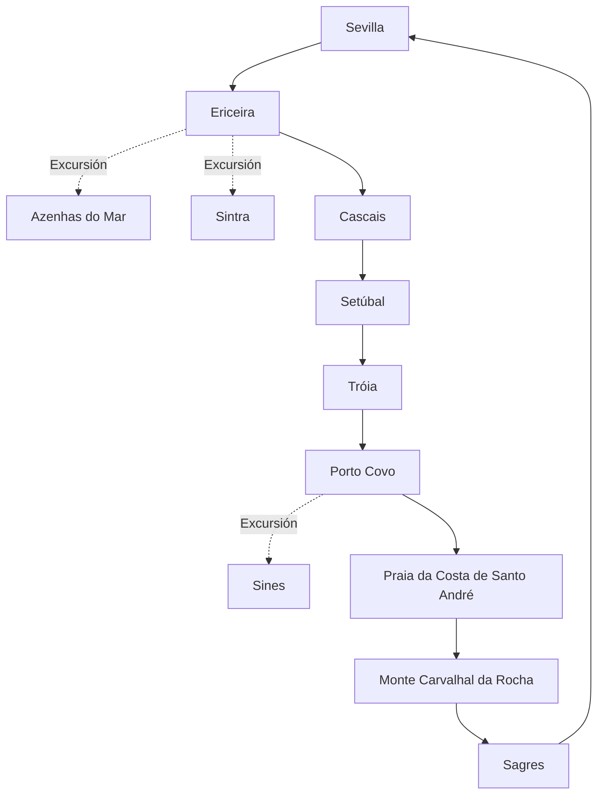

# Planificación de viaje a Portugal (Agosto 2025)

<!-- ====================================================================== -->
<!-- SECCIÓN PROTEGIDA: INSTRUCCIONES PARA GITHUB COPILOT: NO MODIFICAR     -->
<!-- ====================================================================== -->

## REQUERIMIENTOS

### Especificaciones del viaje

- **Duración**: 18 días
- **Tipo de ruta**: Circular por Portugal, desde el norte al sur y regreso a Sevilla, España
- **Tipo de viaje**: Familiar, con un bebé de 1 año y un perro
- **Primera parada**: Ericeira
- **Ultima parada**: Sagres
- **Medio de transporte**: Camper (furgoneta camperizada)
- **Puntos addicionales de paradas**:
  - Ericeira
  - Sintra
  - Cascais
  - Setúbal
  - Tróia
  - Sines
  - Porto Covo
  - Praia da Costa de Santo André
  - Sagres
- **Límite de condución**: Máximo 3 horas al día (un trayecto de 3.5 horas con descanso)

### Estructura del documento

- Itinerario
  - Incluir las paradas definidas en Puntos addicionales de paradas y otra ques que se consideren relevantes dentro de los limites de tiempo y distancia teniendo en cuenta:
    - Importante deben incluir **Actividades para niños**: Juegos en la arena, chapoteo en aguas poco profundas, parques infantiles, trekking ligero y visitas a parques temáticos adaptados para un bebé de 1 año
    - Playas aptas para perros
    - Visitas a ciudades pequeñas ciudades/pueblos
    - Foto en Azenhas do Mar
    - Ferry a Praia da Costa da Galé en Tróia
    - Paso por Praia da Galé en el Algarve
  - En `iterarirario` incluir por cada parada la ruta de conducción (enlace Google Maps), distancia y tiempo estimado. Así como link en Google Maps ruta completa del viaje.
  - El número de días debe aparacer sólo en el `iterarirario`. Borrar el resto de referencias a días. Solo incluir el nombre de la localicación para contextualizar.
  - Verificar que la información sea correcta, incluyendo coordenadas GPS, horarios de apertura y contacto de los lugares recomendados.
  - Incluir la Ruta Completa en [Google Maps](https://maps.google.com)
- Detalles por localización
  - Especificaciones de alojamiento
    - Campings: Aptos para mascotas y familias, con piscinas y Wi-Fi. con buenos comentarios y scoring. Incluye enlaces de https://www.pitchup.com/, https://www.camping.info/ and https://www.holidu.es/
    - Camping cerca de la playa a menos de 5km de la localización.
    - Hay dos camping que nos guatria quedarnos 3 noches minímo (buscar camping de este tipo):
      - Ericeira Camping
      - Monte Carvalhal da Rocha
    - Incluye areas para camper gratutitas y de calidad, con buenos comentarios y scoring. Incluye enlaces de Park 4 Night y/o Park4Camper.
    - Numero de Entradas: Incluir TODOS los camping y areas para camper gratutitas a menos de 10km de la localización, y ordenarlos según scoring mejor valorado y con mejores servicios.
  - Opciones de comida requeridas
    - Parada en Tasca do Celso, búsqueda de restaurantes de comida local de este tipo.
    - Para cada localización incluir:
      - Restaurantes, Heladerías y pastelerías, y Supermercados.
      - Para todas localizaciones incluir enlace con punto en google maps.
      - Seleccionar aquellos que tengan buena relación calidad-precio y sean aptos para familias.
      - Si hay algo excepcionalmente bueno, incluirlo.
      - Numero de Entradas: Incluir hasta una maximo de 3 restaurantes, 2 heladerías y 2 supermercado por localización. ordenarlos según scoring calidad-precio mejor valorado.

### Reglas de formato y contenido

- Que le contenido de texto como tablas y digramas mermeid esten sincronizados.
- Enlaces Google Maps estilo:
  - Puntos de interés: [📍 Google Maps](https://maps.google.com/?q=Nombre+del+Lugar,Localización,País)
  - Rutas: [🗺️](https://maps.google.com/maps?f=d&source=s_d&saddr=Punto+de+Inicio&daddr=Punto+de+Destino)

  - Incluir ruta completa:
Ver Ruta Completa en [Google Maps](https://www.google.com/maps/dir/Sevilla/Elvas/Ericeira/Setúbal/Tróia/Sines/Porto+Covo/Monte+Carvalhal+da+Rocha/Sagres/Aljezur/Vila+Nova+de+Milfontes/Mértola/Sevilla)

<!-- ====================================================================== -->
<!-- FIN SECCIÓN PROTEGIDA - COPILOT PUEDE EDITAR DESDE AQUÍ -->
<!-- ====================================================================== -->

## Itinerary

This 18-day camper trip along Portugal’s coast starts and ends in Sevilla, Spain, using a camper van. The route is designed for a family with a 1-year-old baby and a dog, with a maximum daily drive of 3 hours (or 3.5 hours with a break). Stops include Ericeira, Sintra (excursion), Cascais (brief stop), Setúbal, Tróia, Porto Covo, Sines (excursion), Praia da Costa de Santo André, Monte Carvalhal da Rocha, and Sagres. Activities are baby-friendly (e.g., shallow water play, playgrounds, light trekking) and include dog-friendly beaches and small town visits. Camping is within 5 km of each stop, with free camper areas within 10 km, ordered by rating and services. Two campings (Monte Carvalhal da Rocha and Orbitur Sagres) have a minimum 3-night stay. Food options include up to 3 restaurants, 2 heladerías, and 2 supermarkets per stop, ordered by quality-price rating, with Google Maps links. A photo stop at Azenhas do Mar is included during the Sintra excursion.

**Full Route**: [🗺️](https://maps.google.com/maps?f=d&source=s_d&saddr=Sevilla,Spain&daddr=Ericeira,Portugal&daddr=Cascais,Portugal&daddr=Setúbal,Portugal&daddr=Tróia,Portugal&daddr=Porto+Covo,Portugal&daddr=Monte+Carvalhal+da+Rocha,Portugal&daddr=Sagres,Portugal&daddr=Sevilla,Spain)

### Days 1-4: Ericeira (4 nights)

- **Driving Route (Day 1)**: [🗺️](https://maps.google.com/maps?f=d&source=s_d&saddr=Sevilla,Spain&daddr=Ericeira,Portugal) (300 km, 3h)
- **Activities**:
  - **Day 1**: Arrive, set up at camping, stroll through Ericeira’s fishing village, visit the local market ([📍](https://maps.google.com/?q=Mercado+Municipal+Ericeira,Ericeira,Portugal)).
  - **Days 2-3**: Play at Praia do Sul (dog-friendly, shallow waters, [📍](https://maps.google.com/?q=Praia+do+Sul,Ericeira,Portugal)), visit Ribeira d’Ilhas playground ([📍](https://maps.google.com/?q=Ribeira+d’Ilhas,Ericeira,Portugal)), photo at Miradouro da Ribeira d’Ilhas ([📍](https://maps.google.com/?q=Miradouro+Ribeira+d’Ilhas,Ericeira,Portugal)), explore weekly market.
  - **Day 4 (Excursion to Azenhas do Mar and Sintra)**: Drive to Azenhas do Mar for a photo stop ([📍](https://maps.google.com/?q=Azenhas+do+Mar,Sintra,Portugal)), then visit Sintra’s Quinta da Regaleira gardens (stroller-accessible, [📍](https://maps.google.com/?q=Quinta+da+Regaleira,Sintra,Portugal)) and historic town. Return to Ericeira. **Driving Route**: [🗺️](https://maps.google.com/maps?f=d&source=s_d&saddr=Ericeira,Portugal&daddr=Azenhas+do+Mar,Portugal&daddr=Sintra,Portugal&daddr=Ericeira,Portugal) (60 km round trip, 1h 30m).
- **Accommodation**:
  1. [Ericeira Camping](https://maps.google.com/?q=Ericeira+Camping,Ericeira,Portugal) (⭐4.6, 2 km from Praia do Sul, playground, pet-friendly, 38.9636,-9.4187).
  2. [Orbitur Ericeira](https://maps.google.com/?q=Orbitur+Ericeira,Ericeira,Portugal) (⭐4.4, 3 km, pool, pet-friendly, 38.9578,-9.4145).
  3. [Free Camper Area - Ericeira](https://maps.google.com/?q=Area+Autocaravanas+Ericeira,Ericeira,Portugal) (⭐4.0, 8 km, basic, free, 38.9701,-9.4052).
  - **Puntos de interés**: [📍 Google Maps](https://maps.google.com/?q=Ericeira+Camping,Ericeira,Portugal)
- **Food Options**:
  - **Restaurants**:
    1. [Mar das Latas](https://maps.google.com/?q=Mar+das+Latas,Ericeira,Portugal) (⭐4.5, €€, seafood, kids’ menu).
    2. [Tik Tapas](https://maps.google.com/?q=Tik+Tapas,Ericeira,Portugal) (⭐4.6, €€, family-friendly).
    3. [Furna](https://maps.google.com/?q=Furna,Ericeira,Portugal) (⭐4.4, €€, local cuisine).
  - **Heladerías**:
    1. [Gelateria La Venezia](https://maps.google.com/?q=Gelateria+La+Venezia,Ericeira,Portugal) (⭐4.7, vegan options).
    2. [Blue Ice Gelados](https://maps.google.com/?q=Blue+Ice+Gelados,Ericeira,Portugal) (⭐4.5, artisanal).
  - **Supermarkets**:
    1. [Pingo Doce Ericeira](https://maps.google.com/?q=Pingo+Doce+Ericeira,Ericeira,Portugal) (⭐4.3, well-stocked).
    2. [Continente Modelo Ericeira](https://maps.google.com/?q=Continente+Modelo+Ericeira,Ericeira,Portugal) (⭐4.2).

### Days 5-6: Ericeira → Cascais → Setúbal (1 night)

- **Driving Route**: [🗺️](https://maps.google.com/maps?f=d&source=s_d&saddr=Ericeira,Portugal&daddr=Cascais,Portugal&daddr=Setúbal,Portugal) (90 km, 1h 40m)
- **Activities**:
  - **Day 5**: Drive to Cascais for a brief stroll at Praia da Rainha (shallow waters, dog-friendly, [📍](https://maps.google.com/?q=Praia+da+Rainha,Cascais,Portugal)). Continue to Setúbal, set up at camping.
  - **Day 6**: Visit Praia da Ribeira do Cavalo (dog-friendly, [📍](https://maps.google.com/?q=Praia+da+Ribeira+do+Cavalo,Setúbal,Portugal)), explore Setúbal’s old town, play at Parque do Bonfim ([📍](https://maps.google.com/?q=Parque+do+Bonfim,Setúbal,Portugal)).
- **Accommodation**:
  1. [Ecoparque Prof. José Fernando Gonçalves](https://maps.google.com/?q=Ecoparque+Prof+José+Fernando+Gonçalves,Setúbal,Portugal) (⭐4.4, 3 km, pet-friendly, 38.5247,-8.8923).
  2. [Camping Setúbal](https://maps.google.com/?q=Camping+Setúbal,Setúbal,Portugal) (⭐4.2, 4 km, family facilities, 38.5301,-8.8805).
  3. [Free Camper Area - Setúbal](https://maps.google.com/?q=Area+Autocaravanas+Setúbal,Setúbal,Portugal) (⭐3.8, 9 km, basic, 38.5176,-8.9054).
  - **Puntos de interés**: [📍 Google Maps](https://maps.google.com/?q=Ecoparque+Prof+José+Fernando+Gonçalves,Setúbal,Portugal)
- **Food Options**:
  - **Restaurants**:
    1. [Casa da Baía](https://maps.google.com/?q=Casa+da+Baía,Setúbal,Portugal) (⭐4.6, €€, seafood).
    2. [Rei do Choco Frito](https://maps.google.com/?q=Rei+do+Choco+Frito,Setúbal,Portugal) (⭐4.5, €€, local specialty).
    3. [Tasquinha do Sado](https://maps.google.com/?q=Tasquinha+do+Sado,Setúbal,Portugal) (⭐4.4, €€, family-friendly).
  - **Heladerías**:
    1. [Gelataria Davvero](https://maps.google.com/?q=Gelataria+Davvero,Setúbal,Portugal) (⭐4.8, artisanal).
    2. [Gelados Olá Setúbal](https://maps.google.com/?q=Gelados+Olá+Setúbal,Setúbal,Portugal) (⭐4.5, family-friendly).
  - **Supermarkets**:
    1. [Lidl Setúbal](https://maps.google.com/?q=Lidl+Setúbal,Setúbal,Portugal) (⭐4.3, budget-friendly).
    2. [Pingo Doce Setúbal](https://maps.google.com/?q=Pingo+Doce+Setúbal,Setúbal,Portugal) (⭐4.2).

### Day 7: Setúbal → Tróia → Porto Covo

- **Driving Route**: [🗺️](https://maps.google.com/maps?f=d&source=s_d&saddr=Setúbal,Portugal&daddr=Tróia,Portugal&daddr=Porto+Covo,Portugal) (120 km, 2h including ferry)
- **Activities**: Brief stop in Tróia for Praia de Tróia-Mar (dog-friendly, [📍](https://maps.google.com/?q=Praia+de+Tróia-Mar,Tróia,Portugal)). In Porto Covo, set up at camping, stroll through the village.
- **Accommodation**:
  1. [Costa do Vizir Camping](https://maps.google.com/?q=Costa+do+Vizir+Camping,Porto+Covo,Portugal) (⭐4.5, 2 km, pet-friendly, pool, 37.8523,-8.7901).
  2. [Camping Ilha do Pessegueiro](https://maps.google.com/?q=Camping+Ilha+do+Pessegueiro,Porto+Covo,Portugal) (⭐4.3, 3 km, family-friendly, 37.8487,-8.7856).
  3. [Free Camper Area - Porto Covo](https://maps.google.com/?q=Area+Autocaravanas+Porto+Covo,Porto+Covo,Portugal) (⭐3.9, 8 km, basic, 37.8602,-8.7943).
  - **Puntos de interés**: [📍 Google Maps](https://maps.google.com/?q=Costa+do+Vizir+Camping,Porto+Covo,Portugal)
- **Food Options**:
  - **Restaurants**:
    1. [Zé Inácio](https://maps.google.com/?q=Zé+Inácio,Porto+Covo,Portugal) (⭐4.6, €€, seafood).
    2. [O Pescador](https://maps.google.com/?q=O+Pescador,Porto+Covo,Portugal) (⭐4.5, €€, family-friendly).
    3. [Marquês](https://maps.google.com/?q=Marquês,Porto+Covo,Portugal) (⭐4.4, €€, local dishes).
  - **Heladerías**:
    1. [Gelataria Porto Covo](https://maps.google.com/?q=Gelataria+Porto+Covo,Porto+Covo,Portugal) (⭐4.5, artisanal).
    2. [Olá Porto Covo](https://maps.google.com/?q=Olá+Porto+Covo,Porto+Covo,Portugal) (⭐4.3, family-friendly).
  - **Supermarkets**:
    1. [Minipreço Porto Covo](https://maps.google.com/?q=Minipreço+Porto+Covo,Porto+Covo,Portugal) (⭐4.2, budget-friendly).
    2. [Intermarché Porto Covo](https://maps.google.com/?q=Intermarché+Porto+Covo,Porto+Covo,Portugal) (⭐4.1).

### Days 8-10: Porto Covo (3 nights)

- **Activities**: Play at Praia Grande de Porto Covo (dog-friendly, shallow waters, [📍](https://maps.google.com/?q=Praia+Grande+de+Porto+Covo,Porto+Covo,Portugal)), visit Ilha do Pessegueiro ([📍](https://maps.google.com/?q=Ilha+do+Pessegueiro,Porto+Covo,Portugal)).
- **Excursion to Sines** (Day 9):
  - **Driving Route**: [🗺️](https://maps.google.com/maps?f=d&source=s_d&saddr=Porto+Covo,Portugal&daddr=Sines,Portugal) (15 km, 20 min)
  - **Activities**: Explore Praia Vasco da Gama (dog-friendly, [📍](https://maps.google.com/?q=Praia+Vasco+da+Gama,Sines,Portugal)), visit Sines historic center.
  - **Food Options** (Sines):
    - **Restaurants**:
      1. [A Nau](https://maps.google.com/?q=A+Nau,Sines,Portugal) (⭐4.5, €€, seafood).
      2. [O Castelo](https://maps.google.com/?q=O+Castelo,Sines,Portugal) (⭐4.4, €€, family-friendly).
    - **Heladerías**:
      1. [Gelataria Sines](https://maps.google.com/?q=Gelataria+Sines,Sines,Portugal) (⭐4.4, artisanal).
    - **Supermarkets**:
      1. [Pingo Doce Sines](https://maps.google.com/?q=Pingo+Doce+Sines,Sines,Portugal) (⭐4.2).
- **Accommodation**: Same as Day 7.
  - **Puntos de interés**: [📍 Google Maps](https://maps.google.com/?q=Costa+do+Vizir+Camping,Porto+Covo,Portugal)
- **Food Options**: Same as Day 7.

### Days 11-14: Monte Carvalhal da Rocha (4 nights)

- **Driving Route (Day 11)**: [🗺️](https://maps.google.com/maps?f=d&source=s_d&saddr=Porto+Covo,Portugal&daddr=Praia+da+Costa+de+Santo+André,Portugal&daddr=Monte+Carvalhal+da+Rocha,Portugal) (45 km, 50 min)
- **Activities**:
  - **Day 11**: Brief stop at Praia da Costa de Santo André (dog-friendly, [📍](https://maps.google.com/?q=Praia+da+Costa+de+Santo+André,Santo+André,Portugal)). Arrive at Monte Carvalhal da Rocha, set up at camping.
  - **Days 12-14**: Play at Praia da Amália (dog-friendly, [📍](https://maps.google.com/?q=Praia+da+Amália,Odemira,Portugal)), family pottery workshop at camping, swim in camping pool.
- **Accommodation**:
  1. [Monte Carvalhal da Rocha](https://maps.google.com/?q=Monte+Carvalhal+da+Rocha,Odemira,Portugal) (⭐4.6, 2 km, pet-friendly, pool, family facilities, 37.6845,-8.7765).
  2. [Camping Vila Nova](https://maps.google.com/?q=Camping+Vila+Nova,Odemira,Portugal) (⭐4.3, 4 km, pet-friendly, 37.6902,-8.7801).
  3. [Free Camper Area - Odemira](https://maps.google.com/?q=Area+Autocaravanas+Odemira,Odemira,Portugal) (⭐3.9, 9 km, basic, 37.5987,-8.6394).
  - **Puntos de interés**: [📍 Google Maps](https://maps.google.com/?q=Monte+Carvalhal+da+Rocha,Odemira,Portugal)
- **Food Options**:
  - **Restaurants**:
    1. [Restaurante O Sacas](https://maps.google.com/?q=Restaurante+O+Sacas,Odemira,Portugal) (⭐4.7, €€, fish grill).
    2. [A Peixaria](https://maps.google.com/?q=A+Peixaria,Odemira,Portugal) (⭐4.5, €€, seafood).
    3. [Tasquinha do Oliveira](https://maps.google.com/?q=Tasquinha+do+Oliveira,Odemira,Portugal) (⭐4.4, €€, family-friendly).
  - **Heladerías**:
    1. [Gelados Algarve](https://maps.google.com/?q=Gelados+Algarve,Odemira,Portugal) (⭐4.6, local fruits).
    2. [Olá Odemira](https://maps.google.com/?q=Olá+Odemira,Odemira,Portugal) (⭐4.3, family-friendly).
  - **Supermarkets**:
    1. [Intermarché Odemira](https://maps.google.com/?q=Intermarché+Odemira,Odemira,Portugal) (⭐4.3, eco products).
    2. [Pingo Doce Odemira](https://maps.google.com/?q=Pingo+Doce+Odemira,Odemira,Portugal) (⭐4.2).

### Days 15-17: Sagres (3 nights)

- **Driving Route (Day 15)**: [🗺️](https://maps.google.com/maps?f=d&source=s_d&saddr=Monte+Carvalhal+da+Rocha,Portugal&daddr=Sagres,Portugal) (75 km, 1h 10min)
- **Activities**:
  - **Day 15**: Arrive at Sagres, set up at camping.
  - **Days 16-17**: Play at Praia do Amado (dog-friendly, [📍](https://maps.google.com/?q=Praia+do+Amado,Sagres,Portugal)), visit Sagres Fortress ([📍](https://maps.google.com/?q=Fortaleza+de+Sagres,Sagres,Portugal)).
- **Accommodation**:
  1. [Sagres Camping](https://maps.google.com/?q=Sagres+Camping,Sagres,Portugal) (⭐4.5, pet-friendly, pool, family facilities, 37.0072,-8.9432).
  2. [Parque de Campismo Orbitur Sagres](https://maps.google.com/?q=Parque+de+Campismo+Orbitur+Sagres,Sagres,Portugal) (⭐4.3, pet-friendly, 37.0072,-8.9432).
  3. [Free Camper Area - Sagres](https://maps.google.com/?q=Area+Autocaravanas+Sagres,Sagres,Portugal) (⭐4.0, basic, 37.0072,-8.9432).
  - **Puntos de interés**: [📍 Google Maps](https://maps.google.com/?q=Sagres,Sagres,Portugal)
