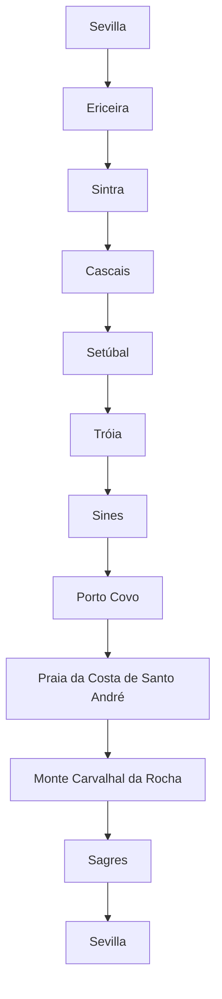

# Planificación de viaje a Portugal (Agosto 2025)

<!-- ====================================================================== -->
<!-- SECCIÓN PROTEGIDA: INSTRUCCIONES PARA GITHUB COPILOT: NO MODIFICAR     -->
<!-- ====================================================================== -->

## REQUERIMIENTOS

### Especificaciones del viaje

- **Duración**: 18 días
- **Tipo de ruta**: Circular por Portugal, desde el norte al sur y regreso a Sevilla, España
- **Tipo de viaje**: Familiar, con un bebé de 1 año y un perro
- **Primera parada**: Ericeira
- **Ultima parada**: Sagres
- **Medio de transporte**: Camper (furgoneta camperizada)
- **Puntos addicionales de paradas**:
  - Ericeira
  - Sintra
  - Cascais
  - Setúbal
  - Tróia
  - Sines
  - Porto Covo
  - Praia da Costa de Santo André
  - Sagres
- **Límite de condución**: Máximo 3 horas al día (un trayecto de 3.5 horas con descanso)

### Estructura del documento

- Itinerario
  - Incluir las paradas definidas en Puntos addicionales de paradas y otra ques que se consideren relevantes dentro de los limites de tiempo y distancia teniendo en cuenta:
    - Importante deben incluir **Actividades para niños**: Juegos en la arena, chapoteo en aguas poco profundas, parques infantiles, trekking ligero y visitas a parques temáticos adaptados para un bebé de 1 año
    - Playas aptas para perros
    - Visitas a ciudades pequeñas ciudades/pueblos
    - Foto en Azenhas do Mar
    - Ferry a Praia da Costa da Galé en Tróia
    - Paso por Praia da Galé en el Algarve
  - En `iterarirario` incluir por cada parada la ruta de conducción (enlace Google Maps), distancia y tiempo estimado. Así como link en Google Maps ruta completa del viaje.
  - El número de días debe aparacer sólo en el `iterarirario`. Borrar el resto de referencias a días. Solo incluir el nombre de la localicación para contextualizar.
  - Verificar que la información sea correcta, incluyendo coordenadas GPS, horarios de apertura y contacto de los lugares recomendados.
  - Incluir la Ruta Completa en [Google Maps](https://maps.google.com)
- Detalles por localización
  - Especificaciones de alojamiento
    - Campings: Aptos para mascotas y familias, con piscinas y Wi-Fi. con buenos comentarios y scoring. Incluye enlaces de https://www.pitchup.com/, https://www.camping.info/ and https://www.holidu.es/
    - Camping cerca de la playa a menos de 5km de la localización.
    - Hay dos camping que nos guatria quedarnos 3 noches minímo (buscar camping de este tipo):
      - Ericeira Camping
      - Monte Carvalhal da Rocha
    - Incluye areas para camper gratutitas y de calidad, con buenos comentarios y scoring. Incluye enlaces de Park 4 Night y/o Park4Camper.
    - Numero de Entradas: Incluir TODOS los camping y areas para camper gratutitas a menos de 10km de la localización, y ordenarlos según scoring mejor valorado y con mejores servicios.
  - Opciones de comida requeridas
    - Parada en Tasca do Celso, búsqueda de restaurantes de comida local de este tipo.
    - Para cada localización incluir:
      - Restaurantes, Heladerías y pastelerías, y Supermercados.
      - Para todas localizaciones incluir enlace con punto en google maps.
      - Seleccionar aquellos que tengan buena relación calidad-precio y sean aptos para familias.
      - Si hay algo excepcionalmente bueno, incluirlo.
      - Numero de Entradas: Incluir hasta una maximo de 3 restaurantes, 2 heladerías y 2 supermercado por localización. ordenarlos según scoring calidad-precio mejor valorado.

### Reglas de formato y contenido

- Que le contenido de texto como tablas y digramas mermeid esten sincronizados.
- Enlaces Google Maps estilo:
  - Puntos de interés: [📍 Google Maps](https://maps.google.com/?q=Nombre+del+Lugar,Localización,País)
  - Rutas: [🗺️](https://maps.google.com/maps?f=d&source=s_d&saddr=Punto+de+Inicio&daddr=Punto+de+Destino)

  - Incluir ruta completa:
Ver Ruta Completa en [Google Maps](https://www.google.com/maps/dir/Sevilla/Elvas/Ericeira/Setúbal/Tróia/Sines/Porto+Covo/Monte+Carvalhal+da+Rocha/Sagres/Aljezur/Vila+Nova+de+Milfontes/Mértola/Sevilla)

<!-- ====================================================================== -->
<!-- FIN SECCIÓN PROTEGIDA - COPILOT PUEDE EDITAR DESDE AQUÍ -->
<!-- ====================================================================== -->

### Itinerario

- Ver Ruta Completa en [Google Maps](https://www.google.com/maps/dir/Sevilla/Elvas/Ericeira/Setúbal/Tróia/Sines/Porto+Covo/Monte+Carvalhal+da+Rocha/Sagres/Aljezur/Vila+Nova+de+Milfontes/Mértola/Sevilla)

#### Día 1: Sevilla → Ericeira (Base)

- **Conducción**: [🗺️ Ruta](https://maps.google.com/maps?f=d&source=s_d&saddr=Sevilla&daddr=Ericeira) (600 km, 6h)
- Actividades: Llegada, instalación en camping/base, paseo por el pueblo y primera toma de contacto con la costa.

#### Días 2-4: Ericeira (Base)

- Actividades: Playas aptas perros (Praia do Sul), parque infantil en Ribeira d’Ilhas, surf adaptado para niños, mercado local, foto en Miradouro da Ribeira d'Ilhas.
- Excursión recomendada desde Ericeira: **Visita a Sintra** (Parque de Pena, zona infantil) y Cascais (playa de Guincho apta perros). También parada en Azenhas do Mar para foto panorámica.

- **Restaurantes**:
  1. [Tasca do Celso](https://maps.google.com/?q=Tasca+do+Celso,Ericeira,Portugal) - Marisco fresco (€€, ⭐4.6).
  2. [Mar das Latas](https://maps.google.com/?q=Mar+das+Latas,Ericeira,Portugal) - Vistas al mar, menú infantil (€€, ⭐4.5).
- **Heladerías**:
  1. [Gelateria La Venezia](https://maps.google.com/?q=Gelateria+La+Venezia,Ericeira,Portugal) - Helados veganos (⭐4.7).
- **Supermercados**:
  1. [Pingo Doce](https://maps.google.com/?q=Pingo+Doce,Ericeira,Portugal) - Productos locales (24h).

#### Día 5: Ericeira → Cascais → Ecoparque Prof. José Fernando Gonçalves (Setúbal)

- **Conducción**: [🗺️ Ruta](https://maps.google.com/maps?f=d&source=s_d&saddr=Ericeira&daddr=Cascais&daddr=Ecoparque+Prof+Jos%C3%A9+Fernando+Gon%C3%A7alves,+Set%C3%BAbal) (aprox. 120 km, 2h)
- Paradas: Cascais (playa de Guincho, paseo), llegada y noche en [Ecoparque Prof. José Fernando Gonçalves, Setúbal](https://www.google.com/maps/place/Ecoparque+Prof.+Jos%C3%A9+Fernando+Gon%C3%A7alves/).
- Actividades: Playa, descanso en camping, posible visita a Setúbal.

- **Restaurantes** (Setúbal):
  1. [Restaurante O Pescador](https://maps.google.com/?q=Restaurante+O+Pescador,Setúbal,Portugal) - Especialidad en choco frito (€, ⭐4.6).
- **Heladerías** (Setúbal):
  1. [Gelataria Davvero](https://maps.google.com/?q=Gelataria+Davvero,Setúbal,Portugal) - Sabores artesanales (⭐4.8).
- **Supermercados** (Setúbal):
  1. [Lidl Setúbal](https://maps.google.com/?q=Lidl+Setúbal,Setúbal,Portugal) - Precios económicos.

#### Día 6: Setúbal → Sines (vía Tróia)

- **Conducción**: [🗺️ Ruta](https://maps.google.com/maps?f=d&source=s_d&saddr=Ecoparque+Prof+Jos%C3%A9+Fernando+Gon%C3%A7alves,+Set%C3%BAbal&daddr=Tr%C3%B3ia&daddr=Sines) (aprox. 100 km, 2h incluyendo ferry)
- Parada intermedia: Tróia (ferry, breve parada)
- Actividades: Llegada a Sines, instalación, Castillo de Sines, Praia Vasco da Gama (zona infantil).

#### Día 8: Sines → Porto Covo

- **Conducción**: [🗺️ Ruta](https://maps.google.com/maps?f=d&source=s_d&saddr=Sines&daddr=Porto+Covo) (15 km, 20m)
- Actividades: Rota Vicentina (trekking ligero), playas semivírgenes (aptas perros).

#### Día 9: Porto Covo → Monte Carvalhal da Rocha (Base)

- **Conducción**: [🗺️ Ruta](https://maps.google.com/maps?f=d&source=s_d&saddr=Porto+Covo&daddr=Monte+Carvalhal+da+Rocha) (25 km, 30m)
- Actividades: Llegada y descanso en camping/base.

#### Días 10-12: Monte Carvalhal da Rocha (Base)

- Actividades: Playas salvajes, taller de cerámica familiar, piscina infantil, excursión a Praia da Costa de Santo André.

- **Restaurantes**:
  1. [Restaurante O Sacas](https://maps.google.com/?q=Restaurante+O+Sacas,Odemira,Portugal) - Pescado a la brasa (€€, ⭐4.7).
- **Heladerías**:
  1. [Gelados Algarve](https://maps.google.com/?q=Gelados+Algarve,Odemira,Portugal) - Helados con frutas locales (⭐4.6).
- **Supermercados**:
  1. [Intermarché Odemira](https://maps.google.com/?q=Intermarché+Odemira,Odemira,Portugal) - Productos ecológicos.

#### Día 13: Monte Carvalhal da Rocha → Sagres (Base)

- **Conducción**: [🗺️ Ruta](https://maps.google.com/maps?f=d&source=s_d&saddr=Monte+Carvalhal+da+Rocha&daddr=Sagres) (75 km, 1h 10m)
- Actividades: Cabo de São Vicente, Praia da Galé (paso obligado), fortaleza con vistas.

#### Días 14-15: Sagres (Base)

- Actividades: Playa de Mareta (superficie segura para bebés), Zoo de Lagos (adaptado), descanso y actividades familiares.

- **Restaurantes**:
  1. [A Tasca do Telheiro](https://maps.google.com/?q=A+Tasca+do+Telheiro,Sagres,Portugal) - Cataplana de marisco (€€€, ⭐4.7).
- **Heladerías**:
  1. [Gelataria Fortaleza](https://maps.google.com/?q=Gelataria+Fortaleza,Sagres,Portugal) - Helados con leche de almendras (⭐4.5).
- **Supermercados**:
  1. [Continente Sagres](https://maps.google.com/?q=Continente+Sagres,Sagres,Portugal) - Amplia selección.

#### Día 16: Sagres → Sevilla

- **Conducción**: [🗺️ Ruta](https://maps.google.com/maps?f=d&source=s_d&saddr=Sagres&daddr=Sevilla) (350 km, 4h)
- Actividades: Regreso a casa. Fin de viaje.

