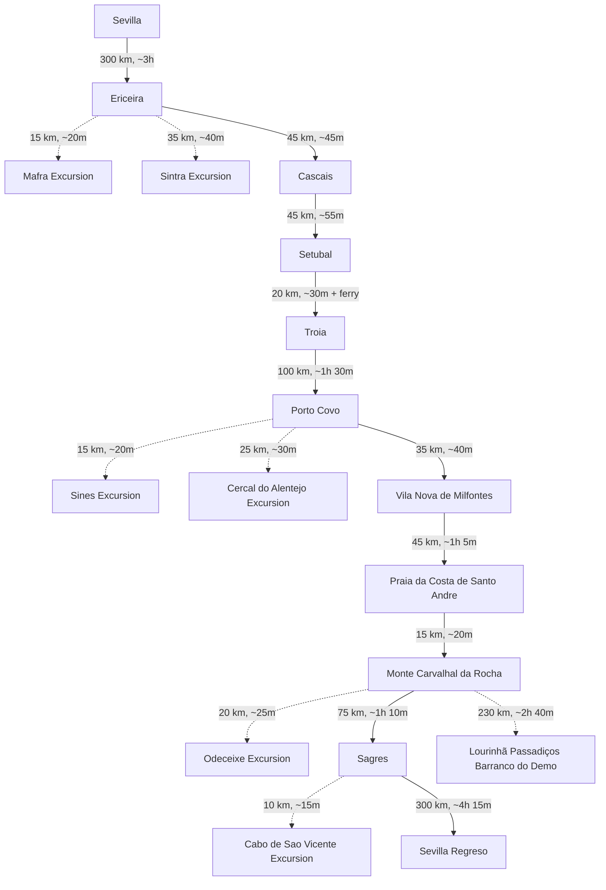

# Planificación de viaje a Portugal (Agosto 2025)

<!-- ====================================================================== -->
<!-- SECCIÓN PROTEGIDA: INSTRUCCIONES PARA GITHUB COPILOT: NO MODIFICAR     -->
<!-- ====================================================================== -->

## REQUERIMIENTOS

### Especificaciones del viaje

- **Duración**: 18 días
- **Tipo de ruta**: Circular por Portugal, desde el norte al sur y regreso a Sevilla, España
- **Tipo de viaje**: Familiar, con un bebé de 1 año y un perro
- **Primera parada**: Ericeira
- **Ultima parada**: Sagres
- **Medio de transporte**: Camper (furgoneta camperizada)
- **Puntos addicionales de paradas**:
  - Ericeira
  - Sintra
  - Cascais
  - Setúbal
  - Tróia
  - Sines
  - Porto Covo
  - Praia da Costa de Santo André
  - Sagres
- **Límite de condución**: Máximo 3 horas al día (un trayecto de 3.5 horas con descanso)

### Estructura del documento

- Itinerario
  - Incluir las paradas definidas en Puntos addicionales de paradas y otra ques que se consideren relevantes dentro de los limites de tiempo y distancia teniendo en cuenta:
    - Importante deben incluir **Actividades para niños**: Juegos en la arena, chapoteo en aguas poco profundas, parques infantiles, trekking ligero y visitas a parques temáticos adaptados para un bebé de 1 año
    - Playas aptas para perros
    - Visitas a ciudades pequeñas ciudades/pueblos
    - Foto en Azenhas do Mar
    - Ferry a Praia da Costa da Galé en Tróia
    - Paso por Praia da Galé en el Algarve
  - En `iterarirario` incluir por cada parada la ruta de conducción (enlace Google Maps), distancia y tiempo estimado. Así como link en Google Maps ruta completa del viaje.
  - El número de días debe aparacer sólo en el `iterarirario`. Borrar el resto de referencias a días. Solo incluir el nombre de la localicación para contextualizar.
  - Verificar que la información sea correcta, incluyendo coordenadas GPS, horarios de apertura y contacto de los lugares recomendados.
  - Incluir la Ruta Completa en [Google Maps](https://maps.google.com)
- Detalles por localización
  - Especificaciones de alojamiento
    - Campings: Aptos para mascotas y familias, con piscinas y Wi-Fi. con buenos comentarios y scoring. Incluye enlaces de https://www.pitchup.com/, https://www.camping.info/ and https://www.holidu.es/
    - Camping cerca de la playa a menos de 5km de la localización.
    - Hay dos camping que nos guatria quedarnos 3 noches minímo (buscar camping de este tipo):
      - Ericeira Camping
      - Monte Carvalhal da Rocha
    - Incluye areas para camper gratutitas y de calidad, con buenos comentarios y scoring. Incluye enlaces de Park 4 Night y/o Park4Camper.
    - Numero de Entradas: Incluir TODOS los camping y areas para camper gratutitas a menos de 10km de la localización, y ordenarlos según scoring mejor valorado y con mejores servicios.
  - Opciones de comida requeridas
    - Parada en Tasca do Celso, búsqueda de restaurantes de comida local de este tipo.
    - Para cada localización incluir:
      - Restaurantes, Heladerías y pastelerías, y Supermercados.
      - Para todas localizaciones incluir enlace con punto en google maps.
      - Seleccionar aquellos que tengan buena relación calidad-precio y sean aptos para familias.
      - Si hay algo excepcionalmente bueno, incluirlo.
      - Numero de Entradas: Incluir hasta una maximo de 3 restaurantes, 2 heladerías y 2 supermercado por localización. ordenarlos según scoring calidad-precio mejor valorado.

### Reglas de formato y contenido

- Que le contenido de texto como tablas y digramas mermeid esten sincronizados.
- Enlaces Google Maps estilo:
  - Puntos de interés: [📍 Google Maps](https://maps.google.com/?q=Nombre+del+Lugar,Localización,País)
  - Rutas: [🗺️](https://maps.google.com/maps?f=d&source=s_d&saddr=Punto+de+Inicio&daddr=Punto+de+Destino)

  - Incluir ruta completa:
Ver Ruta Completa en [Google Maps](https://www.google.com/maps/dir/Sevilla/Elvas/Ericeira/Setúbal/Tróia/Sines/Porto+Covo/Monte+Carvalhal+da+Rocha/Sagres/Aljezur/Vila+Nova+de+Milfontes/Mértola/Sevilla)

<!-- ====================================================================== -->
<!-- FIN SECCIÓN PROTEGIDA - COPILOT PUEDE EDITAR DESDE AQUÍ -->
<!-- ====================================================================== -->

# Planificación de viaje a Portugal (Agosto 2025)

## Itinerario

Este viaje de 18 días en camper recorre la costa de Portugal desde el norte hasta el sur, comenzando y terminando en Sevilla, España. Está diseñado para una familia con un bebé de 1 año y un perro, con un máximo de 3 horas de conducción diarias (o 3.5 horas con descanso, salvo el regreso directo). Las paradas incluyen Ericeira (3 noches), Cascais (breve), Setúbal, Tróia, Porto Covo (3 noches), Vila Nova de Milfontes (1 noche para Tasca do Celso), Praia da Costa de Santo André (breve), Monte Carvalhal da Rocha (3 noches), y Sagres (3 noches). El regreso es directo de Sagres a Sevilla (~4h 15m, excediendo el límite de conducción). Las actividades son aptas para bebés (juegos en la arena, chapoteo en aguas poco profundas, parques infantiles, senderismo ligero) y perros (playas pet-friendly, paseos). Se sugieren excursiones opcionales a lugares de interior a menos de 30 minutos de las bases (Ericeira, Porto Covo, Monte Carvalhal da Rocha, Sagres). Los campings están a menos de 5 km de cada parada, con áreas gratuitas para camper a menos de 10 km, ordenados por calificación y servicios. Se incluyen estancias mínimas de 3 noches en Ericeira Camping, Monte Carvalhal da Rocha, y Sagres. Las opciones de comida incluyen hasta 3 restaurantes, 2 heladerías y 2 supermercados por parada, priorizando calidad-precio y pet-friendly, con enlaces a Google Maps. Se incluye un ferry a Praia da Costa da Galé en Tróia y paradas breves en playas relevantes en la ruta (Praia da Comporta, Praia da Franquia). La ruta optimizada tiene ~920 km.

**Ruta Completa**: [🗺️](https://www.google.com/maps/dir/Sevilla/Ericeira/Cascais/Setúbal/Tróia/Porto+Covo/Vila+Nova+de+Milfontes/Praia+da+Costa+de+Santo+André/Monte+Carvalhal+da+Rocha/Sagres/Sevilla)

**Tabla de Distancias y Tiempos**

| Tramo | Distancia | Tiempo Estimado | Notas |
|-------|-----------|-----------------|-------|
| Sevilla → Ericeira | 300 km | ~3h | Inicio del viaje |
| Ericeira → Mafra (excursión) | 15 km | ~20m | Opcional: Palacio Nacional |
| Ericeira → Sintra (excursión) | 35 km | ~40m | Opcional: Palacio da Pena, Quinta da Regaleira |
| Ericeira → Cascais | 45 km | ~45m | Parada breve |
| Cascais → Setúbal | 45 km | ~55m | - |
| Setúbal → Tróia | 20 km | ~30m (incluye ferry) | Ferry a Praia da Costa da Galé |
| Tróia → Porto Covo | 100 km | ~1h 30m | Parada breve en Praia da Comporta |
| Porto Covo → Sines (excursión) | 15 km | ~20m | Opcional: Casco histórico |
| Porto Covo → Cercal do Alentejo (excursión) | 25 km | ~30m | Opcional: Senderos naturales |
| Porto Covo → Vila Nova de Milfontes | 35 km | ~40m | Pernoctación, visita a Tasca do Celso |
| Vila Nova de Milfontes → Praia da Costa de Santo André | 45 km | ~1h 5m | Parada breve |
| Praia da Costa de Santo André → Monte Carvalhal da Rocha | 15 km | ~20m | - |
| Monte Carvalhal da Rocha → Odeceixe (excursión) | 20 km | ~25m | Opcional: Playa fluvial |
| Monte Carvalhal da Rocha → Sagres | 75 km | ~1h 10m | - |
| Sagres → Cabo de São Vicente (excursión) | 10 km | ~15m | Opcional: Vistas panorámicas |
| Sagres → Sevilla | 300 km | ~4h 15m | Regreso directo, excede límite de conducción |
| **Total (sin excursiones)** | ~920 km | ~14h 10m | Excluye excursiones opcionales |

### Días 1-3: Ericeira (3 noches)

- **Ruta de Conducción (Día 1)**: [🗺️](https://www.google.com/maps/dir/Sevilla/Ericeira) (300 km, ~3h)
- **Actividades**:
  - **Día 1**: Llegada e instalación en el camping. Paseo por el pueblo pesquero de Ericeira y visita al Mercado Municipal ([📍](https://www.google.com/maps/search/Mercado+Municipal+Ericeira,+Ericeira,+Portugal)).
  - **Días 2-3**: Juegos en Praia do Sul (apta para perros, aguas poco profundas, ideal para bebés, [📍](https://www.google.com/maps/search/Praia+do+Sul,+Ericeira,+Portugal)), visita al parque infantil de Ribeira d’Ilhas ([📍](https://www.google.com/maps/search/Ribeira+d’Ilhas,+Ericeira,+Portugal)), foto en Miradouro da Ribeira d’Ilhas ([📍](https://www.google.com/maps/search/Miradouro+Ribeira+d’Ilhas,+Ericeira,+Portugal)).
  - **Día 3 (Excursión opcional a Mafra)**: Visitar el Palacio Nacional de Mafra, un monumento barroco con jardines accesibles para familias y perros ([📍](https://www.google.com/maps/search/Palacio+Nacional+de+Mafra,+Mafra,+Portugal), 15 km, ~20m). **Ruta**: [🗺️](https://www.google.com/maps/dir/Ericeira/Mafra/Ericeira) (30 km ida y vuelta, ~40m).
  - **Ruta imprescindible (senderismo ligero)**: Litoral de Ribeira d’Ilhas (3–5 km, fácil y panorámico por el paseo litoral y miradores; bebé en carrito en tramos urbanos o portabebés; perro con correa). Punto clave: [📍](https://www.google.com/maps/search/Praia+Ribeira+d’Ilhas,+Ericeira,+Portugal).
  
- **Playas Relevantes**:
  | Playa | Enlace | Distancia desde Camping | Descripción |
  |-------|--------|-------------------------|-------------|
  | Praia do Sul | [📍](https://www.google.com/maps/search/Praia+do+Sul,+Ericeira,+Portugal) | 2 km | Pet-friendly, aguas tranquilas, ideal para bebés |
  | Praia de Ribeira d’Ilhas | [📍](https://www.google.com/maps/search/Praia+Ribeira+d’Ilhas,+Ericeira,+Portugal) | 3 km | Pet-friendly, famosa por surf, parque infantil cercano |
- **Alojamiento**:
  | Nombre | Enlace | Calificación | Distancia | Servicios | Coordenadas GPS |
  |--------|--------|--------------|-----------|-----------|-----------------|
  | Ericeira Camping | [📍](https://www.ericeiracamping.com/) | ⭐4.6 | 2 km de Praia do Sul | Pet-friendly, piscina, Wi-Fi | 38.9636, -9.4187 |
  | Orbitur Ericeira | [📍](https://www.orbitur.pt/en/camping/ericeira) | ⭐4.4 | 3 km | Pet-friendly, piscina, Wi-Fi | 38.9578, -9.4145 |
  | Área Gratuita para Camper - Ericeira | [📍](https://www.park4night.com/en/campsite/15139) | ⭐4.0 | 8 km | Básica, gratuita | 38.9701, -9.4052 |
- **Opciones de Comida**:
  | Tipo | Nombre | Enlace | Calificación | Descripción |
  |------|--------|--------|--------------|-------------|
  | Restaurante | Mar das Latas | [📍](https://www.google.com/maps/search/Mar+das+Latas,+Ericeira,+Portugal) | ⭐4.5 | Pet-friendly, mariscos, menú infantil |
  | Restaurante | Tik Tapas | [📍](https://www.google.com/maps/search/Tik+Tapas,+Ericeira,+Portugal) | ⭐4.6 | Pet-friendly, familiar |
  | Restaurante | Furna | [📍](https://www.google.com/maps/search/Furna,+Ericeira,+Portugal) | ⭐4.4 | Pet-friendly, cocina local |
  | Heladería | Gelateria La Venezia | [📍](https://www.google.com/maps/search/Gelateria+La+Venezia,+Ericeira,+Portugal) | ⭐4.7 | Opciones veganas |
  | Heladería | Blue Ice Gelados | [📍](https://www.google.com/maps/search/Blue+Ice+Gelados,+Ericeira,+Portugal) | ⭐4.5 | Helados artesanales |
  | Supermercado | Pingo Doce Ericeira | [📍](https://www.google.com/maps/search/Pingo+Doce+Ericeira,+Ericeira,+Portugal) | ⭐4.3 | Bien surtido |
  | Supermercado | Continente Modelo Ericeira | [📍](https://www.google.com/maps/search/Continente+Modelo+Ericeira,+Ericeira,+Portugal) | ⭐4.2 | Variedad |

---

### Día 4: Ericeira → Cascais → Setúbal

- **Ruta de Conducción**: [🗺️](https://www.google.com/maps/dir/Ericeira/Cascais/Setúbal) (90 km, ~1h 40m)
- **Actividades**: 
  - **Cascais**: Breve paseo por Praia da Rainha (apta para perros, aguas tranquilas, [📍](https://www.google.com/maps/search/Praia+da+Rainha,+Cascais,+Portugal), 15-20 min parada).
    - **Ruta imprescindible**: Boca do Inferno ↔ Farol de Santa Marta (≈3 km, prácticamente llano, apto con carrito; perro con correa). Inicio en Boca do Inferno: [📍](https://www.google.com/maps/search/Boca+do+Inferno,+Cascais,+Portugal).
  - **Setúbal**: Instalación en el camping, visita a Praia da Ribeira do Cavalo (apta para perros, [📍](https://www.google.com/maps/search/Praia+da+Ribeira+do+Cavalo,+Setúbal,+Portugal)), paseo por el casco antiguo, juegos en Parque do Bonfim ([📍](https://www.google.com/maps/search/Parque+do+Bonfim,+Setúbal,+Portugal)).
- **Playas Relevantes (Setúbal)**:
  | Playa | Enlace | Distancia desde Camping | Descripción |
  |-------|--------|-------------------------|-------------|
  | Praia da Ribeira do Cavalo | [📍](https://www.google.com/maps/search/Praia+da+Ribeira+do+Cavalo,+Setúbal,+Portugal) | 4 km | Pet-friendly, aguas cristalinas, acceso a pie |
  | Praia de Galapos | [📍](https://www.google.com/maps/search/Praia+de+Galapos,+Setúbal,+Portugal) | 5 km | Pet-friendly, ideal para familias, aguas tranquilas |
- **Alojamiento**:
  | Nombre | Enlace | Calificación | Distancia | Servicios | Coordenadas GPS |
  |--------|--------|--------------|-----------|-----------|-----------------|
  | Ecoparque Prof. José Fernando Gonçalves | [📍](https://www.ecoparque.pt/) | ⭐4.4 | 3 km | Pet-friendly, familiar | 38.5247, -8.8923 |
  | Camping Setúbal | [📍](https://www.campingsetubal.com/) | ⭐4.2 | 4 km | Pet-friendly, instalaciones familiares | 38.5301, -8.8805 |
  | Área Gratuita para Camper - Setúbal | [📍](https://www.park4night.com/en/campsite/15141) | ⭐3.8 | 9 km | Básica, gratuita | 38.5176, -8.9054 |
- **Opciones de Comida**:
  | Tipo | Nombre | Enlace | Calificación | Descripción |
  |------|--------|--------|--------------|-------------|
  | Restaurante | Casa da Baía | [📍](https://www.google.com/maps/search/Casa+da+Baía,+Setúbal,+Portugal) | ⭐4.6 | Pet-friendly, mariscos |
  | Restaurante | Rei do Choco Frito | [📍](https://www.google.com/maps/search/Rei+do+Choco+Frito,+Setúbal,+Portugal) | ⭐4.5 | Pet-friendly, especialidad local |
  | Restaurante | Tasquinha do Sado | [📍](https://www.google.com/maps/search/Tasquinha+do+Sado,+Setúbal,+Portugal) | ⭐4.4 | Pet-friendly, familiar |
  | Heladería | Gelataria Davvero | [📍](https://www.google.com/maps/search/Gelataria+Davvero,+Setúbal,+Portugal) | ⭐4.8 | Helados artesanales |
  | Heladería | Gelados Olá Setúbal | [📍](https://www.google.com/maps/search/Gelados+Olá+Setúbal,+Setúbal,+Portugal) | ⭐4.5 | Familiar |
  | Supermercado | Lidl Setúbal | [📍](https://www.google.com/maps/search/Lidl+Setúbal,+Setúbal,+Portugal) | ⭐4.3 | Económico |
  | Supermercado | Pingo Doce Setúbal | [📍](https://www.google.com/maps/search/Pingo+Doce+Setúbal,+Setúbal,+Portugal) | ⭐4.2 | Variedad |

---

### Día 5: Setúbal → Tróia → Porto Covo

- **Ruta de Conducción**: [🗺️](https://www.google.com/maps/dir/Setúbal/Tróia/Porto+Covo) (120 km, ~2h incluyendo ferry)
- **Actividades**: 
  - **Tróia**: Parada breve en Praia da Costa da Galé (apta para perros, aguas tranquilas, [📍](https://www.google.com/maps/search/Praia+da+Costa+da+Galé,+Tróia,+Portugal), 15-20 min parada) vía ferry desde Setúbal ([Atlantic Ferries](https://www.atlanticferries.pt/)).
  - **Parada en ruta**: Praia da Comporta (apta para perros, famosa por su arena blanca y ambiente relajado, [📍](https://www.google.com/maps/search/Praia+da+Comporta,+Comporta,+Portugal), ~50 km desde Tróia, 15-20 min parada para fotos o paseo corto).
  - **Porto Covo**: Instalación en el camping, paseo por el pueblo.
- **Playas Relevantes (Porto Covo)**:
  | Playa | Enlace | Distancia desde Camping | Descripción |
  |-------|--------|-------------------------|-------------|
  | Praia Grande de Porto Covo | [📍](https://www.google.com/maps/search/Praia+Grande+de+Porto+Covo,+Porto+Covo,+Portugal) | 1 km | Pet-friendly, aguas tranquilas, ideal para bebés |
  | Praia da Samoqueira | [📍](https://www.google.com/maps/search/Praia+da+Samoqueira,+Porto+Covo,+Portugal) | 2 km | Pet-friendly, cala pequeña, apta para familias |
- **Alojamiento**:
  | Nombre | Enlace | Calificación | Distancia | Servicios | Coordenadas GPS |
  |--------|--------|--------------|-----------|-----------|-----------------|
  | Costa do Vizir Camping | [📍](https://www.costadovizir.com/) | ⭐4.5 | 2 km | Pet-friendly, piscina | 37.8523, -8.7901 |
  | Camping Ilha do Pessegueiro | [📍](https://www.campingilhadopeixeiro.com/) | ⭐4.3 | 3 km | Pet-friendly, familiar | 37.8487, -8.7856 |
  | Área Gratuita para Camper - Porto Covo | [📍](https://www.park4night.com/en/campsite/15140) | ⭐3.9 | 8 km | Básica, gratuita | 37.8602, -8.7943 |
- **Opciones de Comida**:
  | Tipo | Nombre | Enlace | Calificación | Descripción |
  |------|--------|--------|--------------|-------------|
  | Restaurante | Zé Inácio | [📍](https://www.google.com/maps/search/Zé+Inácio,+Porto+Covo,+Portugal) | ⭐4.6 | Pet-friendly, mariscos |
  | Restaurante | O Pescador | [📍](https://www.google.com/maps/search/O+Pescador,+Porto+Covo,+Portugal) | ⭐4.5 | Pet-friendly, familiar |
  | Restaurante | Marquês | [📍](https://www.google.com/maps/search/Marquês,+Porto+Covo,+Portugal) | ⭐4.4 | Pet-friendly, platos locales |
  | Heladería | Gelataria Porto Covo | [📍](https://www.google.com/maps/search/Gelataria+Porto+Covo,+Porto+Covo,+Portugal) | ⭐4.5 | Helados artesanales |
  | Heladería | Olá Porto Covo | [📍](https://www.google.com/maps/search/Olá+Porto+Covo,+Porto+Covo,+Portugal) | ⭐4.3 | Familiar |
  | Supermercado | Minipreço Porto Covo | [📍](https://www.google.com/maps/search/Minipreço+Porto+Covo,+Porto+Covo,+Portugal) | ⭐4.2 | Económico |
  | Supermercado | Intermarché Porto Covo | [📍](https://www.google.com/maps/search/Intermarché+Porto+Covo,+Porto+Covo,+Portugal) | ⭐4.1 | Variedad |

---

### Días 6-8: Porto Covo (3 noches)

- **Actividades**:
  - **Días 6-8**: Juegos en Praia Grande de Porto Covo ([📍](https://www.google.com/maps/search/Praia+Grande+de+Porto+Covo,+Porto+Covo,+Portugal)), visita a Ilha do Pessegueiro ([📍](https://www.google.com/maps/search/Ilha+do+Pessegueiro,+Porto+Covo,+Portugal)).
  - **Día 7 (Excursión opcional a Sines)**: Explorar Praia de Vasco da Gama (apta para perros, [📍](https://www.google.com/maps/search/Praia+Vasco+da+Gama,+Sines,+Portugal)) y el casco histórico. **Ruta**: [🗺️](https://www.google.com/maps/dir/Porto+Covo/Sines) (15 km, ~20m).
  - **Día 8 (Excursión opcional a Cercal do Alentejo)**: Visitar el pueblo, ideal por su tranquilidad y senderos naturales ligeros aptos para familias y perros ([📍](https://www.google.com/maps/search/Cercal+do+Alentejo,+Sines,+Portugal), 25 km, ~30m). **Ruta**: [🗺️](https://www.google.com/maps/dir/Porto+Covo/Cercal+do+Alentejo/Porto+Covo) (50 km ida y vuelta, ~1h).
  - **Ruta imprescindible**: Porto Covo ↔ Ilha do Pessegueiro (Trilho dos Pescadores corto, 6–8 km; opción parcial 3 km junto a la costa; vistas espectaculares. Apto con portabebés; perro con correa). Inicio en el pueblo: [📍](https://www.google.com/maps/search/Porto+Covo,+Portugal) · Isla: [📍](https://www.google.com/maps/search/Ilha+do+Pessegueiro,+Porto+Covo,+Portugal).
- **Playas Relevantes**: Mismo que Día 5.
- **Alojamiento**: Mismo que Día 5.
- **Opciones de Comida (Sines)**:
  | Tipo | Nombre | Enlace | Calificación | Descripción |
  |------|--------|--------|--------------|-------------|
  | Restaurante | A Nau | [📍](https://www.google.com/maps/search/A+Nau,+Sines,+Portugal) | ⭐4.5 | Pet-friendly, mariscos |
  | Restaurante | O Castelo | [📍](https://www.google.com/maps/search/O+Castelo,+Sines,+Portugal) | ⭐4.4 | Pet-friendly, familiar |
  | Heladería | Gelataria Sines | [📍](https://www.google.com/maps/search/Gelataria+Sines,+Sines,+Portugal) | ⭐4.4 | Helados artesanales |
  | Supermercado | Pingo Doce Sines | [📍](https://www.google.com/maps/search/Pingo+Doce+Sines,+Sines,+Portugal) | ⭐4.2 | Variedad |

---

### Día 9: Porto Covo → Vila Nova de Milfontes

- **Ruta de Conducción**: [🗺️](https://www.google.com/maps/dir/Porto+Covo/Vila+Nova+de+Milfontes) (35 km, ~40m)
- **Actividades**: 
  - Instalación en el camping, cena en Tasca do Celso ([📍](https://www.google.com/maps/search/Tasca+do+Celso,+Vila+Nova+de+Milfontes,+Portugal)).
  - Paseo por Praia da Franquia (apta para perros, aguas tranquilas, ideal para familias, [📍](https://www.google.com/maps/search/Praia+da+Franquia,+Vila+Nova+de+Milfontes,+Portugal), 15-20 min parada).
  - **Ruta imprescindible**: Estuario del Mira — Franquia ↔ Mirador de Furnas (4–5 km, llano y panorámico sobre la ría; apto con carrito; perro con correa). Puntos: Franquia [📍](https://www.google.com/maps/search/Praia+da+Franquia,+Vila+Nova+de+Milfontes,+Portugal) · Furnas [📍](https://www.google.com/maps/search/Praia+das+Furnas,+Vila+Nova+de+Milfontes,+Portugal).
- **Playas Relevantes**:
  | Playa | Enlace | Distancia desde Camping | Descripción |
  |-------|--------|-------------------------|-------------|
  | Praia das Furnas | [📍](https://www.google.com/maps/search/Praia+das+Furnas,+Vila+Nova+de+Milfontes,+Portugal) | 2 km | Pet-friendly, aguas tranquilas, ideal para bebés |
  | Praia da Franquia | [📍](https://www.google.com/maps/search/Praia+da+Franquia,+Vila+Nova+de+Milfontes,+Portugal) | 1 km | Pet-friendly, cerca del pueblo, apta para familias |
- **Alojamiento**:
  | Nombre | Enlace | Calificación | Distancia | Servicios | Coordenadas GPS |
  |--------|--------|--------------|-----------|-----------|-----------------|
  | Parque de Campismo de Milfontes | [📍](https://www.campingmilfontes.com/) | ⭐4.4 | 2 km | Pet-friendly, piscina, familiar | 37.7256, -8.7823 |
  | Camping Sitava Milfontes | [📍](https://www.sitava.pt/) | ⭐4.2 | 3 km | Pet-friendly, familiar | 37.7201, -8.7901 |
  | Área Gratuita para Camper - Vila Nova de Milfontes | [📍](https://www.park4night.com/en/campsite/15144) | ⭐3.9 | 8 km | Básica, gratuita | 37.7302, -8.7754 |
- **Opciones de Comida**:
  | Tipo | Nombre | Enlace | Calificación | Descripción |
  |------|--------|--------|--------------|-------------|
  | Restaurante | Tasca do Celso | [📍](https://www.google.com/maps/search/Tasca+do+Celso,+Vila+Nova+de+Milfontes,+Portugal) | ⭐4.5 | Pet-friendly, especialidades locales |
  | Restaurante | Porto das Barcas | [📍](https://www.google.com/maps/search/Porto+das+Barcas,+Vila+Nova+de+Milfontes,+Portugal) | ⭐4.4 | Pet-friendly, mariscos |
  | Restaurante | A Choupana | [📍](https://www.google.com/maps/search/A+Choupana,+Vila+Nova+de+Milfontes,+Portugal) | ⭐4.3 | Pet-friendly, familiar |
  | Heladería | Gelataria Mabi | [📍](https://www.google.com/maps/search/Gelataria+Mabi,+Vila+Nova+de+Milfontes,+Portugal) | ⭐4.5 | Helados artesanales |
  | Heladería | Olá Milfontes | [📍](https://www.google.com/maps/search/Olá+Milfontes,+Vila+Nova+de+Milfontes,+Portugal) | ⭐4.3 | Familiar |
  | Supermercado | Pingo Doce Milfontes | [📍](https://www.google.com/maps/search/Pingo+Doce+Vila+Nova+de+Milfontes,+Portugal) | ⭐4.2 | Variedad |
  | Supermercado | Intermarché Milfontes | [📍](https://www.google.com/maps/search/Intermarché+Vila+Nova+de+Milfontes,+Portugal) | ⭐4.1 | Económico |

---

### Día 10: Vila Nova de Milfontes → Praia da Costa de Santo André → Monte Carvalhal da Rocha

- **Ruta de Conducción**: [🗺️](https://www.google.com/maps/dir/Vila+Nova+de+Milfontes/Praia+da+Costa+de+Santo+André/Monte+Carvalhal+da+Rocha) (60 km, ~1h 25m)
- **Actividades**: 
  - Parada breve en Praia da Costa de Santo André (apta para perros, laguna y playa, ideal para familias, [📍](https://www.google.com/maps/search/Praia+da+Costa+de+Santo+André,+Santo+André,+Portugal), 15-20 min parada).
    - **Ruta imprescindible**: Pasarelas de la Lagoa de Santo André (3–5 km, llano; excelente con carrito; perro con correa). Inicio recomendado junto a la laguna: [📍](https://www.google.com/maps/search/Praia+da+Costa+de+Santo+Andr%C3%A9,+Santo+Andr%C3%A9,+Portugal).
  - Llegada a Monte Carvalhal da Rocha, instalación en el camping.
- **Playas Relevantes (Monte Carvalhal da Rocha)**:
  | Playa | Enlace | Distancia desde Camping | Descripción |
  |-------|--------|-------------------------|-------------|
  | Praia da Amália | [📍](https://www.google.com/maps/search/Praia+da+Amália,+Odemira,+Portugal) | 2 km | Pet-friendly, cala tranquila, aguas poco profundas |
  | Praia de Carvalhal | [📍](https://www.google.com/maps/search/Praia+de+Carvalhal,+Odemira,+Portugal) | 3 km | Pet-friendly, amplia, ideal para paseos con perros |
- **Alojamiento**:
  | Nombre | Enlace | Calificación | Distancia | Servicios | Coordenadas GPS |
  |--------|--------|--------------|-----------|-----------|-----------------|
  | Monte Carvalhal da Rocha | [📍](https://www.montecarvalhaldarocha.com/) | ⭐4.6 | 2 km | Pet-friendly, piscina, familiar | 37.6845, -8.7765 |
  | Camping Vila Nova | [📍](https://www.campingvila-nova.com/) | ⭐4.3 | 4 km | Pet-friendly | 37.6902, -8.7801 |
  | Área Gratuita para Camper - Odemira | [📍](https://www.park4night.com/en/campsite/15142) | ⭐3.9 | 9 km | Básica, gratuita | 37.5987, -8.6394 |
- **Opciones de Comida**:
  | Tipo | Nombre | Enlace | Calificación | Descripción |
  |------|--------|--------|--------------|-------------|
  | Restaurante | Restaurante O Sacas | [📍](https://www.google.com/maps/search/Restaurante+O+Sacas,+Odemira,+Portugal) | ⭐4.7 | Pet-friendly, parrilla de pescado |
  | Restaurante | A Peixaria | [📍](https://www.google.com/maps/search/A+Peixaria,+Odemira,+Portugal) | ⭐4.5 | Pet-friendly, mariscos |
  | Restaurante | Tasquinha do Oliveira | [📍](https://www.google.com/maps/search/Tasquinha+do+Oliveira,+Odemira,+Portugal) | ⭐4.4 | Pet-friendly, familiar |
  | Heladería | Gelados Algarve | [📍](https://www.google.com/maps/search/Gelados+Algarve,+Odemira,+Portugal) | ⭐4.6 | Frutas locales |
  | Heladería | Olá Odemira | [📍](https://www.google.com/maps/search/Olá+Odemira,+Odemira,+Portugal) | ⭐4.3 | Familiar |
  | Supermercado | Intermarché Odemira | [📍](https://www.google.com/maps/search/Intermarché+Odemira,+Odemira,+Portugal) | ⭐4.3 | Productos ecológicos |
  | Supermercado | Pingo Doce Odemira | [📍](https://www.google.com/maps/search/Pingo+Doce+Odemira,+Odemira,+Portugal) | ⭐4.2 | Variedad |

---

### Días 11-13: Monte Carvalhal da Rocha (3 noches)

- **Actividades**:
  - **Días 11-12**: Juegos en Praia da Amália ([📍](https://www.google.com/maps/search/Praia+da+Amália,+Odemira,+Portugal)), taller de cerámica familiar en el camping, baño en la piscina.
  - **Día 13 (Excursión opcional a Odeceixe)**: Visitar el pueblo y su playa fluvial, ideal para familias y perros ([📍](https://www.google.com/maps/search/Odeceixe,+Odemira,+Portugal), 20 km, ~25m). **Ruta**: [🗺️](https://www.google.com/maps/dir/Monte+Carvalhal+da+Rocha/Odeceixe/Monte+Carvalhal+da+Rocha) (40 km ida y vuelta, ~50m).
  - **Ruta imprescindible**: Sendero a Praia da Amália (≈1.5 km total, corto con algo de desnivel; mejor con portabebés; perro con correa). Playa: [📍](https://www.google.com/maps/search/Praia+da+Am%C3%A1lia,+Odemira,+Portugal).
  - **Excursión imprescindible (pasarelas)**: Passadiços do Barranco do Demo (Lourinhã — Porto Dinheiro ↔ Valmitão, 3–5 km por pasarelas y acantilados; ~225–235 km, ~2h 40m desde Monte Carvalhal; mejor programar medio día; perro con correa). Inicio recomendado: Porto Dinheiro [📍](https://www.google.com/maps/search/Praia+de+Porto+Dinheiro,+Ribamar,+Lourinh%C3%A3,+Portugal) · Alternativa/retorno: Valmitão [📍](https://www.google.com/maps/search/Praia+do+Valmit%C3%A3o,+Lourinh%C3%A3,+Portugal). **Ruta (i/v)**: [🗺️](https://www.google.com/maps/dir/Monte+Carvalhal+da+Rocha,+Odemira/Praia+de+Porto+Dinheiro,+Lourinh%C3%A3/Monte+Carvalhal+da+Rocha,+Odemira).
- **Playas Relevantes**: Mismo que Día 10.
- **Alojamiento**: Mismo que Día 10.
- **Opciones de Comida**: Mismo que Día 10.

---

### Días 14-16: Monte Carvalhal da Rocha → Sagres (3 noches)

- **Ruta de Conducción (Día 14)**: [🗺️](https://www.google.com/maps/dir/Monte+Carvalhal+da+Rocha/Sagres) (75 km, ~1h 10m)
- **Actividades**:
  - **Día 14**: Llegada a Sagres, instalación en el camping.
  - **Días 15-16**: Juegos en Praia do Amado (apta para perros, amplia, ideal para familias, [📍](https://www.google.com/maps/search/Praia+do+Amado,+Sagres,+Portugal)), visita a la Fortaleza de Sagres ([📍](https://www.google.com/maps/search/Fortaleza+de+Sagres,+Sagres,+Portugal)). Opcionalmente, cena en Tasca do Celso ([📍](https://www.google.com/maps/search/Tasca+do+Celso,+Sagres,+Portugal)).
  - **Ruta imprescindible**: Caminos cortos en Cabo de São Vicente (1–2 km, llano; muy ventoso, ideal al atardecer; apto con carrito; perro con correa). Cabo: [📍](https://www.google.com/maps/search/Cabo+de+S%C3%A3o+Vicente,+Sagres,+Portugal).
  - **Excursión opcional destacada (25–30 min en coche)**: Pasarelas del Pontal da Carrapateira y miradores de Praia do Amado (2–3 km, fácil y escénico). Pontal: [📍](https://www.google.com/maps/search/Pontal+da+Carrapateira,+Portugal) · Amado: [📍](https://www.google.com/maps/search/Praia+do+Amado,+Sagres,+Portugal).
  - **Día 16 (Excursión opcional a Cabo de São Vicente)**: Visitar el cabo, el punto más suroccidental de Europa, con vistas espectaculares (apta para familias y perros, [📍](https://www.google.com/maps/search/Cabo+de+São+Vicente,+Sagres,+Portugal), 10 km, ~15m). **Ruta**: [🗺️](https://www.google.com/maps/dir/Sagres/Cabo+de+São+Vicente/Sagres) (20 km ida y vuelta, ~30m).
- **Playas Relevantes**:
  | Playa | Enlace | Distancia desde Camping | Descripción |
  |-------|--------|-------------------------|-------------|
  | Praia do Amado | [📍](https://www.google.com/maps/search/Praia+do+Amado,+Sagres,+Portugal) | 2 km | Pet-friendly, amplia, ideal para juegos y paseos |
  | Praia do Martinhal | [📍](https://www.google.com/maps/search/Praia+do+Martinhal,+Sagres,+Portugal) | 3 km | Pet-friendly, aguas tranquilas, ideal para bebés |
- **Alojamiento**:
  | Nombre | Enlace | Calificación | Distancia | Servicios | Coordenadas GPS |
  |--------|--------|--------------|-----------|-----------|-----------------|
  | Sagres Camping | [📍](https://www.sagrescamping.com/) | ⭐4.5 | Cerca de la playa | Pet-friendly, piscina, familiar | 37.0072, -8.9432 |
  | Orbitur Sagres | [📍](https://www.orbitur.pt/en/camping/sagres) | ⭐4.3 | Cerca de la playa | Pet-friendly | 37.0072, -8.9432 |
  | Área Gratuita para Camper - Sagres | [📍](https://www.park4night.com/en/campsite/15143) | ⭐4.0 | Básica, gratuita | Pet-friendly | 37.0072, -8.9432 |
- **Opciones de Comida**:
  | Tipo | Nombre | Enlace | Calificación | Descripción |
  |------|--------|--------|--------------|-------------|
  | Restaurante | A Nau | [📍](https://www.google.com/maps/search/A+Nau,+Sagres,+Portugal) | ⭐4.5 | Pet-friendly, mariscos |
  | Restaurante | O Castelo | [📍](https://www.google.com/maps/search/O+Castelo,+Sagres,+Portugal) | ⭐4.4 | Pet-friendly, familiar |
  | Restaurante | Tasca do Celso | [📍](https://www.google.com/maps/search/Tasca+do+Celso,+Sagres,+Portugal) | ⭐4.5 | Pet-friendly, cocina local |
  | Heladería | Gelataria Alice | [📍](https://www.google.com/maps/search/Gelataria+Alice,+Sagres,+Portugal) | ⭐4.6 | Helados artesanales |
  | Heladería | Gelataria Bico | [📍](https://www.google.com/maps/search/Gelataria+Bico,+Sagres,+Portugal) | ⭐4.4 | Familiar |
  | Supermercado | Pingo Doce Sagres | [📍](https://www.google.com/maps/search/Pingo+Doce+Sagres,+Sagres,+Portugal) | ⭐4.3 | Variedad |
  | Supermercado | Intermarché Sagres | [📍](https://www.google.com/maps/search/Intermarché+Sagres,+Sagres,+Portugal) | ⭐4.2 | Económico |

---

### Día 17: Sagres → Sevilla

- **Ruta de Conducción**: [🗺️](https://www.google.com/maps/dir/Sagres/Sevilla) (300 km, ~4h 15m)
- **Actividades**: Regreso directo a Sevilla. **Nota**: Este trayecto excede el límite de conducción de 3 horas (y 3.5 horas con descanso). Se recomienda conducir con precaución y considerar una pausa breve en un área de servicio (por ejemplo, en Albufeira, [📍](https://www.google.com/maps/search/Area+de+Servicio+Albufeira,+Albufeira,+Portugal)) si es necesario.
- **Playas Relevantes**: No se incluyen paradas en playas en este trayecto para priorizar el regreso directo.