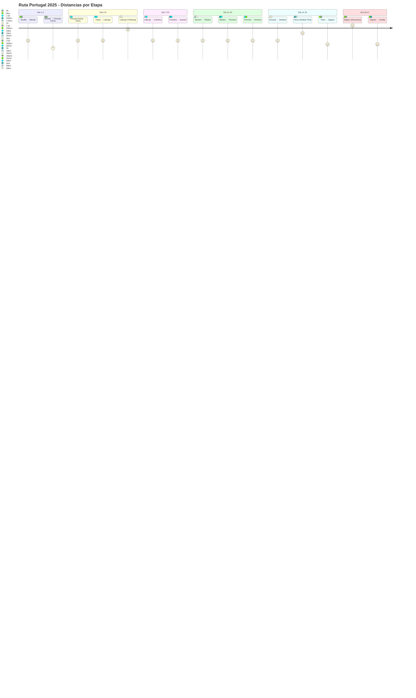

# Diagrama de Ruta - Portugal 2025

## Mapa de Flujo del Itinerario


## Mapa de Actividades por Tipo


## Estadísticas del Viaje


## Distancias y Tiempos



## Kilómetros Acumulados por Día

```mermaid
xychart-beta
    title "Kilómetros Acumulados - Portugal 2025"
    x-axis [Día1, Día2, Día3, Día4, Día5, Día6, Día7, Día8, Día9, Día10, Día11, Día12, Día13, Día14, Día15, Día16, Día17]
    y-axis "Kilómetros" 0 --> 1800
    line [200, 650, 650, 730, 750, 750, 920, 920, 1080, 1080, 1120, 1145, 1195, 1290, 1490, 1490, 1790]
```

## Resumen de Distancias Diarias

```mermaid
gitgraph
    commit id: "Sevilla - 0 km"
    branch dia1
    checkout dia1
    commit id: "Día 1: +200km → Mérida"
    checkout main
    merge dia1
    
    branch dia2
    checkout dia2
    commit id: "Día 2: +450km → Peneda-Gerês"
    checkout main
    merge dia2
    
    branch dia3-4
    checkout dia3-4
    commit id: "Día 3: 0km (Peneda-Gerês)"
    commit id: "Día 4: +80km → Viana"
    checkout main
    merge dia3-4
    
    branch dia5-6
    checkout dia5-6
    commit id: "Día 5: +20km → Labruja"
    commit id: "Día 6: 0km (Trekking)"
    checkout main
    merge dia5-6
    
    branch dia7-10
    checkout dia7-10
    commit id: "Día 7: +170km → Coimbra"
    commit id: "Día 8: 0km (Coimbra)"
    commit id: "Día 9: +160km → Nazaré"
    commit id: "Día 10: 0km (Nazaré)"
    checkout main
    merge dia7-10
    
    branch dia11-14
    checkout dia11-14
    commit id: "Día 11: +40km → Óbidos"
    commit id: "Día 12: +25km → Peniche"
    commit id: "Día 13: +50km → Ericeira"
    commit id: "Día 14: +95km → Tróia (Ferry)"
    checkout main
    merge dia11-14
    
    branch dia15-17
    checkout dia15-17
    commit id: "Día 15: +200km → Sagres"
    commit id: "Día 16: 0km (Descanso)"
    commit id: "Día 17: +300km → Sevilla"
    checkout main
    merge dia15-17
```

## Análisis de Intensidad de Conducción

```mermaid
heatmap
    title Intensidad de Conducción por Día
    x-axis [Lun, Mar, Mié, Jue, Vie, Sáb, Dom, Lun, Mar, Mié, Jue, Vie, Sáb, Dom, Lun, Mar, Mié]
    y-axis [Tiempo, Distancia, Descanso]
    
    heatmap-square 2 : Tiempo
    heatmap-square 3 : Tiempo
    heatmap-square 0 : Tiempo
    heatmap-square 1 : Tiempo
    heatmap-square 0 : Tiempo
    heatmap-square 0 : Tiempo
    heatmap-square 1 : Tiempo
    heatmap-square 0 : Tiempo
    heatmap-square 1 : Tiempo
    heatmap-square 0 : Tiempo
    heatmap-square 0 : Tiempo
    heatmap-square 0 : Tiempo
    heatmap-square 0 : Tiempo
    heatmap-square 1 : Tiempo
    heatmap-square 2 : Tiempo
    heatmap-square 0 : Tiempo
    heatmap-square 3 : Tiempo
    
    heatmap-square 2 : Distancia
    heatmap-square 4 : Distancia
    heatmap-square 0 : Distancia
    heatmap-square 1 : Distancia
    heatmap-square 0 : Distancia
    heatmap-square 0 : Distancia
    heatmap-square 2 : Distancia
    heatmap-square 0 : Distancia
    heatmap-square 2 : Distancia
    heatmap-square 0 : Distancia
    heatmap-square 0 : Distancia
    heatmap-square 0 : Distancia
    heatmap-square 1 : Distancia
    heatmap-square 1 : Distancia
    heatmap-square 2 : Distancia
    heatmap-square 0 : Distancia
    heatmap-square 3 : Distancia
    
    heatmap-square 1 : Descanso
    heatmap-square 0 : Descanso
    heatmap-square 4 : Descanso
    heatmap-square 2 : Descanso
    heatmap-square 3 : Descanso
    heatmap-square 4 : Descanso
    heatmap-square 1 : Descanso
    heatmap-square 4 : Descanso
    heatmap-square 1 : Descanso
    heatmap-square 4 : Descanso
    heatmap-square 3 : Descanso
    heatmap-square 3 : Descanso
    heatmap-square 2 : Descanso
    heatmap-square 2 : Descanso
    heatmap-square 1 : Descanso
    heatmap-square 4 : Descanso
    heatmap-square 0 : Descanso
```
